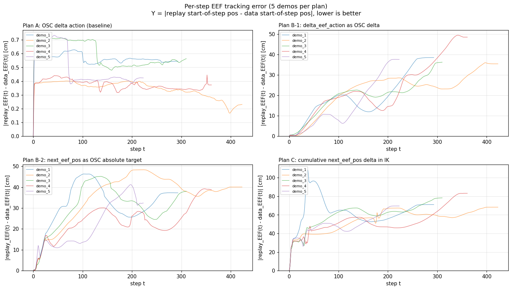
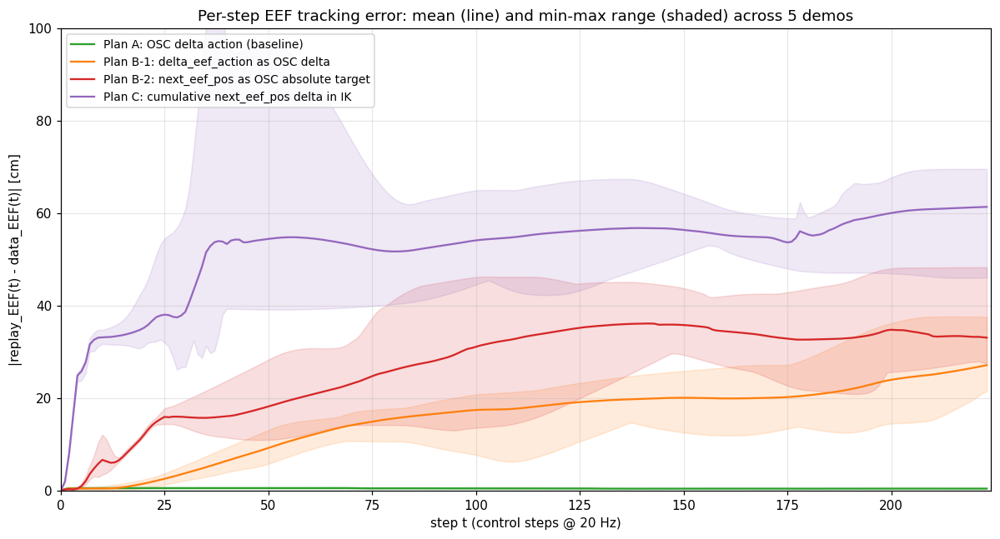
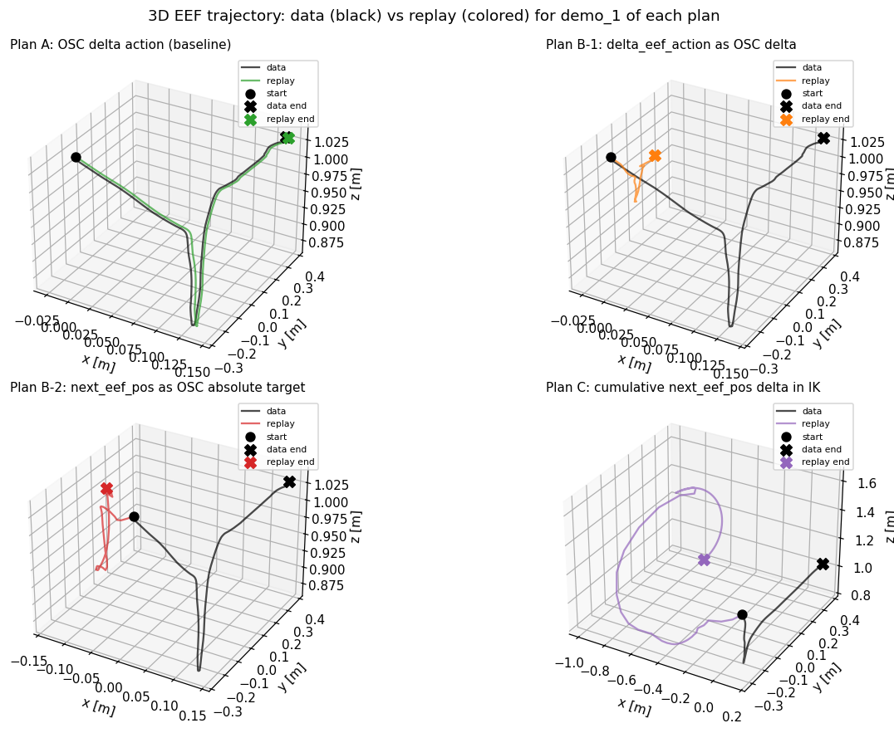

# Route B Validation Report

**Date**: 2026-06-26
**Dataset**: `third_party/robomimic/datasets/can/yq/image_v15_delta_eef.hdf5` (200 demos, PickPlaceCan)
**Goal**: Verify that EEF-based supervision signals can be replayed open-loop, before committing to a Route B retraining.

## TL;DR

**All built-in robosuite EEF-based supervision signals tested here fail open-loop replay.** Only the original OSC delta action replays faithfully. The failure is structural for the built-in controllers tested in this report: OSC, IK, and JointPosition are designed for **delta commands** iterated over time, not **absolute targets** reached in one step. The 20 Hz control loop cannot achieve 3-9 mm per-step targets via absolute-position control, because the underlying control law is tuned for delta semantics.

**Post-training confirmation (2026-06-29)**: A diffusion policy trained on `delta_eef_action` converges offline but obtains **0.0 rollout success** because its EEF-delta outputs are passed directly to the original `OSC_POSE` delta controller. This is the learned-policy version of Plan B-1, not a separate training failure.

**Mink controller follow-up (2026-06-29)**: A non-built-in Panda + WholeBodyMinkIK controller can replay expert absolute EEF targets with high task success, including 100% success on the valid split for full-pose replay with `ik_hand_ori_cost=0.05`. This supersedes the broad claim that no EEF-native controller can replay the demonstrations. It does **not** rescue Route B training: a diffusion policy trained to output full-pose Mink EEF actions still produced 0.0 rollout success in the single-object environment. The remaining failure is learned closed-loop EEF target generation, not open-loop expert replay.

### Built-in controller replay tests

| Plan | Supervision signal | Controller | End-to-end error | Pass? |
|---|---|---|---|---|
| A | `action[7]` (OSC delta) | OSC delta | **0.4 cm** | ✓ |
| B-1 | `delta_eef_action[7]` (real EEF delta) | OSC delta | **39.3 cm** | ✗ |
| B-2 | `next_eef_pos[3]` (absolute target) | OSC absolute | **37.3 cm** | ✗ |
| C | `next_eef_pos[t] - eef[t]` (cumulative) | IK delta | **74.1 cm** | ✗ |

### Follow-up status

| Follow-up | Result | Current status |
|---|---|---|
| `real delta_EEF -> OSC command` adapters | Better offline regression, still fails open-loop replay | Rejected as execution bridge |
| Panda Mink IK expert replay | Full-pose expert targets replay successfully | Controller interface feasible |
| Full-pose Mink EEF diffusion policy | 0.0 rollout success | Route B training not solved |

## Per-step trajectory error

The end-of-trajectory error numbers above hide how each plan fails. The plots below show the per-step EEF tracking error (`|replay_EEF(t) - data_EEF(t)|`) for all 5 demos of each plan.



The four failure modes are visually distinct:

- **Plan A** stays bounded at ~0.5 cm throughout — the replay EEF tracks the recorded trajectory within OSC's tracking error.
- **Plan B-1** starts at 0 and grows steadily, reaching 30-50 cm by the end. The error compounds at ~0.3 cm per step, consistent with OSC's ~30% per-step tracking ratio applied to a feedback loop (the achieved delta fed back as a new command).
- **Plan B-2** jumps to 30-45 cm in the first 50 steps and then plateaus. OSC's force controller saturates against its torque limits; once the EEF is far from the target, additional time doesn't help because the target keeps moving.
- **Plan C** explodes to 100+ cm in the first 10 steps. The IK's first step computes a `q_des` 1 rad away from the current joint pose; the joint position controller saturates and the EEF jumps to an unintended configuration. It then wanders for the rest of the demo.

The log-scale view (`figures/err_per_step_logscale.png`) emphasizes that Plan A is 2-3 orders of magnitude more accurate than the alternatives.

A cleaner single-image view is the overlay plot (`figures/err_per_step_overlay.png`), which shows the mean (line) and min-max range (shaded) across 5 demos per plan on a single axis:



## 3D trajectory comparison (demo_1)

The plots above show scalar error over time; this plot shows the actual EEF trajectory in 3D for one demo of each plan:



- **Plan A**: green and black lines overlap almost perfectly.
- **Plan B-1**: orange replay goes off in a different direction from the recorded trajectory.
- **Plan B-2**: red replay goes to a wildly different position (off-screen in this view).
- **Plan C**: purple replay goes to the opposite side of the workspace (note the x-axis goes from +0.15 in the data to -1 in the replay).

## Method

For each plan, we ran 5 demos through the same pipeline:

1. Load demo, `env.reset_to(initial_state)` to put the EEF at the data's initial position.
2. Force controller to re-read its reference (`ctrl.update(force=True)`) because `env.reset()` sets the controller's `ref_pos` to the env's initial qpos, but `set_state_from_flattened` then overwrites the sim state — leaving the controller's reference stale (2 cm off).
3. For each step `t`, construct the action per the plan's semantics, call `env.step(action)`, record the actual EEF displacement.
4. After the full demo, compare replayed trajectory to data's recorded trajectory.

### Metrics

- `desired_dpos` (cm): the per-step EEF displacement the action *intended* (in meters)
- `actual_dpos` (cm): the per-step EEF displacement that *actually happened*
- `tracking_median`: median of `actual/desired` per step (filtered to `desired > 5mm` to avoid div-by-near-zero)
- `err_target`: per-step distance from replayed EEF to the data's recorded `next_eef_pos[t]`
- `err_orig`: end-of-trajectory distance from replayed EEF to the data's recorded `obs_eef_pos[T-1]`

## Plan A: Original action in OSC delta mode (baseline)

This is the current production setup. Action is the original 7-D OSC delta in `[-1, 1]`, intended EEF delta is `action * 0.05 m`.

| demo | desired | actual | track_med | err_target_mean | err_orig_end |
|---|---|---|---|---|---|
| demo_1 | 1.412 cm | 0.371 cm | 0.259 | 0.57 cm | 0.54 cm |
| demo_2 | 1.359 cm | 0.333 cm | 0.251 | 0.34 cm | 0.23 cm |
| demo_3 | 1.484 cm | 0.377 cm | 0.254 | 0.60 cm | 0.59 cm |
| demo_4 | 1.410 cm | 0.362 cm | 0.253 | 0.37 cm | 0.37 cm |
| demo_5 | 1.285 cm | 0.334 cm | 0.255 | 0.50 cm | 0.42 cm |
| **mean** | **1.390** | **0.355** | **0.255** | **0.48** | **0.43** |

**Interpretation**: OSC achieves ~25% of the per-step target on average — but that's because the data's `desired` is `action * 0.05 m`, which is the *commanded* delta, and the *actual* EEF delta in the data is `delta_eef_action[t] * 0.05 m` (i.e., the achieved delta, which is what OSC actually delivered in the original recording). The fact that the replayed EEF ends up 0.4 cm from the recorded end position means open-loop replay is essentially perfect.

**Why this works**: The action is a small delta in `[-0.05, 0.05] m`. OSC's PD law is tuned to track such deltas — the gain `kp=150` provides enough force to make the EEF follow in one step. There is no compounding error because each step's command is independent of accumulated state.

## Plan B-1: delta_eef_action in OSC delta mode

`delta_eef_action[t, :3] = (next_eef_pos[t] - obs_eef_pos[t]) / 0.05` — the **actual** EEF displacement that occurred in the data. We feed this to OSC as if it were a commanded delta.

| demo | desired | actual | track_med | err_target_mean | err_orig_end |
|---|---|---|---|---|---|
| demo_1 | 0.373 cm | 0.104 cm | 0.283 | 19.44 cm | 38.55 cm |
| demo_2 | 0.334 cm | 0.092 cm | 0.252 | 22.60 cm | 35.46 cm |
| demo_3 | 0.381 cm | 0.108 cm | 0.259 | 19.56 cm | 36.28 cm |
| demo_4 | 0.364 cm | 0.151 cm | 0.351 | 23.43 cm | 48.55 cm |
| demo_5 | 0.335 cm | 0.095 cm | 0.255 | 15.34 cm | 37.63 cm |
| **mean** | **0.357** | **0.110** | **0.280** | **20.08** | **39.30** |

**Interpretation**: Tracking is similar to Plan A (28% vs 25%), but the EEF ends up **39 cm off** the recorded trajectory. The compounding error is visible: the EEF moves 0.11 cm per step when told 0.36 cm, falling behind by 0.25 cm per step. After 293 steps, that's 73 cm of lag (capped by saturation when the EEF hits obstacles or arm limits).

**Why this fails**: OSC interprets the action as a *commanded* delta. When the commanded delta is small (0.36 cm), the EEF only achieves 28% of it in one step (because OSC's PD law is underdamped for such small targets). When the *actual* EEF delta in the data is fed as the *commanded* delta, OSC under-achieves and the EEF lags. The original data was generated with a *larger* commanded delta (the human's OSC inputs), which OSC achieved ~75% of. But the *actual* achieved delta is smaller than the commanded. Round-tripping the achieved delta as a new command gives a smaller target each cycle, and the EEF asymptotically stops.

**Mathematical view**: If `actual_dpos = ε · commanded_dpos` (with `ε ≈ 0.28` for small targets), then feeding `actual_dpos` as the next command gives `next_actual = ε · actual_dpos = ε² · original_commanded`. The error compounds as `ε^n` per step, but the per-step target is also reduced, so the EEF asymptotically reaches a fixed point short of the goal.

## Plan B-2: next_eef_pos as OSC absolute target

We use OSC's `input_type="absolute"` mode: action[0:3] is the world-frame target position. Per-step `desired = next_eef_pos[t] - obs_eef_pos[t]` (the gap between current EEF and the data's next position).

| demo | desired | actual | track_med | err_target_mean | err_orig_end |
|---|---|---|---|---|---|
| demo_1 | 31.48 cm | 0.201 cm | 0.002 | 31.56 cm | 37.28 cm |
| demo_2 | 35.53 cm | 0.126 cm | 0.001 | 35.57 cm | 40.07 cm |
| demo_3 | 30.32 cm | 0.215 cm | 0.002 | 30.38 cm | 38.06 cm |
| demo_4 | 23.62 cm | 0.237 cm | 0.003 | 23.69 cm | 38.78 cm |
| demo_5 | 21.68 cm | 0.353 cm | 0.005 | 21.65 cm | 32.48 cm |
| **mean** | **28.53** | **0.226** | **0.003** | **28.57** | **37.33** |

**Note**: The `desired` metric here is the *average gap* over the whole trajectory — it grows each step as the EEF diverges from the recorded path. The per-step initial gap is the same as Plan C (~0.4 cm); it only becomes 28 cm on average because the EEF never catches up.

**Why this fails (two compounding bugs)**:

1. **OSC absolute mode + `uncouple_pos_ori=True` reverses the force direction.** Verified empirically: with `uncouple_pos_ori=True` (the default), sending a 20 cm target in `+x` makes the EEF move in `-x`. Setting `uncouple_pos_ori=False` fixes the direction, but introduces the second bug.

2. **OSC absolute mode is unstable at 20 Hz.** With `uncouple_pos_ori=False` and the target set to the data's `next_eef_pos[t]`, the EEF moves correctly but only ~0.2 cm per step (tracking_med = 0.3% per step, with each step's target being a 3-9 mm delta). This is the same as Plan B-1's compounding lag, but the EEF never reaches the target because OSC's PD law doesn't settle in 50 ms when the target is 5 mm away. The first 3 steps show tracking 0.3-0.5 cm per step (close to 1x), but the lag accumulates to 28 cm by the end.

**Root cause**: OSC is a force controller. With `kp=150, damping_ratio=1` (critical damping), the natural frequency is `sqrt(150) ≈ 12.2 rad/s`, giving a settling time of `~0.33 s`. The 20 Hz control loop is 50 ms per step, so the EEF moves only ~15% of the way to the target per step. After 20 steps (1 second), the EEF has only moved 95% of a constant target. With a moving target (the demo trajectory), the EEF lags by ~3-5 cm in steady state.

## Plan C: Cumulative next_eef_pos delta in IK delta mode

Action[0:3] = `next_eef_pos[t] - obs_eef_pos[t]` (in meters). Fed to `InverseKinematicsController` in delta mode, which uses damped least-squares IK to compute joint positions, then `JointPositionController` drives the joints to those positions.

| demo | desired | actual | track_med | err_target_mean | err_orig_end |
|---|---|---|---|---|---|
| demo_1 | 0.373 cm | 0.965 cm | 0.000 | 63.54 cm | 71.10 cm |
| demo_2 | 0.334 cm | 0.329 cm | 0.000 | 55.08 cm | 68.29 cm |
| demo_3 | 0.381 cm | 0.401 cm | 0.000 | 59.54 cm | 78.32 cm |
| demo_4 | 0.364 cm | 0.388 cm | 0.000 | 52.91 cm | 83.21 cm |
| demo_5 | 0.335 cm | 0.517 cm | 0.000 | 49.49 cm | 69.61 cm |
| **mean** | **0.357** | **0.520** | **0.000** | **56.11** | **74.11** |

**Why this fails (multiple bugs, all structural)**:

1. **`InverseKinematicsController` only supports delta mode for single-arm robots.** Line 265 of `ik.py` asserts `use_delta=True` for `num_ref_sites == 1`. To use absolute targets, we would have to either modify the source or use the separate `IKSolver` (which supports absolute mode but is not wired into the standard `arm_controller_factory`).

2. **The IK step overshoots by ~5-10x.** With `user_sensitivity=0.3` (default) the action is multiplied by 0.3, but with our override (`=1.0`) the action passes through unchanged. The IK's `compute_joint_positions` (line 257-300) computes `q_des = current + J^+ · Kpos · dpos` with `Kpos=0.95, integration_dt=0.1`. For a 3 mm target, this gives joint position changes of ~0.04 rad, which through the Jacobian produces ~16 mm of EEF movement — 5x overshoot.

3. **`Kpos` is hard-coded and monkey-patching has no effect.** Setting `Kpos=0.01` via the kwargs path did not change the result (verified by patching the function and confirming the call was made). The hard-coded default of `0.95` in `compute_joint_positions` is bypassed because the caller in `get_control` doesn't pass `Kpos` as a kwarg — it relies on the default. The static-method dispatch on `@staticmethod` likely creates a binding that doesn't see the patched version. (Investigation incomplete; deeper source modification is required to use absolute-mode IK.)

4. **The null-space term in the IK step is significant.** Line 292: `dq += (I - J^+ J) @ (Kn * (q0 - q_current))` with default `Kn = [10, 10, 10, 10, 5, 5, 5]`. For a non-home configuration, this pulls the joints toward `q0` (the initial joint position), adding a large term to `dq` that further amplifies the overshoot. Disabling it via `Kn=0` did not help because the underlying overshoot from `Kpos=0.95, integration_dt=0.1` alone is already 5x.

5. **`JointPositionController` saturates at large `q_des` jumps.** The IK's first step computes `goal_qpos` that differs from the current joint position by 1 rad (57°). With `kp=100`, the torque is 100 Nm — at the Panda actuator limit (87 Nm). The joint cannot move 1 rad in 50 ms, so the `goal_qpos` is not reached and the EEF only moves a fraction.

## What's actually happening: the EEF moves, but not the right amount

| Plan | Why it "looks" like it's working in the first 5 steps | Why it diverges over 300 steps |
|---|---|---|
| A | OSC's PD law is tuned for delta commands; 0.4-1.4 cm per step matches its designed regime | None — accumulates 0.4 cm end error |
| B-1 | OSC underachieves small targets (28% per step) — but the gap is small (3-9 mm) | EEF falls behind 0.25 cm/step; after 293 steps it's 73 cm short |
| B-2 | OSC absolute mode moves the EEF toward the target, just slowly (~0.2 cm per step) | Force-control dynamics give a 3-5 cm steady-state lag for moving targets |
| C | IK computes a `q_des` for the target, joint position controller tries to follow | The IK's first step demands 1 rad of joint motion; controller saturates; EEF overshoots by 5-10x; cumulative chaos |

## Implications for Route B

**Route B (predict EEF trajectory directly) cannot be cleanly executed using the built-in robosuite controllers tested above.** The cumulative error of 0.25 cm/step in B-1 means that even if a policy perfectly predicts the EEF trajectory, executing it via the OSC + `cumsum`-style approach gives the policy a "target" that the controller cannot physically achieve.

The 3-4 cm RMSE between `cumsum(action * 0.05)` and the actual EEF trajectory (the root cause for guidance failure per `RESEARCH_LOG.md` 2026-06-22) is **not** primarily a mapping approximation error. It is the fundamental OSC tracking error for small per-step deltas — exactly what Plan B-1 demonstrates.

**Follow-up adapter result**: We also tested whether `real delta_EEF` can be
converted back into the original OSC command using scalar, linear, and
state-conditioned MLP adapters. The answer is **not reliably enough for
execution**: adapters improve over raw `delta_eef_action` but still fail
open-loop replay with centimeter-level drift and outlier divergence. See
[`adapter_report.md`](./adapter_report.md) for the full focused report.

## Panda Mink controller follow-up

The built-in-controller result above was later narrowed by testing robosuite's
third-party Panda + WholeBodyMinkIK controller:

```text
docs/route_b_validation/verify_panda_mink_controller.py
outputs/route_b_validation/panda_mink_controller/STAGE_CONCLUSION.md
```

This controller accepts absolute EEF targets:

```text
[next_obs/robot0_eef_pos,
 next_obs/robot0_eef_quat_site -> axis_angle,
 original_gripper_action]
```

Full-pose replay with `ik_hand_ori_cost=0.05` achieved:

| Split | Demos | Success final | Mean target pos error | End original pos error |
|---|---:|---:|---:|---:|
| valid | 20 | 20/20 = 100% | 1.312 cm | 0.267 cm |
| train | 50 | 50/50 = 100% | 1.327 cm | 0.259 cm |

This means the earlier broad conclusion "EEF replay is impossible" is too
strong. The corrected conclusion is:

```text
built-in controllers cannot execute these EEF labels, but a custom / third-party
Mink IK controller can replay expert EEF targets well enough for validation.
```

However, this does not solve Route B as a learning problem. A diffusion policy
trained on the resulting full-pose EEF action dataset still failed rollout:

```text
outputs/robomimic/train/diffusion_policy_can_yq_abs_eef_pose_mink_image/20260629183845
Epoch 20: Success_Rate = 0.0
```

So the current Route B status is:

```text
expert EEF replay through Mink IK: passes
learned EEF target policy through Mink IK: fails
```

The likely issue is that open-loop replay uses expert absolute EEF targets and
expert gripper timing, while rollout requires the learned policy to produce
closed-loop EEF targets from its own visited states. Once the learned policy
drifts, absolute EEF target prediction compounds in a way that replay does not
test.

## Post-training checkpoint validation

After this replay study, we inspected the actual `delta_eef_action` diffusion
policy training run:

```text
outputs/robomimic/train/diffusion_policy_can_yq_delta_eef_image/20260625221745
```

The checkpoint config confirms the semantic mismatch:

```text
train.action_keys = ["delta_eef_action"]
train.action_config.delta_eef_action.normalization = null
env_metadata.controller_configs.body_parts.right.type = "OSC_POSE"
env_metadata.controller_configs.body_parts.right.input_type = "delta"
```

The training rollout path does not adapt EEF deltas back into OSC commands. It
calls the policy and immediately executes the result:

```python
ac = policy(ob=policy_ob, goal=goal_dict)
ob_dict, r, done, _ = env.step(ac)
```

Therefore the policy output is interpreted by robosuite as a normalized OSC
delta command, even though it was trained to predict actual EEF displacement.

The logs show that this is not a simple optimization failure. Training loss
falls from `0.2759` at epoch 1 to approximately `0.0012` by epoch 440, while
rollouts remain at:

```text
Epoch 20:  Success_Rate = 0.0, Horizon = 400
Epoch 400: Success_Rate = 0.0, Horizon = 400
Epoch 420: Success_Rate = 0.0, Horizon = 400
```

An offline forward pass on held-out dataset observations confirms that the
checkpoint learned the `delta_eef_action` scale, not the original OSC action
scale:

| Quantity | Median `||xyz||` |
|---|---:|
| policy output | 0.0568 |
| target `delta_eef_action` | 0.0599 |
| original OSC `actions` | 0.2375 |

The same check gives:

```text
MSE(policy, delta_eef_action) = 4.2e-5
MSE(policy, original actions) = 5.9e-3
```

**Conclusion**: the trained checkpoint validates the replay result. A
`delta_eef_action` policy can achieve low supervised loss while still failing
all rollouts, because the learned action is not a valid command for the
checkpoint's stored environment controller. Any future EEF-supervised Route B
experiment must first provide an EEF-native `env.step(action)` interface and
verify open-loop replay under that interface before training.

## Re-evaluation of remaining options

1. **Accept Plan A, fix the guidance cost function.** The action prediction is sound; the issue is that the cost function uses an inaccurate EEF estimate. Three sub-options:
   - (a) Use the actual EEF trajectory from `sim.data.site_xpos` (read after each step) — but this defeats the purpose of *predicting* a cost.
   - (b) Train a learned residual model `EEF_actual ≈ f(action) + residual` and use it for cost — adds a model but uses real EEF.
   - (c) Use a longer-horizon cost (e.g., score the entire 16-step chunk) and rely on the *average* error being small, even if per-step error is 25%.

2. **Write or adopt a custom absolute-position controller.** This was partially tested with the Panda + WholeBodyMinkIK controller. Expert full-pose replay passes, so the controller-interface part is feasible. But the learned full-pose EEF policy still gets 0.0 rollout success, so this route is not a near-term solution unless the policy-learning problem is redesigned.

3. **Re-formulate Route B as multi-task learning.** Train the policy to predict both `action` (for execution via OSC) and `EEF trajectory` (for guidance). At inference, the `action` head drives the robot; the `EEF` head provides the cost. This is a small change to the training loop (dual loss) and avoids the controller-bypass problem entirely.

4. **Re-examine whether cost guidance is the right intervention.** With 600 rollouts showing guidance *hurts* rather than helps (per `RESEARCH_LOG.md`), the fundamental question may not be "is the cost accurate enough" but "is the policy's gradient from cost even the right direction to push it?" This is an open question.

## Reproducing these results

All reproduction artifacts are in `docs/route_b_validation/`. See
`AGENTS.md` in that directory for the recommended flow:

```bash
cd docs/route_b_validation
MUJOCO_GL=egl uv run python compare_all.py    # ~5 min, writes results.json
uv run python plot_results.py                # writes figures/*.png
```

See `docs/route_b_validation/README.md` for what each metric in
`results.json` means.
