# 3D Diffusion Policy: Generalizable Visuomotor Policy Learning via Simple 3D Representations

Yanjie Ze<sup>1∗</sup> Gu Zhang<sup>12∗</sup> Kangning Zhang<sup>12</sup> Chenyuan Hu<sup>13</sup> Muhan Wang<sup>13</sup> Huazhe Xu<sup>314</sup> <sup>1</sup>Shanghai Qi Zhi Institute <sup>2</sup>Shanghai Jiao Tong University <sup>3</sup>Tsinghua University, IIIS <sup>4</sup>Shanghai AI Lab <sup>∗</sup>Equal contribution

3d-diffusion-policy.github.io

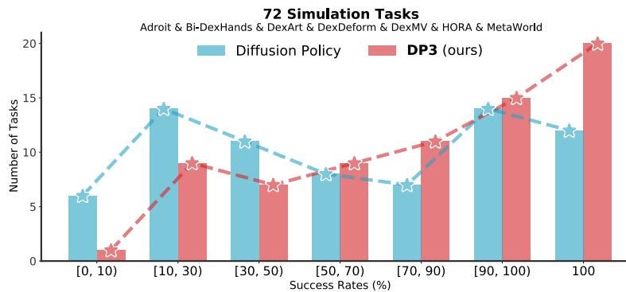

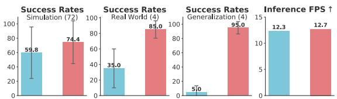  
(a) 3D Diffusion Policy (DP3) vs. Diffusion Policy: Better, Faster, Stronger.

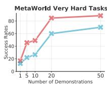

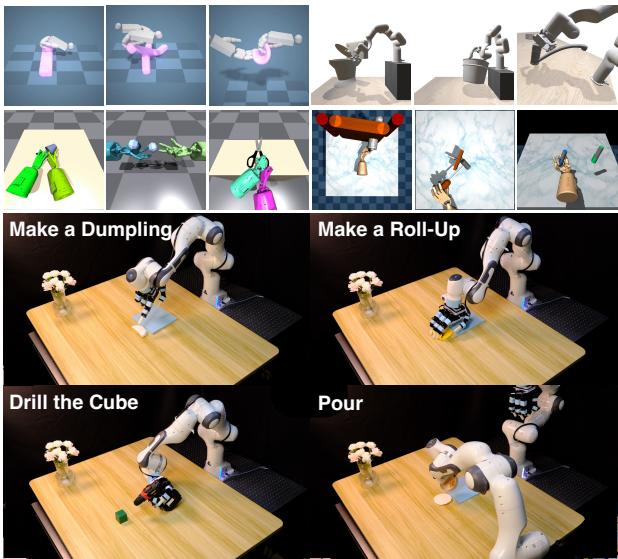  
(b) We evaluate DP3 in diverse simulated and real tasks.  
Fig. 1: 3D Diffusion Policy (DP3) is a visual imitation learning algorithm that marries 3D visual representations with diffusion policies, achieving surprising effectiveness in diverse simulation and real-world tasks, with a practical inference speed.

Abstract—Imitation learning provides an efficient way to teach robots dexterous skills; however, learning complex skills robustly and generalizablely usually consumes large amounts of human demonstrations. To tackle this challenging problem, we present 3D Diffusion Policy (DP3), a novel visual imitation learning approach that incorporates the power of 3D visual representations into diffusion policies, a class of conditional action generative models. The core design of DP3 is the utilization of a compact 3D visual representation, extracted from sparse point clouds with an efficient point encoder. In our experiments involving 72 simulation tasks, DP3 successfully handles most tasks with just 10 demonstrations and surpasses baselines with a 24.2% relative improvement. In 4 real robot tasks, DP3 demonstrates precise control with a high success rate of 85%, given only 40 demonstrations of each task, and shows excellent generalization abilities in diverse aspects, including space, viewpoint, appearance, and instance. Interestingly, in real robot experiments, DP3 rarely violates safety requirements, in contrast to baseline methods which frequently do, necessitating human intervention. Our extensive evaluation highlights the critical importance of 3D representations in real-world robot learning. Code and videos are available on 3d-diffusion-policy.github.io .

## I. INTRODUCTION

Imitation learning provides an efficient way to teach robots a wide range of motor skills, such as grasping [68, 60, 82], legged locomotion [40], dexterous manipulation [1, 16], humanoid loco-manipulation [54], and mobile manipulation [57,

12]. Visual imitation learning, which takes high-dimensional visual observations such as images or depth maps, eases the need for task-specific state estimation and thus gains the popularity [10, 60, 82, 11, 20].

However, the generality of visual imitation learning comes at a cost of vast demonstrations [16, 10, 11]. For example, the state-of-the-art method Diffusion Policy [10] necessitates 100 to 200 human-collected demonstrations for each real-world task. To collect the required extensive number of demonstrations, the entire data-gathering process can span several days due to its long-horizon nature and failure-prone process. One solution is online learning [16], where the policy continues to evolve through interaction with environments and a learned reward function from expert demonstrations. Nevertheless, online learning in real-world scenarios introduces its own challenges, such as safety considerations, the necessity for automatic resetting, human intervention, and additional robot hardware costs. Therefore, how to enable (offline) imitation learning algorithms to learn robust and generalizable skills with as few demonstrations as possible is a fundamental problem, especially for practical real-world robot learning.

To tackle this challenging problem, we introduce 3D Diffusion Policy (DP3), a simple yet effective visual imitation learning algorithm that integrates the strengths of 3D visual representations with diffusion policies. DP3 encodes sparsely sampled point clouds into a compact 3D representation using a straightforward and efficient MLP encoder. Subsequently, DP3 denoises random noise into a coherent action sequence, conditioned on this compact 3D representation and the robot poses. This integration leverages not only the spatial understanding capabilities inherent in 3D modalities but also the expressiveness of diffusion models.

To comprehensively evaluate DP3, we have developed a simulation benchmark comprising 72 diverse robotic tasks from 7 domains, alongside 4 real-world tasks including challenging dexterous manipulation on deformable objects. Our extensive experiments demonstrate that although DP3 is conceptually straightforward, it exhibits several notable advantages over 2D-based diffusion policies and other baselines:

1) Efficiency & Effectiveness. DP3 not only achieves superior accuracy but also does so with significantly fewer demonstrations and fewer training steps.

2) Generalizability. The 3D nature of DP3 facilitates generalization capabilities across multiple aspects: space, viewpoint, instance, and appearance.

3) Safe deployment. An interesting observation in our real-world experiments is that DP3 seldom gives erratic commands in real-world tasks, unlike baseline methods which often do and exhibit unexpected behaviors, posing potential damage to the robot hardware.

We conduct several analyses of our 3D visual representations. Intriguingly, we observed that while other baseline methods, such as BCRNN [35] and IBC [11], benefit from the incorporation of 3D representations, they do not achieve enhancements comparable to DP3. Additionally, DP3 consistently outperforms other 3D modalities, including depth and voxel representations, and surpasses other point encoders like PointNeXt [46] and Point Transformer [84]. These ablation studies highlight that the success of DP3 is not just due to the usage of 3D visual representations, but also because of its careful design.

In summary, our contributions are four-fold:

1) We propose 3D Diffusion Policy (DP3), an effective visuomotor policy that generalizes across diverse aspects with few demonstrations.

2) To reduce the variance brought by benchmarks and tasks, we evaluate DP3 in a broad range of simulated and realworld tasks, showing the universality of DP3.

3) We conduct comprehensive analyses on visual representations in DP3 and show that a simple point cloud representation is preferred over other intricate 3D representations and is better suited for diffusion policies over other policy backbones.

4) DP3 is able to perform real-world deformable object manipulation using a dexterous hand with only 40 demonstrations, demonstrating that complex high-dimensional tasks could be handled with little human data.

DP3 emphasizes the power of marrying 3D representations with diffusion policies in real-world robot learning. Code is available on https://github.com/YanjieZe/3D-Diffusion-Policy.

## II. RELATED WORK

## A. Diffusion Models in Robotics

Diffusion models, a category of generative models that progressively transform random noise into a data sample, have achieved great success in high-fidelity image generation [23, 63, 51, 62]. Owing to their impressive expressiveness, diffusion models have recently been applied in robotics, including in fields such as reinforcement learning [70, 2], imitation learning [10, 39, 50, 72, 64, 41], reward learning [25, 37], grasping [71, 66, 61], and motion planning [52, 27]. In this work, we focus on representing visuomotor policies as conditional diffusion models, referred to as diffusion policies, following the framework established in [10, 39]. Unlike prior methods that primarily focus on images and states as conditions, we pioneer in incorporating 3D conditioning into diffusion policies.

## B. Visual Imitation Learning

Imitation learning offers an efficient way for robots to acquire human-like skills, typically relying on extensive observation-action pairs from expert demonstrations. Given the challenges in accurately estimating object states in the real world, visual observations such as images have emerged as a practical alternative. While 2D image-based policies [38, 11, 10, 35, 16, 56, 68, 15] have predominated the field, the significance of 3D is increasingly recognized [60, 82, 80, 14, 13, 28, 69].

Recent 3D-based policies, including PerAct [60], GNFactor [82], RVT [14], ACT3D [13], and NeRFuser [74], have demonstrated notable advancements in low-dimensional control tasks. However, these works face two primary challenges: (1) Impractical setting. These methods convert the imitation learning problem into a prediction-and-planning paradigm using keyframe pose extraction. While effective, this formulation is less suitable for high-dimensional control tasks. (2) Slow inference. The intricate architectures of these methods result in slow inference speeds. For instance, PerAct [60] runs at an inference speed of 2.23 FPS, making it hard to address tasks that require dense commands, such as highly dynamic environments. Another closely related work 3D Diffuser Actor [28] runs at 1.67 FPS mainly due to the usage of attention to language tokens and the difference in the task setting<sup>1</sup>. Compared to this line of works, we endeavor to develop a universal and fast 3D policy capable of tackling a broader spectrum of robotic tasks, encompassing both highdimensional and low-dimensional control tasks.

## C. Learning Dexterous Skills

Achieving human-like manipulation skills in robots has been a longstanding objective pursued by robotics researchers. Reinforcement learning has been a key tool in this endeavor, enabling robots with dexterous hands to master a variety of tasks, such as pouring water [47, 81], opening doors [49, 21, 8], rotating objects [44, 76, 78, 45], reorienting objects [18, 7, 6], spinning pens [33], grasping tools [1], executing handovers [83, 24], and building Legos [9]. Imitation learning offers another pathway, with approaches like DIME [3] and DexMV [47] translating human hand movements into robotic actions through retargeting and enabling learning from human videos. Our work, however, diverges from these specific design-centric methods. We demonstrate that enabling the acquisition of these complex skills with minimal demonstrations could be achieved by improving the imitation learning algorithm itself.

## III. METHOD

Given a small set of expert demonstrations that contain complex robot skill trajectories, we want to learn a visuomotor policy $\pi : { \mathcal { O } } \mapsto A$ that maps the visual observations $o \in \mathcal { O }$ to actions $a \in A ,$ such that our robots not only reproduce the skill but also generalize beyond the training data. To this end, we introduce 3D Diffusion Policy (DP3), which mainly consists of two critical parts: (a) Perception. DP3 perceives the environments with point cloud data and processes these visual observations with an efficient point encoder into visual features; (b) Decision. DP3 utilizes the expressive Diffusion Policy [10] as the action-making backbone, which generates action sequences conditioning on our 3D visual features. An overview of DP3 is in Figure 2. We will detail each part in the following sections.

## A. A Motivating Example

To better illustrate the generalization ability of DP3, we first give a straightforward example. We use the MetaWorld Reach task [77] as our testbed. In this task, the goal is for the gripper to accurately reach a designated target point. To evaluate the effectiveness of imitation learning algorithms in not only fitting training data but also generalizing to new scenarios, we visualize the • training points and the • successful evaluation points in 3D space, as shown in Figure 3. We observe that with merely five training points, DP3 reaches points distributed over the 3D space, while for 2D-based methods, Diffusion Policy [10] and IBC [11] learn to reach within a plane-like area, and BCRNN [35] fails to cover the space. This example demonstrates the superior generalization and efficiency of DP3, particularly in scenarios where available data is limited.

## B. Perception

We now detail the perception module in DP3. DP3 focuses on only utilizing a single-view camera for policy learning for all the tasks, which is different from previous works [10, 18] that set up multiple cameras around robots. This is primarily chosen for its practical applicability in real-world tasks.

Representing 3D scenes with point clouds. The 3D scene could be represented in different ways, such as RGB-D images, point clouds, voxels [7], implicit functions [36], and 3D gaussians [29]. Among them, DP3 uses sparse point clouds as the 3D representation. As evidenced in our ablations (see Table IV), point clouds are found to be more efficient compared to other explicit representations, such as RGB-D, depth, and voxels.

For both simulation and the real world, we obtain depth images with size $8 4 \times 8 4$ from a single camera. We then convert depth into point clouds with camera extrinsics and intrinsics. We do not use color channels for better appearance generalization.

Point cloud processing. Since the point clouds converted from depth may contain redundant points, such as points from the table and the ground, we crop out these points and only leave points within a bounding box.

We further downsample points by farthest point sampling (FPS, [42]), which helps cover the 3D space sufficiently and reduces the randomness of point cloud sampling, compared to uniform sampling. In practice, we find downsampling 512 or 1024 points is sufficient for all the tasks in both simulation and the real world.

Encoding point clouds into compact representations. We then encode point clouds into compact 3D representations with a lightweight MLP network, as shown in Figure 2. The network, termed as DP3 Encoder, is conceptually simple: it consists of a three-layer MLP, a max-pooling function as an order-equivariant operation to pool point cloud features, and a projection head to project the features into a compact vector. LayerNorm layers are interleaved to stabilize training [22]. The final 3D feature, denoted as v, is only 64 dimension. As shown in our ablation studies (see Table V), this simple encoder could even outperform pre-trained point encoders such as PointNeXt [46], aligning with observations from [20], where a properly designed small encoder is better than pretrained large encoders in visuomotor control tasks.

## C. Decision

Conditional action generation. The decision module in DP3 is formulated as a conditional denoising diffusion model [23, 10, 39] that conditions on 3D visual features v and robot poses q, then denoises a random Gaussian noise into actions a. Specifically, starting from a Gaussian noise $a ^ { K }$ the denoising network ϵ<sub>θ</sub> performs K iterations to gradually denoise a random noise $a ^ { K }$ into the noise-free action $a ^ { 0 }$

$$
a ^ {k - 1} = \alpha_ {k} \left(a ^ {k} - \gamma_ {k} \boldsymbol {\epsilon} _ {\theta} \left(a ^ {k}, k, v, q\right)\right) + \sigma_ {k} \mathcal {N} (0, \mathbf {I}),\tag{1}
$$

where $\mathcal { N } ( 0 , \bf { I } )$ is Gaussian noise, $\alpha _ { k } , \gamma _ { k }$ , and $\sigma _ { k }$ are functions of k and depend on the noise scheduler. This process is also called the reverse process [23].

Training objective. To train the denoising network $\epsilon _ { \theta } .$ , we randomly sample a data point $a ^ { 0 }$ from the dataset and do a diffusion process [23] on the data point to get the noise at k iteration $\epsilon ^ { k } ,$ . The training objective is to predict the noise added to the original data,

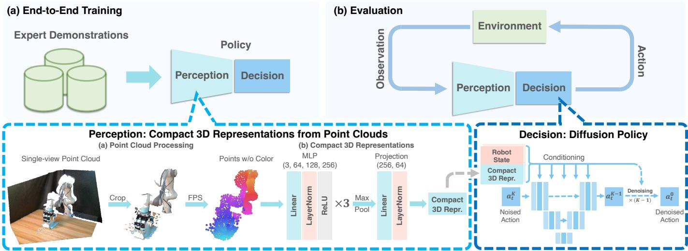

Fig. 2: Overview of 3D Diffusion Policy (DP3). Above: In the training phase, DP3 simultaneously trains its perception module and decision-making process in an end-to-end manner using expert demonstrations. During evaluation, DP3 determines actions based on visual observations from the environment. Below: DP3 perceives its environment through single-view point clouds. These are transformed into compact 3D representations by a lightweight MLP encoder. Subsequently, DP3 generates actions conditioning on these 3D representations and the robot’s states, using a diffusion-based backbone. TABLE I: Main simulation results. Averaged over 72 tasks, DP3 achieves 24.2% relative improvement compared to Diffusion Policy, with a smaller variance. Success rates for individual tasks are in Appendix C.

<table><tr><td>Algorithm \ Task</td><td>Adroit (3)</td><td>Bi-DexHands (6)</td><td>DexArt (4)</td><td>DexDeform (6)</td><td>DexMV (2)</td><td>HORA (1)</td><td>MetaWorld Easy (28)</td><td>MetaWorld Medium (11)</td><td>MetaWorld Hard (6)</td><td>MetaWorld Very Hard (5)</td><td>Average (72)</td></tr><tr><td>DP3</td><td>68.3</td><td>70.2</td><td>68.5</td><td>87.8</td><td>99.5</td><td>71.0</td><td>90.9</td><td>61.6</td><td>31.7</td><td>49.0</td><td>74.4±29.9 (↑ 24.2%)</td></tr><tr><td>Diffusion Policy</td><td>31.7</td><td>61.3</td><td>49.0</td><td>90.5</td><td>95.0</td><td>49.0</td><td>83.6</td><td>31.1</td><td>9.0</td><td>26.6</td><td>59.8±35.9</td></tr></table>

TABLE II: Comparing DP3 with more baselines in simulation. We include IBC, BCRNN, and their 3D variants, termed as IBC+3D and BCRNN+3D. The 3D variants use our DP3 Encoder for a fair comparison.

<table><tr><td rowspan="2">Algorithm \ Task</td><td colspan="3">Adroit</td><td colspan="3">MetaWorld</td><td colspan="4">DexArt</td><td rowspan="2">Average</td></tr><tr><td>Hammer</td><td>Door</td><td>Pen</td><td>Assembly</td><td>Disassemble</td><td>Stick-Push</td><td>Laptop</td><td>Faucet</td><td>Toilet</td><td>Bucket</td></tr><tr><td>DP3</td><td>100±0</td><td>62±4</td><td>43±6</td><td>99±1</td><td>69±4</td><td>97±4</td><td>83±1</td><td>63±2</td><td>82±4</td><td>46±2</td><td>74.4</td></tr><tr><td>Diffusion Policy</td><td>48±17</td><td>50±5</td><td>25±4</td><td>15±1</td><td>43±7</td><td>63±3</td><td>69±4</td><td>23±8</td><td>58±2</td><td>46±1</td><td>44.0</td></tr><tr><td>BCRNN</td><td>0±0</td><td>0±0</td><td>9±3</td><td>3±4</td><td>32±12</td><td>45±11</td><td>3±3</td><td>1±0</td><td>5±5</td><td>0±0</td><td>9.8</td></tr><tr><td>BCRNN+3D</td><td>8±14</td><td>0±0</td><td>8±1</td><td>1±5</td><td>11±6</td><td>0±0</td><td>29±12</td><td>26±2</td><td>38±10</td><td>24±11</td><td>14.5</td></tr><tr><td>IBC</td><td>0±0</td><td>0±0</td><td>9±2</td><td>0±0</td><td>1±1</td><td>16±2</td><td>3±2</td><td>7±1</td><td>14±1</td><td>0±0</td><td>5.0</td></tr><tr><td>IBC+3D</td><td>0±0</td><td>0±0</td><td>10±1</td><td>18±9</td><td>3±5</td><td>50±6</td><td>1±1</td><td>7±2</td><td>15±1</td><td>0±0</td><td>10.4</td></tr></table>

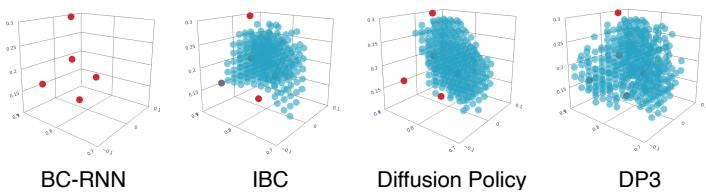  
Fig. 3: Generalization in 3D space with few data. We use MetaWorld Reach as an example task, given only 5 demonstrations (visualized by •). We evaluate 1000 times to cover the 3D space and visualize the • successful evaluation points. DP3 learns the generalizable skill in 3D space; Diffusion Policy and IBC [11] only succeed in partial space; BC-RNN [35] fails to learn such a simple skill with limited data. Number of successful trials from left to right: 0 / 285 / 327 / 415.

$$
\mathcal {L} = \mathrm{MSE} \left(\boldsymbol {\epsilon} ^ {k}, \boldsymbol {\epsilon} _ {\theta} (\bar {\alpha_ {k}} a ^ {0} + \bar {\beta_ {k}} \boldsymbol {\epsilon} ^ {k}, k, v, q)\right),\tag{2}
$$

where $\bar { \alpha _ { k } }$ and $\bar { \beta _ { k } }$ are noise schedule that performs one step noise adding [23].

Implementation details. We use the convolutional networkbased diffusion policy [10]. We use DDIM [62] as the noise scheduler and use sample prediction instead of epsilon prediction for better high-dimensional action generation, with 100 timesteps at training and 10 timesteps at inference. We train 1000 epochs for MetaWorld tasks due to its simplicity and 3000 epochs for other simulated and real-world tasks, with batch size 128 for DP3 and all the baselines.

## IV. SIMULATION EXPERIMENTS

## A. Experiment Setup

Simulation benchmark. Though the simulation environments are increasingly realistic nowadays [34, 73, 65, 85], a notable gap between simulation and real-world scenarios persists [80, 30, 7]. This discrepancy underscores two key aspects: (a) the importance of real robot experiments and (b) the necessity of large-scale diverse simulation tasks for more scientific benchmarking. Therefore, for simulation experiments, we collect in total 72 tasks from 7 domains, covering diverse robotic skills. These tasks range from challenging scenarios like bi-manual manipulation [8], deformable object manipulation [31], and articulated object manipulation [5], to simpler tasks like parallel gripper manipulation [77]. These tasks are built with different simulators including MuJoCo [65], Sapien [73], IsaacGym [34], and PlasticineLab [26], ensuring our benchmarking is not limited by the choice of simulator. Tasks in MetaWorld [77] are categorized into various difficulty levels based on [55]. A brief overview is shown in Table III. The 3D observations are visualized in Figure 4.

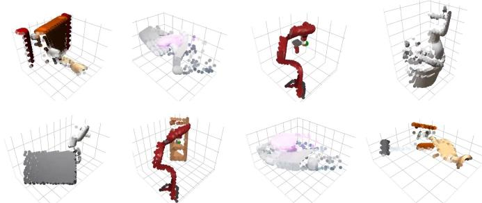  
Fig. 4: 3D visual observations in simulation. We sample some simulated tasks and show the downsampled point clouds in these tasks.

Expert demonstrations. Human-teleoperated data is used in DexDeform; Script policies are used in MetaWorld; Trajectories for other domains are collected with agents trained by reinforcement learning (RL) algorithms, where we use VRL3 [67] is used for Adroit; PPO [53] is used in all other domains. We generate successful trajectories with RL agents and ensure all imitation learning algorithms are using the same demonstrations. The success rates for experts are given in Appendix C.

Baselines. The primary focus of this work is to underscore the significance of the 3D modality in diffusion policies. To this end, our main baseline is the image-based diffusion policy [10], simply referred to as Diffusion Policy. Additionally, we incorporate comparisons with IBC [11], BCRNN [35], and their 3D variations. However, given that these algorithms showed limited effectiveness in our challenging tasks, we evaluate them on only 10 tasks (see Table II). We emphasize that the image and depth resolution for all 2D and 3D methods are the same across all experiments, ensuring a fair comparison.

Evaluation metric. We run 3 seeds for each experiment with seed number 0, 1, 2. For each seed, we evaluate 20 episodes every 200 training epochs and then compute the average of the highest 5 success rates. We report the mean and std of success rates across 3 seeds.

## B. Efficiency and Effectiveness

DP3 shows surprising efficiency across diverse tasks, mainly reflected in the following three perspectives:

1) High accuracy. Summarized results are in Figure 1(a) and results for each domain are in Table I. We observe that DP3 achieves a success rate exceeding 90% in nearly 30 tasks, whereas Diffusion Policy does in fewer than 15 tasks. Additionally, DP3 did not record any task with a success rate below 10%, in contrast to Diffusion Policy, which had more than 10 tasks below 10%. Note that most of the tasks are only trained with 10 demonstrations.

TABLE III: Task suite of DP3, including Adroit [49], Bi-DexHands [8], DexArt [5], DexDeform [31], DexMV [47], HORA [44], MetaWorld [77], and our real robot tasks. ActD: the highest action dimension for the domain. #Demo: Number of expert demonstrations used for each task in the domain. Art: articulated objects. Deform: deformable objects.

<table><tr><td colspan="8">Simulation Benchmark (72 Tasks)</td></tr><tr><td>Domain</td><td>Robo</td><td>Object</td><td>Simulator</td><td>ActD</td><td>#Task</td><td>#Demo</td><td></td></tr><tr><td>Adroit</td><td>Shadow</td><td>Rigid/Art</td><td>MuJoCo</td><td>28</td><td>3</td><td>10</td><td></td></tr><tr><td>Bi-DexHands</td><td>Shadow</td><td>Rigid/Art</td><td>IsaacGym</td><td>52</td><td>6</td><td>10</td><td></td></tr><tr><td>DexArt</td><td>Allegro</td><td>Art</td><td>Sapien</td><td>22</td><td>4</td><td>100</td><td></td></tr><tr><td>DexDeform</td><td>Shadow</td><td>Deform</td><td>PlasticineLab</td><td>52</td><td>6</td><td>10</td><td></td></tr><tr><td>DexMV</td><td>Shadow</td><td>Rigid/Fluid</td><td>Sapien</td><td>30</td><td>2</td><td>10</td><td></td></tr><tr><td>HORA</td><td>Allegro</td><td>Rigid</td><td>IsaacGym</td><td>16</td><td>1</td><td>100</td><td></td></tr><tr><td>MetaWorld</td><td>Gripper</td><td>Rigid/Art</td><td>MuJoCo</td><td>4</td><td>50</td><td>10</td><td></td></tr><tr><td colspan="8">Real Robot Benchmark (4 Tasks)</td></tr><tr><td>Task</td><td>Robo</td><td>Object</td><td>ActD</td><td>#Demo</td><td>Description</td><td></td><td></td></tr><tr><td>Roll-Up</td><td>Allegro</td><td>Deform</td><td>22</td><td>40</td><td>Wrap plasticine to make a roll-up</td><td></td><td></td></tr><tr><td>Dumpling</td><td>Allegro</td><td>Deform</td><td>22</td><td>40</td><td>Wrap plasticine and pinch with fingers</td><td></td><td></td></tr><tr><td>Drill</td><td>Allegro</td><td>Rigid</td><td>22</td><td>40</td><td>Grasp the drill and touch the cube</td><td></td><td></td></tr><tr><td>Pour</td><td>Gripper</td><td>Rigid</td><td>7</td><td>40</td><td>Pick the bowl, pour, and place</td><td></td><td></td></tr></table>

2) Learning efficiency. While we train all the algorithms for 3000 epochs to guarantee convergence, we observe that DP3 typically reaches convergence within approximately 500 epochs across all tasks, as illustrated in Figure 5. In contrast, Diffusion Policy tends to converge at a much slower pace or converge into sub-optimal results.

3) Efficient scaling with demonstrations. As shown in Figure 6, we find that in Adroit tasks, both DP3 and Diffusion Policy perform reasonably while DP3 achieves a comparable accuracy with fewer demonstrations. For some MetaWorld tasks above the easy level such as Assembly and Disassemble, DP3 could achieve higher accuracy when demonstrations are sufficient. This underscores that the 3D modality is not just beneficial but essential for certain manipulation tasks.

4) Competitive inference speed. As depicted in Figure 1, DP3 achieves an inference speed marginally surpassing Diffusion Policy. Contrary to the prevailing assumption that 3D-based policies are slower [60, 82, 72], DP3 manages to achieve efficient inference speeds, primarily attributed to the utilization of sparse point clouds and compact 3D representations.

## C. Ablations

We select 6 tasks to conduct more ablation studies: Hammer (H), Door (D), Pen (P) from Adroit and Assembly (A), Disassemble (DA), Stick-Push (SP) from MetaWorld. These tasks include both high-dimensional and low-dimensional control tasks, and each task only uses 10 demonstrations. We use the abbreviations of these tasks in the tables for simplicity.

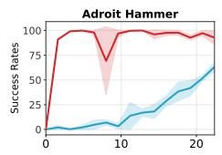

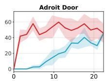

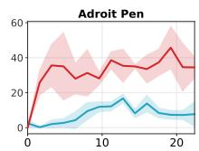

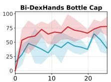

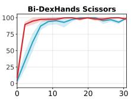

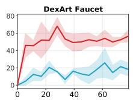

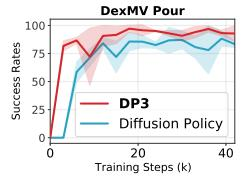

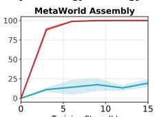

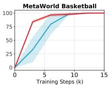

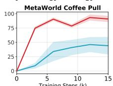

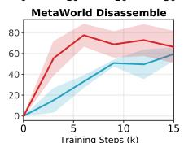

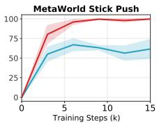

Fig. 5: Learning efficiency. We sample 12 simulation tasks and show the learning curves of DP3 and Diffusion Policy. DP3 demonstrates a rapid convergence towards high accuracy. In contrast, Diffusion Policy exhibits a slower learning progress and achieves notably lower convergence in most tasks.  
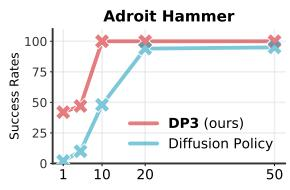

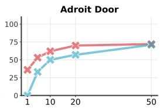

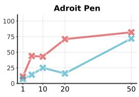

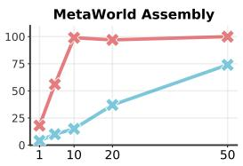

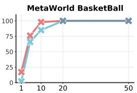

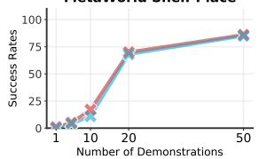

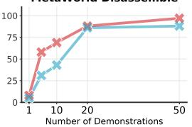

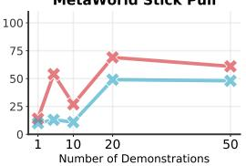

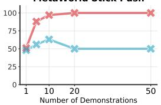

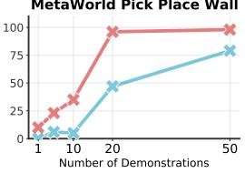  
Fig. 6: Efficient scaling with demonstrations. We sample 10 simulation tasks and train DP3 and Diffusion Policy with an increasing number of demonstrations. DP3 addresses all these tasks well and generally improves the accuracy with more demonstrations. Diffusion Policy also scales well on some tasks while still falling short of accuracy.

Choice of 3D representations. In DP3, we deliberately select point clouds to represent the 3D scene. To compare different choices of 3D representations, we implement other 3D representations, including RGB-D, depth, and voxel. We also compare with oracle states, which include object states, target goals, and robot velocity besides robot poses. The RGB-D and depth images are processed using the same image encoder as Diffusion Policy, while voxel representations employ the VoxelCNN, as implemented in [7]. As demonstrated in Table IV, these alternative 3D representations fall short of DP3. We note that RGB-D and depth images are close and not comparable to point clouds, indicating that the proper usage of depth information is essential. Additionally, we observe that point clouds and oracle states are very competitive, showing that point clouds might help learn an optimal policy from demonstrations.

TABLE IV: Ablation on 3D representations. We replace the visual observation and the corresponding encoder in DP3 to evaluate different 3D representations.

<table><tr><td>Repr.</td><td>H</td><td>D</td><td>P</td><td>A</td><td>DA</td><td>SP</td><td>Average</td></tr><tr><td>Oracle State</td><td>99±2</td><td>61±2</td><td>44±3</td><td>94±1</td><td>72±7</td><td>91±8</td><td>76.8</td></tr><tr><td>Point cloud</td><td>100±0</td><td>62±4</td><td>43±6</td><td>99±1</td><td>69±4</td><td>97±4</td><td>78.3</td></tr><tr><td>Image</td><td>48±17</td><td>50±5</td><td>25±4</td><td>15±1</td><td>43±7</td><td>63±3</td><td>40.7</td></tr><tr><td>Depth</td><td>39±15</td><td>49±1</td><td>12±3</td><td>15±4</td><td>15±2</td><td>62±3</td><td>32.0</td></tr><tr><td>RGB-D</td><td>57±14</td><td>47±5</td><td>14±2</td><td>15±3</td><td>14±1</td><td>61±3</td><td>34.7</td></tr><tr><td>Voxel</td><td>54±5</td><td>33±3</td><td>18±2</td><td>10±2</td><td>17±1</td><td>62±6</td><td>32.3</td></tr></table>

Choice of point cloud encoders. We compare DP3 Encoder with other widely used point encoders, including

PointNet [42], PointNet++ [43], PointNeXt [46], and Point Transformer [84]. We also include the pre-trained models of PointNet++ and PointNeXt. Surprisingly, we find that none of these complex models and the pre-trained ones are competitive to DP3 Encoder, as shown in Table V.

TABLE V: Ablation on point cloud encoders. We replace DP3 Encoder with other widely used encoders, including PointNet [42], PointNet++ [43], PointNeXt [46], and Point Transformer [84]. We also include the pre-trained encoders.

<table><tr><td>Encoders</td><td>H</td><td>D</td><td>P</td><td>A</td><td>DA</td><td>SP</td><td>Average</td></tr><tr><td>DP3 Encoder</td><td> $100 \pm 0$ </td><td> $62 \pm 4$ </td><td> $43 \pm 6$ </td><td> $99 \pm 1$ </td><td> $69 \pm 4$ </td><td> $97 \pm 4$ </td><td>78.3</td></tr><tr><td>PointNet</td><td> $46 \pm 8$ </td><td> $34 \pm 8$ </td><td> $14 \pm 4$ </td><td> $0 \pm 0$ </td><td> $0 \pm 0$ </td><td> $0 \pm 0$ </td><td>15.7</td></tr><tr><td>PointNet++</td><td> $0 \pm 0$ </td><td> $0 \pm 0$ </td><td> $13 \pm 3$ </td><td> $0 \pm 0$ </td><td> $0 \pm 0$ </td><td> $0 \pm 0$ </td><td>2.2</td></tr><tr><td>PointNeXt</td><td> $0 \pm 0$ </td><td> $0 \pm 0$ </td><td> $14 \pm 3$ </td><td> $0 \pm 0$ </td><td> $0 \pm 0$ </td><td> $0 \pm 0$ </td><td>2.3</td></tr><tr><td>Point Transformer</td><td> $0 \pm 0$ </td><td> $0 \pm 0$ </td><td> $6 \pm 5$ </td><td> $0 \pm 0$ </td><td> $0 \pm 0$ </td><td> $0 \pm 0$ </td><td>1.0</td></tr><tr><td>PointNet++ (pre-trained)</td><td> $5 \pm 9$ </td><td> $19 \pm 12$ </td><td> $17 \pm 6$ </td><td> $0 \pm 0$ </td><td> $0 \pm 0$ </td><td> $0 \pm 0$ </td><td>6.8</td></tr><tr><td>PointNeXt (pre-trained)</td><td> $0 \pm 0$ </td><td> $36 \pm 13$ </td><td> $17 \pm 6$ </td><td> $0 \pm 0$ </td><td> $0 \pm 0$ </td><td> $0 \pm 0$ </td><td>8.8</td></tr></table>

Gradually modifying a PointNet. To elucidate the performance disparity between DP3 Encoder and a commonly used point cloud encoder, e.g., PointNet, we gradually modify a PointNet to make it aligned with a DP3 Encoder. Through extensive experiments shown in Table VI, we identify that the T-Net and BatchNorm layers in PointNet are primary inhibitors to its efficiency. By omitting these two elements, PointNet attains an average success rate of 72.3, competitive to 78.3 achieved by our DP3 Encoder.One plausible explanation for the T-Net is that our control tasks use the fixed camera and do not require feature transformations from the T-Net. Further replacing high-dimensional features with a lower-dimensional one would not hurt the performance much $( 7 2 . 5 \  \ 7 2 . 3 )$ but increase the speed. We would explore the reason for the failures of other encoders in the future.

TABLE VI: Gradually modifying a PointNet to a DP3- style encoder. Conv: use convolutional layers or linear layers. w/ T-Net: with or without T-Net. w/ BN: with or without BacthNorm layers. 1024 Dim: set feature dimensions before the projection layer to be 1024 or 256. Average success rates for 6 ablation tasks are reported.

<table><tr><td>Encoders</td><td>Conv</td><td>w/ T-Net</td><td>w/ BN</td><td>1024 Dim</td><td>Average</td></tr><tr><td rowspan="5">PointNet</td><td>✓</td><td>✓</td><td>✓</td><td>✓</td><td>15.7</td></tr><tr><td>✗</td><td>✓</td><td>✓</td><td>✓</td><td>15.7</td></tr><tr><td>✓</td><td>✗</td><td>✓</td><td>✓</td><td>16.0</td></tr><tr><td>✗</td><td>✗</td><td>✓</td><td>✓</td><td>26.0</td></tr><tr><td>✗</td><td>✓</td><td>✓</td><td>✗</td><td>18.2</td></tr><tr><td rowspan="4">Turnaroud!</td><td>✓</td><td>✗</td><td>✗</td><td>✓</td><td>72.5</td></tr><tr><td>✗</td><td>✗</td><td>✓</td><td>✗</td><td>19.8</td></tr><tr><td>✗</td><td>✓</td><td>✗</td><td>✗</td><td>26.8</td></tr><tr><td>✗</td><td>✗</td><td>✗</td><td>✗</td><td>72.3</td></tr></table>

Design choices in DP3. Besides the 3D representations, the effectiveness of DP3 is contributed by several small design choices, as shown in Table VII. (a) Cropping point clouds helps largely improve accuracy; (b) Incorporating LayerNorm layers could help stabilize training across different tasks [22, 4]; (c) Sample prediction in the noise sampler brings faster convergence, also shown in Figure 7; (d) The projection head in DP3 Encoder accelerates the inference by projecting features to the lower dimension, without hurting accuracy; (e) Removing color channels ensures robust appearance generalization; (f) In low-dimensional control tasks, DPM-solver++ [32] as the noise sampler is competitive to DDIM, while DPMsolver++ could not handle high-dimensional control tasks well.

TABLE VII: Ablation on design choices in DP3. Most of the design choices would not affect the accuracy but bring other benefits such as appearance generalization by removing color.

<table><tr><td>Designs</td><td>H</td><td>D</td><td>P</td><td>A</td><td>DA</td><td>SP</td><td>Average</td></tr><tr><td>DP3</td><td> $100 \pm 0$ </td><td> $62 \pm 4$ </td><td> $43 \pm 6$ </td><td> $99 \pm 1$ </td><td> $69 \pm 4$ </td><td> $97 \pm 4$ </td><td>78.3</td></tr><tr><td>w/o cropping</td><td> $98 \pm 1$ </td><td> $69 \pm 3$ </td><td> $14 \pm 1$ </td><td> $19 \pm 9$ </td><td> $32 \pm 6$ </td><td> $40 \pm 2$ </td><td>45.3</td></tr><tr><td>w/o LayerNorm</td><td> $100 \pm 0$ </td><td> $56 \pm 4$ </td><td> $44 \pm 3$ </td><td> $96 \pm 2$ </td><td> $51 \pm 3$ </td><td> $91 \pm 5$ </td><td>73.0</td></tr><tr><td>w/o sample pred</td><td> $68 \pm 3$ </td><td> $67 \pm 8$ </td><td> $37 \pm 12$ </td><td> $96 \pm 2$ </td><td> $58 \pm 9$ </td><td> $76 \pm 9$ </td><td>67.0</td></tr><tr><td>w/o projection</td><td> $100 \pm 0$ </td><td> $61 \pm 2$ </td><td> $47 \pm 3$ </td><td> $99 \pm 1$ </td><td> $60 \pm 8$ </td><td> $99 \pm 2$ </td><td>77.7</td></tr><tr><td>w/ color</td><td> $100 \pm 1$ </td><td> $67 \pm 3$ </td><td> $46 \pm 4$ </td><td> $76 \pm 8$ </td><td> $75 \pm 5$ </td><td> $68 \pm 3$ </td><td>72.0</td></tr><tr><td>DDIM→DPM-solver++</td><td> $12 \pm 4$ </td><td> $9 \pm 5$ </td><td> $26 \pm 5$ </td><td> $93 \pm 3$ </td><td> $58 \pm 6$ </td><td> $92 \pm 14$ </td><td>48.3</td></tr></table>

## V. REAL WORLD EXPERIMENTS

## A. Experiment Setup

Real robot benchmark. DP3 is evaluated across 4 tasks on 2 different robots, including an Allegro hand and a gripper. We use one RealSense L515 camera to obtain real-world visual observations. All the tasks are visualized in Figure 10 and summarized in Table III. Our real-world setup and everyday objects used in our tasks are shown in Figure 8. We now briefly describe our tasks:

1) Roll-Up. The Allegro hand wraps the plasticine multiple times to make a roll-up.

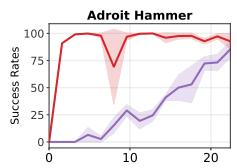

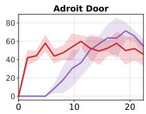

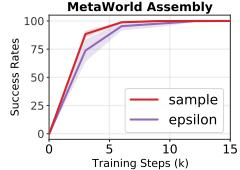

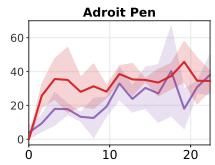

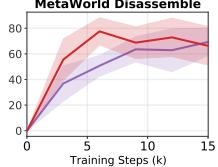

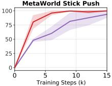  
Fig. 7: Learning curves of DP3 with sample prediction and epsilon prediction. With sample prediction, DP3 generally converges faster, while epsilon prediction is also competitive.

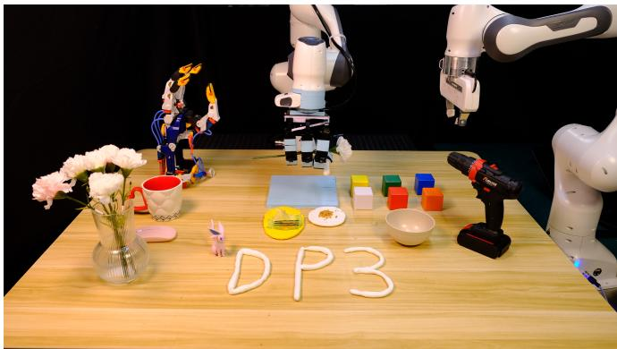

(a) Robots and objects used in DP3.  
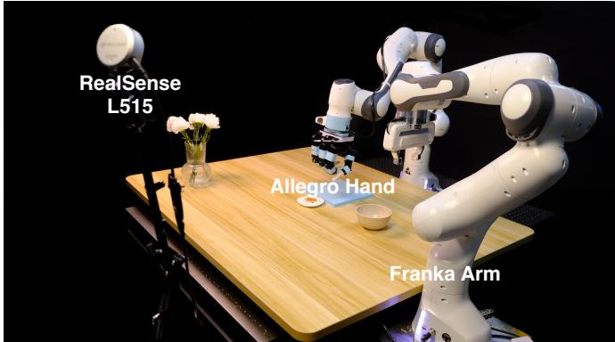  
(b) Real-world experiment setup.  
Fig. 8: (a) Our robots and objects. (b) Our real-world experiment setup. We use an Allegro hand and a gripper based on Franka arms and include diverse everyday objects in our manipulation tasks. A RealSense L515 camera is applied to capture visual observations.

2) Dumpling. The Allegro hand first wraps the plasticine and then pinchs it to make dumpling pleats.

3) Drill. The Allegro hand grasps the drill up and moves towards the green cube to touch the cube with the drill.

4) Pour. The gripper grasps the bowl, moves towards the plasticine, pours out the dried meat floss in the bowl, and places the bowl on the table.

The randomization in each task is shown in Figure 9. For Roll-Up and Dumpling, the plasticine’s shape and the appearance of the objects placed upon the plasticine are randomized. For Drill and Pour, the variations come from the random positions

of the cube, drill, and bowl.

Notably, our tasks using the multi-finger hand are carefully designed to show its advantage over the parallel gripper: In Roll-Up and Dumpling, robots could wrap plasticine without requiring extra tools, unlike RoboCook [59]; In Drill, the drill in the real world is large and heavy, which is quite difficult for the gripper to grasp.

Expert demonstrations are collected by human teleoperation. The Franka arm and the gripper are teleoperated by the keyboard. The Allegro hand is teleoperated with human hands by vision-based retargeting [48, 17]. Since our tasks contain more than one stage and include complex multifinger robots and deformable objects, making the process of demonstration collection very time-consuming, we only provide 40 demonstrations for each task.

Baselines. Based on our simulation experiments, imagebased and depth-based diffusion policies are still powerful, thus we select them as baselines for real-world experiments. Different vision modalities are visualized in Figure 11.

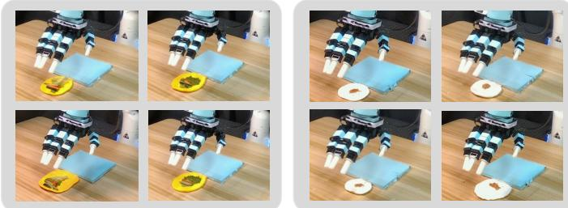  
(a) Roll-Up & Dumpling: randomized shapes and appearances

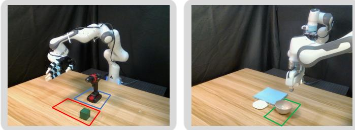  
(b) Drill & Pour: randomized object positions

Fig. 9: Randomization in collected demonstrations for realworld tasks. Roll-Up: The shape of the plasticine and the vegetables on it varies in each trajectory. Dumpling: The shape of the plasticine and the distribution of the meat floss on it are different in each trajectory. Drill: The red and blue rectangles respectively mark the range of positions where the cube and drill can be placed. Pour: The green rectangle marks the range of positions of the bowl.

## B. Effectiveness

Results for our real robot tasks are given in Table VIII. Consistent with our simulation findings, we observe in realworld experiments that DP3 could handle all tasks with high success rates, given only 40 demonstrations. Interestingly, we also observe that while both image-based and depth-based diffusion policies have comparatively low average accuracies, they exhibit distinct strengths in specific tasks. For instance, the image-based diffusion policy excels in the Drill task but fails entirely in Roll-Up. In contrast, the depth-based policy achieves a notable success rate of 40% in Roll-Up.

TABLE VIII: Main results for real robot experiments. Each task is evaluated with 10 trials.

<table><tr><td>Real Robot</td><td>Roll-Up</td><td>Dumpling</td><td>Drill</td><td>Pour</td><td>Average</td></tr><tr><td>Diffusion Policy</td><td>0</td><td>30</td><td>70</td><td>40</td><td>35.0±25.0</td></tr><tr><td>Diffusion Policy (Depth)</td><td>40</td><td>20</td><td>10</td><td>10</td><td>20.0±12.2</td></tr><tr><td>DP3</td><td>90</td><td>70</td><td>80</td><td>100</td><td>85.0±11.2</td></tr></table>

## C. Generalization

Besides the effectiveness in handling all tasks, DP3 show strong generalization abilities in the real world. We categorize the generalization abilities of DP3 into 4 aspects and detail each aspect as follows.

Spatial generalization. As illustrated in our motivating example, DP3 could better extrapolate in 3D space. We demonstrate this property in the real world, as shown in Table IX. We find that baselines fail to generalize to all test positions while DP3 succeed in 4 out of 5 trials.

TABLE IX: Spatial generalization on Pour. We place the bowl at 5 different positions that are unseen in the training data. Each position is evaluated with one trial.

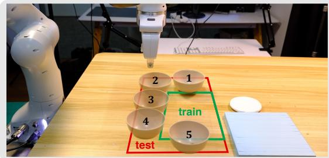

<table><tr><td>Spatial Generalization</td><td>1</td><td>2</td><td>3</td><td>4</td><td>5</td></tr><tr><td>Diffusion Policy</td><td>×</td><td>×</td><td>×</td><td>×</td><td>×</td></tr><tr><td>Diffusion Policy (Depth)</td><td>×</td><td>×</td><td>×</td><td>×</td><td>×</td></tr><tr><td>DP3</td><td>×</td><td>√</td><td>√</td><td>√</td><td>√</td></tr></table>

Appearance generalization. DP3 is designed to process point clouds without color information, inherently enabling it to generalize across various appearances effectively. As demonstrated in Table X, DP3 consistently exhibits successful generalization to cubes of differing colors, while baseline methods could not achieve. It is noteworthy that the depthbased diffusion policy also does not incorporate color as input. However, due to its lower accuracy on the training object, the ability to generalize is also limited.

One solution to improve the appearance generalization abil ity of image-based methods is applying strong data augmentation during training [20, 19], which however could impede the learning process [79, 19]. More importantly, the primary objective of this work is to demonstrate that DP3, even without the aid of any data augmentation, can effectively generalize, thereby underscoring the potential of 3D representations in real robot learning.

Instance generalization. Achieving generalization across diverse instances, which vary in shape, size, and appearance, presents a significantly greater challenge compared to mere appearance generalization. In Table XI, we demonstrate that DP3 effectively manages a wide range of everyday objects. This success can be primarily attributed to the inherent characteristics of point clouds. Specifically, the use of point clouds allows for policies that are less prone to confusion, particularly when these point clouds are downsampled. This feature significantly enhances the model’s ability to adapt to varied instances.

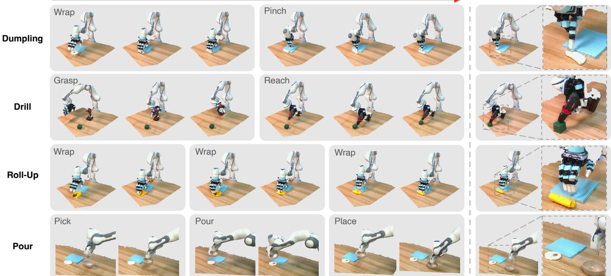  
Fig. 10: Our real robot benchmark consists of 4 challenging tasks. The Allegro hand is required to make a Dumpling, Drill the cube, and make a Roll-Up. The gripper is required to Pour dried meat floss in the bowl. Each task contains multiple stages. We visualize the point clouds of the collected trajectories.

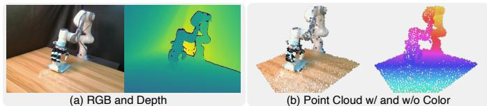  
(a) RGB and Depth  
(b) Point Cloud w/ and w/o Color

Fig. 11: Different vision modalities in the real world, include images, depths, and point clouds.  
TABLE X: Appearance generalization on Drill. Algorithms are trained with the green cube only and evaluated on 5 different colored cubes. Each color is evaluated with one trial.  
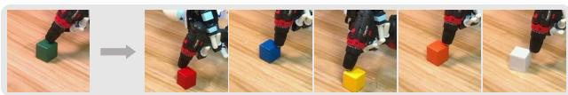

<table><tr><td>Appearance Generalization (■)</td><td>■</td><td>■</td><td>■</td><td>■</td><td>■</td></tr><tr><td>Diffusion Policy</td><td>×</td><td>×</td><td>×</td><td>×</td><td>×</td></tr><tr><td>Diffusion Policy (Depth)</td><td>×</td><td>×</td><td>×</td><td>×</td><td>×</td></tr><tr><td>DP3</td><td>✓</td><td>✓</td><td>✓</td><td>✓</td><td>✓</td></tr></table>

View generalization. Generalizing image-based methods across different views is notably challenging [75], and acquiring training data from multiple views can be time-consuming and costly [82, 58]. We demonstrate in Table XII that DP3

TABLE XI: Instance generalization on Drill. We replace the cube used in Drill with five objects in varied sizes from our daily life. Each instance is evaluated with one trial.

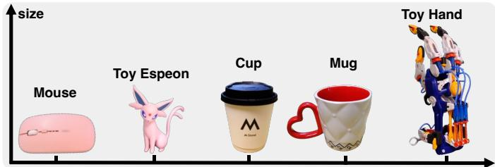

<table><tr><td>Instance Generalization</td><td>Mouse</td><td>Espeon</td><td>Cup</td><td>Mug</td><td>Hand</td></tr><tr><td>Diffusion Policy</td><td>✗</td><td>✗</td><td>✗</td><td>✗</td><td>✓</td></tr><tr><td>Diffusion Policy (Depth)</td><td>✗</td><td>✗</td><td>✓</td><td>✗</td><td>✗</td></tr><tr><td>DP3</td><td>✓</td><td>✓</td><td>✓</td><td>✓</td><td>✓</td></tr></table>

effectively addresses this generalization problem when the camera views are altered slightly. It is important to note that since the camera view is altered, we manually transform the point clouds and adjust the cropped space of the point clouds. Accurate transformation isn’t necessary due to the robustness of our network. However, it is crucial to acknowledge that while the network can generalize across minor variations in camera views, significant changes might be hard to handle.

Cluttered Scenes. Despite the simplicity of the DP3 Encoder, we demonstrate that DP3 is capable of handling tasks in complex real-world cluttered environments. To illustrate this, we design a pick & place task (i.e. pick the cube and place it in the bowl) set in cluttered scenes using a gripper and collect 50 demonstrations for training. The results presented in Table XIII show that DP3 solves the task with a high success rate. Aligning with our simulation experiments, DP3 equipped with PointNeXt fails to address the task. Meanwhile, DP3 using color point clouds as input performs comparably to the original DP3 when picking the training yellow cube, yet it struggles with other colored cubes and diverse objects. This demonstrates the effectiveness and generalization ability of DP3 in complex scenes.

TABLE XII: View generalization on Roll-Up. Each view is evaluated with one trial.  
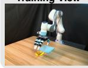

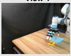

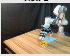

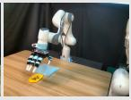

<table><tr><td>View Generalization</td><td>View 1</td><td>View 2</td><td>View 3</td></tr><tr><td>Diffusion Policy</td><td>✗</td><td>✗</td><td>✗</td></tr><tr><td>Diffusion Policy (Depth)</td><td>✗</td><td>✗</td><td>✗</td></tr><tr><td>DP3</td><td>✓</td><td>✓</td><td>✓</td></tr></table>

TABLE XIII: Results in cluttered scenes. Each algorithm is evaluated with 10 trials in the training color. Each out-ofdomain color and object are evaluated with one trial.

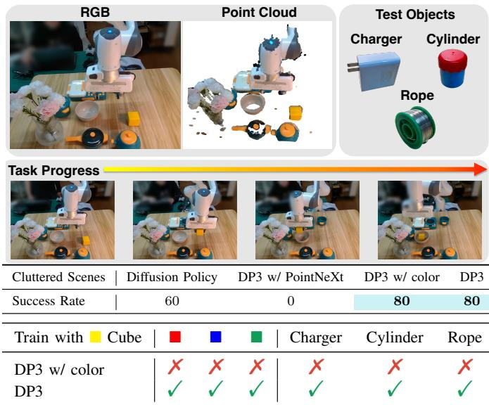

## D. Observation on Deployment Safety

In our real-world experiments, we observe that image-based and depth-based diffusion policies often deliver unpredictable behaviors in real-world experiments, which necessitates human termination to ensure robot safety. We define this situation as safety violation and compute the safety violation rate in our main real-world experiments, shown in Table XIV. Interestingly and surprisingly, we find that DP3 rarely violates the safety, showing that DP3 is a practical and hardware-friendly method for real robot learning. An intuitive explanation is that since the robots operate in 3D space, directly observing 3D information helps avoid collision. It is important to note that our assessment of safety is primarily qualitative. We intend to explore a more theoretical understanding of this observation in our future work.

TABLE XIV: Safety violation rate. While conducting the main real-world experiments, we also count the times of safety violation and compute the rate.

Examples of Safety Violation  
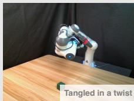


<table><tr><td>Safety Violation Rate ↓</td><td>Roll-Up</td><td>Dumpling</td><td>Drill</td><td>Pour</td><td>Average</td></tr><tr><td>Diffusion Policy</td><td>90</td><td>20</td><td>20</td><td>0</td><td>32.5</td></tr><tr><td>Diffusion Policy (Depth)</td><td>20</td><td>30</td><td>30</td><td>20</td><td>25.0</td></tr><tr><td>DP3</td><td>0</td><td>0</td><td>0</td><td>0</td><td>0.0</td></tr></table>

## VI. CONCLUSION

In this work, we introduce 3D Diffusion Policy (DP3), an efficient visual imitation learning algorithm, adept at managing a wide range of robotic tasks in both simulated and real-world environments with only a small set of demonstrations. The essence of DP3 lies in its integration of carefully designed 3D representations with the expressiveness of diffusion policies. Across 72 simulated tasks, DP3 outperforms its 2D counterpart by a relative margin of 24.2%. In real-world scenarios, DP3 shows high accuracy in executing complex manipulations of deformable objects using the Allegro hand. More importantly, we demonstrate that DP3 possesses robust generalization capabilities across various aspects and causes fewer safety violations in real-world scenarios.

Limitations. Though we have developed an efficient architecture, the optimal 3D representation for control is still yet discovered. Besides, this work does not delve into tasks with extremely long horizons, which remains for future exploration.

## ACKNOWLEDGEMENT

We would like to thank Zhecheng Yuan, Chen Wang, Cheng Lu, and Jianfei Chen for their helpful discussions. This work is supported by National Key R&D Program of China (2022ZD0161700).

## REFERENCES

[1] Ananye Agarwal, Shagun Uppal, Kenneth Shaw, and Deepak Pathak. Dexterous functional grasping. In CoRL, 2023.

[2] Anurag Ajay, Yilun Du, Abhi Gupta, Joshua Tenenbaum, Tommi Jaakkola, and Pulkit Agrawal. Is conditional generative modeling all you need for decision-making? arXiv preprint arXiv:2211.15657, 2022.

[3] Sridhar Pandian Arunachalam, Sneha Silwal, Ben Evans, and Lerrel Pinto. Dexterous imitation made easy: A learning-based framework for efficient dexterous manipulation. In ICRA, 2023.

[4] Jimmy Lei Ba, Jamie Ryan Kiros, and Geoffrey E Hinton. Layer normalization. arXiv, 2016.

[5] Chen Bao, Helin Xu, Yuzhe Qin, and Xiaolong Wang. Dexart: Benchmarking generalizable dexterous manipulation with articulated objects. In CVPR, 2023.

[6] Tao Chen, Jie Xu, and Pulkit Agrawal. A system for general in-hand object re-orientation. In CoRL, 2022.

[7] Tao Chen, Megha Tippur, Siyang Wu, Vikash Kumar, Edward Adelson, and Pulkit Agrawal. Visual dexterity: In-hand reorientation of novel and complex object shapes. Science Robotics, 8(84):eadc9244, 2023. doi: 10.1126/scirobotics.adc9244.

[8] Yuanpei Chen, Tianhao Wu, Shengjie Wang, Xidong Feng, Jiechuan Jiang, Zongqing Lu, Stephen McAleer, Hao Dong, Song-Chun Zhu, and Yaodong Yang. Towards human-level bimanual dexterous manipulation with reinforcement learning. NeurIPS, 2022.

[9] Yuanpei Chen, Chen Wang, Li Fei-Fei, and C Karen Liu. Sequential dexterity: Chaining dexterous policies for long-horizon manipulation. CoRL, 2023.

[10] Cheng Chi, Siyuan Feng, Yilun Du, Zhenjia Xu, Eric Cousineau, Benjamin Burchfiel, and Shuran Song. Diffusion policy: Visuomotor policy learning via action diffusion. RSS, 2023.

[11] Pete Florence, Corey Lynch, Andy Zeng, Oscar A Ramirez, Ayzaan Wahid, Laura Downs, Adrian Wong, Johnny Lee, Igor Mordatch, and Jonathan Tompson. Implicit behavioral cloning. In CoRL, 2022.

[12] Zipeng Fu, Tony Z. Zhao, and Chelsea Finn. Mobile aloha: Learning bimanual mobile manipulation with lowcost whole-body teleoperation. In arXiv, 2024.

[13] Theophile Gervet, Zhou Xian, Nikolaos Gkanatsios, and Katerina Fragkiadaki. Act3d: Infinite resolution action detection transformer for robotic manipulation. arXiv preprint arXiv:2306.17817, 2023.

[14] Ankit Goyal, Jie Xu, Yijie Guo, Valts Blukis, Yu-Wei Chao, and Dieter Fox. Rvt: Robotic view transformer for 3d object manipulation. arXiv, 2023.

[15] Huy Ha, Pete Florence, and Shuran Song. Scaling up and distilling down: Language-guided robot skill acquisition. In Conference on Robot Learning. PMLR, 2023.

[16] Siddhant Haldar, Jyothish Pari, Anant Rai, and Lerrel Pinto. Teach a robot to fish: Versatile imitation from one minute of demonstrations. RSS, 2023.

[17] Ankur Handa, Karl Van Wyk, Wei Yang, Jacky Liang, Yu-Wei Chao, Qian Wan, Stan Birchfield, Nathan Ratliff, and Dieter Fox. Dexpilot: Vision-based teleoperation of dexterous robotic hand-arm system. In 2020 IEEE International Conference on Robotics and Automation (ICRA). IEEE, 2020.

[18] Ankur Handa, Arthur Allshire, Viktor Makoviychuk, Aleksei Petrenko, Ritvik Singh, Jingzhou Liu, Denys Makoviichuk, Karl Van Wyk, Alexander Zhurkevich, Balakumar Sundaralingam, et al. Dextreme: Transfer of agile in-hand manipulation from simulation to reality. In ICRA, 2023.

[19] Nicklas Hansen, Hao Su, and Xiaolong Wang. Stabilizing deep q-learning with convnets and vision transformers under data augmentation. Advances in neural information processing systems, 2021.

[20] Nicklas Hansen, Zhecheng Yuan, Yanjie Ze, Tongzhou

Mu, Aravind Rajeswaran, Hao Su, Huazhe Xu, and Xiaolong Wang. On pre-training for visuo-motor control: Revisiting a learning-from-scratch baseline. In International Conference on Machine Learning (ICML), 2022.

[21] Nicklas Hansen, Yixin Lin, Hao Su, Xiaolong Wang, Vikash Kumar, and Aravind Rajeswaran. Modem: Accelerating visual model-based reinforcement learning with demonstrations. In ICLR, 2023.

[22] Nicklas Hansen, Hao Su, and Xiaolong Wang. Td-mpc2: Scalable, robust world models for continuous control. arXiv, 2023.

[23] Jonathan Ho, Ajay Jain, and Pieter Abbeel. Denoising diffusion probabilistic models. NeurIPS, 2020.

[24] Binghao Huang, Yuanpei Chen, Tianyu Wang, Yuzhe Qin, Yaodong Yang, Nikolay Atanasov, and Xiaolong Wang. Dynamic handover: Throw and catch with bimanual hands. CoRL, 2023.

[25] Tao Huang, Guangqi Jiang, Yanjie Ze, and Huazhe Xu. Diffusion reward: Learning rewards via conditional video diffusion. arXiv, 2023.

[26] Zhiao Huang, Yuanming Hu, Tao Du, Siyuan Zhou, Hao Su, Joshua B Tenenbaum, and Chuang Gan. Plasticinelab: A soft-body manipulation benchmark with differentiable physics. arXiv, 2021.

[27] Michael Janner, Yilun Du, Joshua B Tenenbaum, and Sergey Levine. Planning with diffusion for flexible behavior synthesis. arXiv, 2022.

[28] Tsung-Wei Ke, Nikolaos Gkanatsios, and Katerina Fragkiadaki. 3d diffuser actor: Policy diffusion with 3d scene representations. Arxiv, 2024.

[29] Bernhard Kerbl, Georgios Kopanas, Thomas Leimkuhler,¨ and George Drettakis. 3d gaussian splatting for real-time radiance field rendering. ACM Transactions on Graphics, 2023.

[30] Kun Lei, Zhengmao He, Chenhao Lu, Kaizhe Hu, Yang Gao, and Huazhe Xu. Uni-o4: Unifying online and offline deep reinforcement learning with multi-step on-policy optimization. arXiv, 2023.

[31] Sizhe Li, Zhiao Huang, Tao Chen, Tao Du, Hao Su, Joshua B Tenenbaum, and Chuang Gan. Dexdeform: Dexterous deformable object manipulation with human demonstrations and differentiable physics. arXiv, 2023.

[32] Cheng Lu, Yuhao Zhou, Fan Bao, Jianfei Chen, Chongxuan Li, and Jun Zhu. Dpm-solver++: Fast solver for guided sampling of diffusion probabilistic models. arXiv, 2022.

[33] Yecheng Jason Ma, William Liang, Guanzhi Wang, De-An Huang, Osbert Bastani, Dinesh Jayaraman, Yuke Zhu, Linxi Fan, and Anima Anandkumar. Eureka: Humanlevel reward design via coding large language models. arXiv, 2023.

[34] Viktor Makoviychuk, Lukasz Wawrzyniak, Yunrong Guo, Michelle Lu, Kier Storey, Miles Macklin, David Hoeller, Nikita Rudin, Arthur Allshire, Ankur Handa, et al. Isaac gym: High performance gpu-based physics simulation for robot learning. arXiv, 2021.

[35] Ajay Mandlekar, Danfei Xu, Josiah Wong, Soroush Nasiriany, Chen Wang, Rohun Kulkarni, Li Fei-Fei, Silvio Savarese, Yuke Zhu, and Roberto Mart´ın-Mart´ın. What matters in learning from offline human demonstrations for robot manipulation. arXiv, 2021.

[36] Ben Mildenhall, Pratul P Srinivasan, Matthew Tancik, Jonathan T Barron, Ravi Ramamoorthi, and Ren Ng. Nerf: Representing scenes as neural radiance fields for view synthesis. Communications of the ACM, 2021.

[37] Felipe Nuti, Tim Franzmeyer, and Joao F Henriques.˜ Extracting reward functions from diffusion models. arXiv preprint arXiv:2306.01804, 2023.

[38] Jyothish Pari, Nur Muhammad Shafiullah, Sridhar Pandian Arunachalam, and Lerrel Pinto. The surprising effectiveness of representation learning for visual imitation. arXiv preprint arXiv:2112.01511, 2021.

[39] Tim Pearce, Tabish Rashid, Anssi Kanervisto, Dave Bignell, Mingfei Sun, Raluca Georgescu, Sergio Valcarcel Macua, Shan Zheng Tan, Ida Momennejad, Katja Hofmann, et al. Imitating human behaviour with diffusion models. ICLR, 2023.

[40] Xue Bin Peng, Erwin Coumans, Tingnan Zhang, Tsang-Wei Lee, Jie Tan, and Sergey Levine. Learning agile robotic locomotion skills by imitating animals. arXiv, 2020.

[41] Aaditya Prasad, Kevin Lin, Jimmy Wu, Linqi Zhou, and Jeannette Bohg. Consistency policy: Accelerated visuomotor policies via consistency distillation. In Robotics: Science and Systems, 2024.

[42] Charles R Qi, Hao Su, Kaichun Mo, and Leonidas J Guibas. Pointnet: Deep learning on point sets for 3d classification and segmentation. In CVPR, 2017.

[43] Charles Ruizhongtai Qi, Li Yi, Hao Su, and Leonidas J Guibas. Pointnet++: Deep hierarchical feature learning on point sets in a metric space. NeurIPS, 2017.

[44] Haozhi Qi, Ashish Kumar, Roberto Calandra, Yi Ma, and Jitendra Malik. In-hand object rotation via rapid motor adaptation. In CoRL, 2023.

[45] Haozhi Qi, Brent Yi, Sudharshan Suresh, Mike Lambeta, Yi Ma, Roberto Calandra, and Jitendra Malik. General in-hand object rotation with vision and touch. In CoRL, 2023.

[46] Guocheng Qian, Yuchen Li, Houwen Peng, Jinjie Mai, Hasan Hammoud, Mohamed Elhoseiny, and Bernard Ghanem. Pointnext: Revisiting pointnet++ with improved training and scaling strategies. NeurIPS, 2022.

[47] Yuzhe Qin, Yueh-Hua Wu, Shaowei Liu, Hanwen Jiang, Ruihan Yang, Yang Fu, and Xiaolong Wang. Dexmv: Imitation learning for dexterous manipulation from human videos. In ECCV, 2022.

[48] Yuzhe Qin, Wei Yang, Binghao Huang, Karl Van Wyk, Hao Su, Xiaolong Wang, Yu-Wei Chao, and Dietor Fox. Anyteleop: A general vision-based dexterous robot arm-hand teleoperation system. arXiv preprint arXiv:2307.04577, 2023.

[49] Aravind Rajeswaran, Vikash Kumar, Abhishek Gupta,

Giulia Vezzani, John Schulman, Emanuel Todorov, and Sergey Levine. Learning complex dexterous manipulation with deep reinforcement learning and demonstrations. arXiv, 2017.

[50] Moritz Reuss, Maximilian Li, Xiaogang Jia, and Rudolf Lioutikov. Goal-conditioned imitation learning using score-based diffusion policies. arXiv preprint arXiv:2304.02532, 2023.

[51] Robin Rombach, Andreas Blattmann, Dominik Lorenz, Patrick Esser, and Bjorn Ommer. High-resolution image¨ synthesis with latent diffusion models. In Proceedings of the IEEE/CVF conference on computer vision and pattern recognition, 2022.

[52] Kallol Saha, Vishal Mandadi, Jayaram Reddy, Ajit Srikanth, Aditya Agarwal, Bipasha Sen, Arun Singh, and Madhava Krishna. Edmp: Ensemble-of-costs-guided diffusion for motion planning. arXiv, 2023.

[53] John Schulman, Filip Wolski, Prafulla Dhariwal, Alec Radford, and Oleg Klimov. Proximal policy optimization algorithms. arXiv preprint arXiv:1707.06347, 2017.

[54] Mingyo Seo, Steve Han, Kyutae Sim, Seung Hyeon Bang, Carlos Gonzalez, Luis Sentis, and Yuke Zhu. Deep imitation learning for humanoid loco-manipulation through human teleoperation. Humanoids, 2023.

[55] Younggyo Seo, Danijar Hafner, Hao Liu, Fangchen Liu, Stephen James, Kimin Lee, and Pieter Abbeel. Masked world models for visual control. In CoRL, 2023.

[56] Nur Muhammad Shafiullah, Zichen Cui, Ariuntuya Arty Altanzaya, and Lerrel Pinto. Behavior transformers: Cloning k modes with one stone. Advances in neural information processing systems, 2022.

[57] Nur Muhammad Mahi Shafiullah, Anant Rai, Haritheja Etukuru, Yiqian Liu, Ishan Misra, Soumith Chintala, and Lerrel Pinto. On bringing robots home. arXiv, 2023.

[58] William Shen, Ge Yang, Alan Yu, Jansen Wong, Leslie Pack Kaelbling, and Phillip Isola. Distilled feature fields enable few-shot language-guided manipulation. arXiv preprint arXiv:2308.07931, 2023.

[59] Haochen Shi, Huazhe Xu, Samuel Clarke, Yunzhu Li, and Jiajun Wu. Robocook: Long-horizon elasto-plastic object manipulation with diverse tools. Proceedings of the 7th Conference on Robot Learning (CoRL), 2023.

[60] Mohit Shridhar, Lucas Manuelli, and Dieter Fox. Perceiver-actor: A multi-task transformer for robotic manipulation. In CoRL, 2023.

[61] Anthony Simeonov, Ankit Goyal, Lucas Manuelli, Lin Yen-Chen, Alina Sarmiento, Alberto Rodriguez, Pulkit Agrawal, and Dieter Fox. Shelving, stacking, hanging: Relational pose diffusion for multi-modal rearrangement. arXiv preprint arXiv:2307.04751, 2023.

[62] Jiaming Song, Chenlin Meng, and Stefano Ermon. Denoising diffusion implicit models. ICLR, 2021.

[63] Yang Song, Jascha Sohl-Dickstein, Diederik P Kingma, Abhishek Kumar, Stefano Ermon, and Ben Poole. Scorebased generative modeling through stochastic differential equations. ICLR, 2021.

[64] Kaustubh Sridhar, Souradeep Dutta, Dinesh Jayaraman, James Weimer, and Insup Lee. Memory-consistent neural networks for imitation learning. In The Twelfth International Conference on Learning Representations, 2024. URL https://openreview.net/forum?id=R3Tf7LDdX4.

[65] Emanuel Todorov, Tom Erez, and Yuval Tassa. Mujoco: A physics engine for model-based control. In IROS, 2012.

[66] Julen Urain, Niklas Funk, Jan Peters, and Georgia Chalvatzaki. Se (3)-diffusionfields: Learning smooth cost functions for joint grasp and motion optimization through diffusion. In 2023 IEEE International Conference on Robotics and Automation (ICRA). IEEE, 2023.

[67] Che Wang, Xufang Luo, Keith Ross, and Dongsheng Li. Vrl3: A data-driven framework for visual deep reinforcement learning. Advances in Neural Information Processing Systems, 2022.

[68] Chen Wang, Linxi Fan, Jiankai Sun, Ruohan Zhang, Li Fei-Fei, Danfei Xu, Yuke Zhu, and Anima Anandkumar. Mimicplay: Long-horizon imitation learning by watching human play. CoRL, 2023.

[69] Chen Wang, Haochen Shi, Weizhuo Wang, Ruohan Zhang, Li Fei-Fei, and C Karen Liu. Dexcap: Scalable and portable mocap data collection system for dexterous manipulation. arXiv preprint arXiv:2403.07788, 2024.

[70] Zhendong Wang, Jonathan J Hunt, and Mingyuan Zhou. Diffusion policies as an expressive policy class for offline reinforcement learning. ICLR, 2023.

[71] Tianhao Wu, Mingdong Wu, Jiyao Zhang, Yunchong Gan, and Hao Dong. Learning score-based grasping primitive for human-assisting dexterous grasping. In NeurIPS, 2023.

[72] Zhou Xian, Nikolaos Gkanatsios, Theophile Gervet, Tsung-Wei Ke, and Katerina Fragkiadaki. Chaineddiffuser: Unifying trajectory diffusion and keypose prediction for robotic manipulation. In CoRL, 2023.

[73] Fanbo Xiang, Yuzhe Qin, Kaichun Mo, Yikuan Xia, Hao Zhu, Fangchen Liu, Minghua Liu, Hanxiao Jiang, Yifu Yuan, He Wang, et al. Sapien: A simulated part-based interactive environment. In CVPR, 2020.

[74] Ge Yan, Yueh-Hua Wu, and Xiaolong Wang. NeRFuser: Diffusion guided multi-task 3d policy learning, 2024. URL https://openreview.net/forum?id=8GmPLkO0oR.

[75] Sizhe Yang, Yanjie Ze, and Huazhe Xu. Movie: Visual model-based policy adaptation for view generalization. Annual Conference on Neural Information Processing Systems (NeurIPS), 2023.

[76] Zhao-Heng Yin, Binghao Huang, Yuzhe Qin, Qifeng Chen, and Xiaolong Wang. Rotating without seeing: Towards in-hand dexterity through touch. RSS, 2023.

[77] Tianhe Yu, Deirdre Quillen, Zhanpeng He, Ryan Julian, Karol Hausman, Chelsea Finn, and Sergey Levine. Metaworld: A benchmark and evaluation for multi-task and meta reinforcement learning. In CoRL, 2020.

[78] Ying Yuan, Haichuan Che, Yuzhe Qin, Binghao Huang, Zhao-Heng Yin, Kang-Won Lee, Yi Wu, Soo-Chul Lim,

and Xiaolong Wang. Robot synesthesia: In-hand manipulation with visuotactile sensing. arXiv, 2023.

[79] Zhecheng Yuan, Zhengrong Xue, Bo Yuan, Xueqian Wang, Yi Wu, Yang Gao, and Huazhe Xu. Pre-trained image encoder for generalizable visual reinforcement learning. Advances in Neural Information Processing Systems, 2022.

[80] Yanjie Ze, Nicklas Hansen, Yinbo Chen, Mohit Jain, and Xiaolong Wang. Visual reinforcement learning with self-supervised 3d representations. IEEE Robotics and Automation Letters, 2023.

[81] Yanjie Ze, Yuyao Liu, Ruizhe Shi, Jiaxin Qin, Zhecheng Yuan, Jiashun Wang, and Huazhe Xu. H-index: Visual reinforcement learning with hand-informed representations for dexterous manipulation. In Annual Conference on Neural Information Processing Systems (NeurIPS), 2023.

[82] Yanjie Ze, Ge Yan, Yueh-Hua Wu, Annabella Macaluso, Yuying Ge, Jianglong Ye, Nicklas Hansen, Li Erran Li, and Xiaolong Wang. Gnfactor: Multi-task real robot learning with generalizable neural feature fields. Proceedings of the 7th Conference on Robot Learning (CoRL), 2023.

[83] Gu Zhang, Hao-Shu Fang, Hongjie Fang, and Cewu Lu. Flexible handover with real-time robust dynamic grasp trajectory generation. In 2023 IEEE/RSJ International Conference on Intelligent Robots and Systems (IROS), 2023.

[84] Hengshuang Zhao, Li Jiang, Jiaya Jia, Philip HS Torr, and Vladlen Koltun. Point transformer. In ICCV, 2021.

[85] Yuke Zhu, Josiah Wong, Ajay Mandlekar, Roberto Mart´ın-Mart´ın, Abhishek Joshi, Soroush Nasiriany, and Yifeng Zhu. robosuite: A modular simulation framework and benchmark for robot learning. arXiv preprint arXiv:2009.12293, 2020.

## A. Implementation Details

DP3 mainly consists of two parts: perception and decision. We now detail the implementation details of each part as follows. The official implementation of DP3 is available on https://github.com/YanjieZe/3D-Diffusion-Policy.

Perception. The input of DP3 includes the visual observation and the robot pose. The visual observation is a point cloud without colors, downsampled from the raw point cloud using Farthest Point Sampling (FPS). We use 512 or 1024 in all the simulated and real-world tasks. DP3 encodes the point cloud into a compact representation with our designed DP3 Encoder. We provide a simple PyTorch implementation of our DP3 Encoder as follows:

```python
class DP3Encoder(nn.Module):
    def __init__(self, channels=3):
        # We only use xyz (channels=3) in this work
        # while our encoder also works for xyzrgb (channels=6) in our experiments
        self.mlp = nn.Sequential(
            nn.Linear(channels, 64), nn.LayerNorm(64), nn.ReLU(),
            nn.Linear(64, 128), nn.LayerNorm(128), nn.ReLU(),
            nn.Linear(128, 256), nn.LayerNorm(256), nn.ReLU())
        self.projection = nn.Sequential(nn.Linear(256, 64), nn.LayerNorm(64))

    def forward(self, x):
        # x: B, N, 3
        x = self.mlp(x) # B, N, 256
        x = torch.max(x, 1)[0] # B, 256
        x = self.projection(x) # B, 64
        return x
```

The robot poses are also processed by an MLP network described as follows:

```python
# DimRobo is the dimension of the robot poses.
Sequential(
  (0): Linear(in_features=DimRobo, out_features=64, bias=True)
  (1): ReLU()
  (2): Linear(in_features=64, out_features=64, bias=True))
```

The representations encoded from point clouds and robot poses are concatenated into one representation of dimension 128. Afterward, the decision backbone generates actions conditioning on this representation.

Decision. The decision backbone is a convolutional network-based diffusion policy, which transforms random Gaussian noise into a coherent sequence of actions. For implementation, we utilize the official PyTorch framework available from [10]. In practice, the model is designed to predict a series of H actions based on $N _ { o b s }$ <sub>s</sub> observed timesteps, but it will only execute the last $N _ { a c t }$ actions during inference. We se $H = 4 , N _ { o b s } = 2 , N _ { a c t } = 3$ for DP3 and diffusion-based baselines.

The original Diffusion Policy typically employs a longer horizon, primarily due to the denser nature of the timesteps in their tasks. In Table XV, we show that there is no significant difference between a short horizon and a long horizon for our tasks. Moreover, considering the potential for sudden disruptions in real-world robotic operations, we choose to employ a shorter horizon.

Normalization. We scale the min and max of each action dimension and each observation dimension to [−1, 1] independently. Normalizing the actions to [−1, 1] is a must for the prediction of DDPM and DDIM since they would clip the prediction to [−1, 1] for stability.

## B. Task Suite

Simulated tasks. We collect diverse simulated tasks to systematically evaluate imitation learning algorithms. Our collected tasks mainly focus on robotic manipulation, including Adroit [49], Bi-DexHands [8], DexArt [5], DexDeform [31], DexMV [47], HORA [44], and MetaWorld [77]. The full task names could be seen in Table XVIII. We add the support for 3D modality in these tasks when the 3D modality is not available originally.

Real-world tasks. The episode length for our real-world tasks is not fixed. Average episode lengths for demonstrations of each task are listed as follows: (1) 79.9 for Roll-Up; (2) 113.5 for Dumpling; (3) 71.4 for Drill; and (4) 83.6 for Pour. During the evaluation of the policy, we stop the robot when we find (1) the policy finishes the task; (2) the policy can not successfully handle the task; and (3) the policy makes behaviors that are harmful to the hardware. Our real-world setup and everyday objects used in our tasks are shown in Figure 8. The randomization in each task is shown in Figure 9. For Roll-Up and Dumpling, the plasticine’s shape and the appearance of the objects placed upon the plasticine are randomized. For Drill and Pour, the variations come from the random positions of the cube, drill, and bowl.

## C. More Simulation Experiments

Simulation results for each task. We give the simulation results for each task in Table XVIII, which is supplementary to Table I in our main paper. We report average success rates across 3 seeds. For HORA, we report the normalized returns since this task is doing in-hand rotation and is not measured by success rates.

Success rates for experts. In our simulated tasks, we apply Reinforcement Learning (RL)-trained agents to generate demonstrations. These expert policies are rigorously evaluated over 200 episodes, and their success rates are detailed in Table XIX. For MetaWorld tasks, we present results from scripted policies.

Choice of prediction horizon. DP3 applies a short action prediction and execution horizon $H = 4 , N _ { a c t } = 3$ , and so does the baseline Diffusion Policy. This is mainly designed for the generality of DP3 in complex tasks and real robot tasks, where the environment would be changed by human intervention and the policy needs to switch action immediately. As shown in Table XV, a shortened prediction horizon is competitive with a longer one.

TABLE XV: Ablation on prediction horizon. In this work, DP3 and Diffusion Policy uses a prediction horizon $H = 4 , N _ { a c t } =$ 3. We test $H = 1 6 , N _ { a c t } = 8$ originally used in [10] for both methods.

<table><tr><td>Algorithm</td><td>H</td><td>D</td><td>P</td><td>A</td><td>DA</td><td>SP</td><td>Average</td></tr><tr><td>DP3</td><td> $100 \pm 0$ </td><td> $62 \pm 4$ </td><td> $43 \pm 6$ </td><td> $99 \pm 1$ </td><td> $69 \pm 4$ </td><td> $97 \pm 4$ </td><td>78.3</td></tr><tr><td>w/ long horizon</td><td> $100 \pm 0$ </td><td> $64 \pm 5$ </td><td> $46 \pm 3$ </td><td> $99 \pm 1$ </td><td> $75 \pm 3$ </td><td> $85 \pm 14$ </td><td>78.2</td></tr><tr><td>Diffusion Policy</td><td> $48 \pm 17$ </td><td> $50 \pm 5$ </td><td> $25 \pm 4$ </td><td> $15 \pm 1$ </td><td> $43 \pm 7$ </td><td> $63 \pm 3$ </td><td>40.7</td></tr><tr><td>w/ long horizon</td><td> $68 \pm 11$ </td><td> $44 \pm 4$ </td><td> $16 \pm 2$ </td><td> $12 \pm 3$ </td><td> $14 \pm 1$ </td><td> $44 \pm 5$ </td><td>33.0</td></tr></table>

## D. Simple DP3

To enhance the applicability of DP3 in real-world robot learning, we simplify the policy backbone of DP3, which is identified as one critical factor that impacts inference speed. The refined version, dubbed Simple DP3, offers 2x inference speed while maintaining high accuracy, as shown in Table XVI. The efficiency stems from removing the redundant components in the UNet backbone. The implementation of Simple DP3 is available on https://github. com/YanjieZe/3D-Diffusion-Policy.

Accuracy (Avg Success) Inference Speed (FPS)  


TABLE XVI: Results of Simple DP3. Compared to DP3, Simple DP3 achieves nearly 2x inference speed without losing much accuracy. Full evaluation results are given in Table XVII.

<table><tr><td>Algorithm</td><td>Diffusion Policy</td><td>DP3</td><td>Simple DP3</td></tr><tr><td>Inference Speed (FPS)</td><td>12.3</td><td>12.7</td><td>25.3 (↑ 99%)</td></tr><tr><td>Accuracy (Avg Success)</td><td>44.0</td><td>74.4</td><td>70.2 (↓ 6%)</td></tr></table>

TABLE XVII: Full evaluation results of Simple DP3. We evaluate Simple DP3 on 10 tasks and compare it with DP3 and find that Simple DP3 could achieve results very competitive to DP3.

<table><tr><td rowspan="2">Algorithm \ Task</td><td colspan="3">Adroit</td><td colspan="3">MetaWorld</td><td colspan="4">DexArt</td><td rowspan="2">Average</td></tr><tr><td>Hammer</td><td>Door</td><td>Pen</td><td>Assembly</td><td>Disassemble</td><td>Stick-Push</td><td>Laptop</td><td>Faucet</td><td>Toilet</td><td>Bucket</td></tr><tr><td>DP3</td><td>100±0</td><td>62±4</td><td>43±6</td><td>99±1</td><td>69±4</td><td>97±4</td><td>83±1</td><td>63±2</td><td>82±4</td><td>46±2</td><td>74.4</td></tr><tr><td>Diffusion Policy</td><td>48±17</td><td>50±5</td><td>25±4</td><td>15±1</td><td>43±7</td><td>63±3</td><td>69±4</td><td>23±8</td><td>58±2</td><td>46±1</td><td>44.0</td></tr><tr><td>Simple DP3</td><td>100±0</td><td>58±4</td><td>46±5</td><td>79±1</td><td>50±3</td><td>97±5</td><td>84±2</td><td>63±3</td><td>81±6</td><td>44±6</td><td>70.2</td></tr></table>

TABLE XVIII: Main results on 72 simulation tasks. Results for each task are provided in this table. A summary across domains is shown in Table I.

<table><tr><td rowspan="2">Alg \ Task</td><td colspan="4">Adroit [49]</td><td colspan="9">Bi-DexHands [8]</td></tr><tr><td>Hammer</td><td>Door</td><td>Pen</td><td>Block Stack</td><td>Bottle Cap</td><td>Door Open</td><td>Outward</td><td>Grasp</td><td>And Place</td><td>Hand Over</td><td>Scissors</td><td></td><td></td></tr><tr><td>DP3</td><td>100±0</td><td>62±4</td><td>43±6</td><td>24±15</td><td>83±10</td><td colspan="2">100±0</td><td colspan="2">69±22</td><td>45±8</td><td>100±0</td><td></td><td></td></tr><tr><td>Diffusion Policy</td><td>45±5</td><td>37±2</td><td>13±2</td><td>4±4</td><td>61±5</td><td colspan="2">100±0</td><td colspan="2">65±9</td><td>38±0</td><td>100±0</td><td></td><td></td></tr><tr><td rowspan="2">Alg \ Task</td><td colspan="4">DexArt [5]</td><td colspan="4">DexDeform [31]</td><td colspan="2">DexMV [47]</td><td>HORA [44]</td><td></td><td></td></tr><tr><td>Laptop</td><td>Faucet</td><td>Toilet</td><td>Bucket</td><td>Rope</td><td>Bun</td><td>Dumpling</td><td>Wrap</td><td>Flip</td><td>Folding</td><td>Pour</td><td>Place Inside</td><td>Rotation</td></tr><tr><td>DP3</td><td>83±1</td><td>63±2</td><td>82±4</td><td>46±2</td><td>93±2</td><td>70±9</td><td>92±0</td><td>94±0</td><td>97±1</td><td>81±2</td><td>99±2</td><td>100±0</td><td>71±31</td></tr><tr><td>Diffusion Policy</td><td>69±4</td><td>23±8</td><td>58±2</td><td>46±1</td><td>97±0</td><td>76±4</td><td>92±0</td><td>91±0</td><td>99±0</td><td>88±1</td><td>90±2</td><td>100±0</td><td>49±11</td></tr><tr><td colspan="14">Meta-World [77] (Easy)</td></tr><tr><td>Alg \ Task</td><td>Button Press</td><td colspan="2">Button Press Topdown</td><td colspan="3">Button Press Topdown Wall</td><td colspan="2">Button Press Wall</td><td colspan="2">Coffee Button</td><td colspan="2">Dial Turn</td><td>Door Close</td></tr><tr><td>DP3</td><td>100±0</td><td colspan="2">100±0</td><td colspan="3">99±2</td><td colspan="2">99±1</td><td colspan="2">100±0</td><td colspan="2">66±1</td><td>100±0</td></tr><tr><td>Diffusion Policy</td><td>99±1</td><td colspan="2">98±1</td><td colspan="3">96±3</td><td colspan="2">97±3</td><td colspan="2">99±1</td><td colspan="2">63±10</td><td>100±0</td></tr><tr><td colspan="14">Meta-World (Easy)</td></tr><tr><td>Alg \ Task</td><td>Door Lock</td><td>Door Open</td><td>Door Unlock</td><td>Drawer Close</td><td colspan="2">Drawer Open</td><td colspan="2">Faucet Close</td><td colspan="2">Faucet Open</td><td colspan="2">Handle Press</td><td>Handle Pull</td></tr><tr><td>DP3</td><td>98±2</td><td>99±1</td><td>100±0</td><td>100±0</td><td colspan="2">100±0</td><td colspan="2">100±0</td><td colspan="2">100±0</td><td colspan="2">100±0</td><td>53±11</td></tr><tr><td>Diffusion Policy</td><td>86±8</td><td>98±3</td><td>98±3</td><td>100±0</td><td colspan="2">93±3</td><td colspan="2">100±0</td><td colspan="2">100±0</td><td colspan="2">81±4</td><td>27±22</td></tr><tr><td colspan="14">Meta-World (Easy)</td></tr><tr><td>Alg \ Task</td><td>Handle Press Side</td><td colspan="2">Handle Pull Side</td><td>Lever Pull</td><td colspan="2">Plate Slide</td><td colspan="2">Plate Slide Back</td><td colspan="2">Plate Slide Back Side</td><td colspan="2">Plate Slide Side</td><td>Reach</td></tr><tr><td>DP3</td><td>100±0</td><td colspan="2">85±3</td><td>79±8</td><td colspan="2">100±1</td><td colspan="2">99±0</td><td colspan="2">100±0</td><td colspan="2">100±0</td><td>24±1</td></tr><tr><td>Diffusion Policy</td><td>100±0</td><td colspan="2">23±17</td><td>49±5</td><td colspan="2">83±4</td><td colspan="2">99±0</td><td colspan="2">100±0</td><td colspan="2">100±0</td><td>18±2</td></tr><tr><td colspan="7">Meta-World (Easy)</td><td colspan="7">Meta-World (Medium)</td></tr><tr><td>Alg \ Task</td><td>Reach Wall</td><td>Window Close</td><td>Window Open</td><td colspan="3">Peg Unplug Side</td><td>Basketball</td><td>Bin Picking</td><td colspan="2">Box Close</td><td colspan="2">Coffee Pull</td><td>Coffee Push</td></tr><tr><td>DP3</td><td>68±3</td><td>100±0</td><td>100±0</td><td colspan="3">75±5</td><td>98±2</td><td>34±30</td><td colspan="2">42±3</td><td colspan="2">87±3</td><td>94±3</td></tr><tr><td>Diffusion Policy</td><td>59±7</td><td>100±0</td><td>100±0</td><td colspan="3">74±3</td><td>85±6</td><td>15±4</td><td colspan="2">30±5</td><td colspan="2">34±7</td><td>67±4</td></tr><tr><td colspan="8">Meta-World (Medium)</td><td colspan="6">Meta-World (Hard)</td></tr><tr><td>Alg \ Task</td><td>Hammer</td><td>Peg Insert Side</td><td>Push Wall</td><td>Soccer</td><td>Sweep</td><td>Sweep Into</td><td>Assembly</td><td colspan="2">Hand Insert</td><td colspan="2">Pick Out of Hole</td><td colspan="2">Pick Place</td></tr><tr><td>DP3</td><td>76±4</td><td>69±7</td><td>49±8</td><td>18±3</td><td>96±3</td><td>15±5</td><td>99±1</td><td colspan="2">14±4</td><td colspan="2">14±9</td><td colspan="2">12±4</td></tr><tr><td>Diffusion Policy</td><td>15±6</td><td>34±7</td><td>20±3</td><td>14±4</td><td>18±8</td><td>10±4</td><td>15±1</td><td colspan="2">9±2</td><td colspan="2">0±0</td><td colspan="2">0±0</td></tr><tr><td colspan="4">Meta-World (Hard)</td><td colspan="9">Meta-World (Very Hard)</td><td>Average</td></tr><tr><td>Alg \ Task</td><td>Push</td><td>Push Back</td><td>Shelf Place</td><td colspan="2">Disassemble</td><td>Stick Pull</td><td colspan="2">Stick Push</td><td colspan="5">Pick Place Wall</td></tr><tr><td>DP3</td><td>51±3</td><td>0±0</td><td>17±10</td><td colspan="2">69±4</td><td>27±8</td><td colspan="2">97±4</td><td colspan="4">35±8</td><td>74.4</td></tr><tr><td>Diffusion Policy</td><td>30±3</td><td>0±0</td><td>11±3</td><td colspan="2">43±7</td><td>11±2</td><td colspan="2">63±3</td><td colspan="4">5±1</td><td>59.8</td></tr></table>

TABLE XIX: Success rates of experts on 72 simulation tasks. We evaluate 200 episodes for each task. For MetaWorld tasks, we evaluate both BAC agents and the script policies provided officially in MetaWorld. For DexDeform tasks, the demonstrations are collected by human teleportation [31] and we record the success rates as 100%.

<table><tr><td rowspan="2">Alg \ Task</td><td colspan="4">Adroit [49]</td><td colspan="9">Bi-DexHands [8]</td></tr><tr><td>Hammer</td><td>Door</td><td>Pen</td><td>Block Stack</td><td>Bottle Cap</td><td colspan="3">Door Open Outward</td><td colspan="2">Grasp And Place</td><td>Hand Over</td><td>Scissors</td><td></td></tr><tr><td>Expert</td><td>99.0</td><td>100.0</td><td>97.0</td><td>83.5</td><td>100.0</td><td colspan="3">100.0</td><td colspan="2">100.0</td><td>77.0</td><td>99.5</td><td></td></tr><tr><td rowspan="2">Alg \ Task</td><td colspan="4">DexArt [5]</td><td colspan="5">DexDeform [31]</td><td colspan="2">DexMV [47]</td><td>HORA [44]</td><td></td></tr><tr><td>Laptop</td><td>Faucet</td><td>Toilet</td><td>Bucket</td><td>Rope</td><td>Bun</td><td>Dumpling</td><td>Wrap</td><td>Flip</td><td>Folding</td><td>Pour</td><td>Place Inside</td><td>Rotation</td></tr><tr><td>Expert</td><td>86.5</td><td>58.0</td><td>66.5</td><td>80.0</td><td>100.0</td><td>100.0</td><td>100.0</td><td>100.0</td><td>100.0</td><td>100.0</td><td>88.5</td><td>64.5</td><td>80.5</td></tr><tr><td rowspan="2">Alg \ Task</td><td colspan="13">Meta-World [77] (Easy)</td></tr><tr><td>Button Press</td><td colspan="3">Button Press Topdown</td><td colspan="3">Button Press Topdown Wall</td><td colspan="2">Button Press Wall</td><td colspan="2">Coffee Button</td><td>Dial Turn</td><td>Door Close</td></tr><tr><td>Expert</td><td>100.0</td><td colspan="3">100.0</td><td colspan="3">100.0</td><td colspan="2">98.5</td><td colspan="2">100.0</td><td>100.0</td><td>100.0</td></tr><tr><td rowspan="2">Alg \ Task</td><td colspan="13">Meta-World (Easy)</td></tr><tr><td>Door Lock</td><td>Door Open</td><td>Door Unlock</td><td>Drawer Close</td><td colspan="3">Drawer Open</td><td colspan="2">Faucet Close</td><td colspan="2">Faucet Open</td><td>Handle Press</td><td>Handle Pull</td></tr><tr><td>Expert</td><td>100.0</td><td>98.5</td><td>100.0</td><td>100.0</td><td colspan="3">100.0</td><td colspan="2">100.0</td><td colspan="2">100.0</td><td>100.0</td><td>100.0</td></tr><tr><td rowspan="2">Alg \ Task</td><td colspan="13">Meta-World (Easy)</td></tr><tr><td>Handle Press Side</td><td colspan="2">Handle Pull Side</td><td>Lever Pull</td><td colspan="2">Plate Slide</td><td colspan="2">Plate Slide Back</td><td colspan="2">Plate Slide Back Side</td><td colspan="2">Plate Slide Side</td><td>Reach</td></tr><tr><td>Expert</td><td>100.0</td><td colspan="2">100.0</td><td>98.5</td><td colspan="2">100.0</td><td colspan="2">100.0</td><td colspan="2">100.0</td><td colspan="2">100.0</td><td>100.0</td></tr><tr><td rowspan="2">Alg \ Task</td><td colspan="6">Meta-World (Easy)</td><td colspan="7">Meta-World (Medium)</td></tr><tr><td>Reach Wall</td><td>Window Close</td><td>Window Open</td><td colspan="3">Peg Unplug Side</td><td>Basketball</td><td>Bin Picking</td><td colspan="2">Box Close</td><td colspan="2">Coffee Pull</td><td>Coffee Push</td></tr><tr><td>Expert</td><td>100.0</td><td>100.0</td><td>100.0</td><td colspan="3">99.0</td><td>100.0</td><td>97.0</td><td colspan="2">90.0</td><td colspan="2">100.0</td><td>100.0</td></tr><tr><td rowspan="2">Alg \ Task</td><td colspan="7">Meta-World (Medium)</td><td colspan="6">Meta-World (Hard)</td></tr><tr><td>Hammer</td><td>Peg Insert Side</td><td>Push Wall</td><td>Soccer</td><td>Sweep</td><td>Sweep Into</td><td>Assembly</td><td colspan="2">Hand Insert</td><td colspan="2">Pick Out of Hole</td><td colspan="2">Pick Place</td></tr><tr><td>Expert</td><td>100.0</td><td>92.0</td><td>100.0</td><td>90.5</td><td>100.0</td><td>90.0</td><td>100.0</td><td colspan="2">100.0</td><td colspan="2">100.0</td><td>100.0</td><td>100.0</td></tr><tr><td rowspan="2">Alg \ Task</td><td colspan="2">Meta-World (Hard)</td><td colspan="11">Meta-World (Very Hard)</td></tr><tr><td>Push</td><td>Push Back</td><td>Shelf Place</td><td>Disassemble</td><td colspan="2">Stick Pull</td><td>Stick Push</td><td colspan="6">Pick Place Wall</td></tr><tr><td>Expert</td><td>100.0</td><td>0.0</td><td>99.5</td><td>92.5</td><td colspan="2">95.0</td><td>100.0</td><td colspan="6">99.5</td></tr></table>