# EmbodiSteer: Steering Embodiment-Agnostic Visuomotor Policies with Joint-Space Guidance for Zero-Shot Cross-Embodiment Deployment

Shihefeng Wang∗,1,2,3 Kangchen Lv∗,1,2,3 Mingrui Yu†,1,2,3 Xiang Li†,1,2,3 1Department of Automation, Tsinghua University, 2Beijing Key Laboratory of Embodied Intelligence Systems 3Institute for Embodied Intelligence and Robotics, Tsinghua University ∗Equal contribution. †Corresponding author.

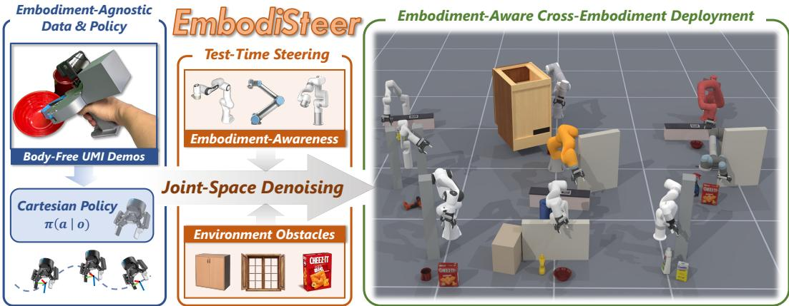  
Figure 1: We present EMBODISTEER, an inference-time steering framework for embodimentaware deployment of embodiment-agnostic visuomotor policies. Given a trained Cartesian policy (left), EmbodiSteer lifts the sampling process into the target robot’s joint space and incorporates robot embodiment and obstacle guidance during denoising (middle), enabling zero-shot whole-body collision-aware execution across diverse robots without finetuning (right).

Abstract: Scalable robot imitation learning relies on large-scale heterogeneous data from diverse robots or body-free data, making Cartesian end-effector actions a key interface for embodiment-agnostic policy learning. However, end-effectoronly abstraction leaves Cartesian policies unaware of the deployed robot body, making them brittle under robot-specific constraints such as whole-body collision avoidance. To overcome this limitation, we present EMBODISTEER, a trainingfree framework that steers embodiment-agnostic visuomotor policies toward zeroshot, embodiment-aware deployment. EMBODISTEER keeps policy learning in Cartesian space while efficiently lifting inference-time diffusion sampling into the target robot’s joint space via forward kinematics and Jacobian-based updates. With whole-body collision-aware guidance over joint trajectories after each denoising step, the arm can be steered away from collisions while preserving learned end-effector behavior. Compared with Cartesian-only execution, EMBODISTEER reduces collision rate by 46.1% and improves task success rate by 28.5% across 9 simulated robots, and further achieves 90.0% collision rate reduction and 36.7% success rate increase on two physical robots in highly constrained scenarios. Our project page is at https://frankwang67.github.io/EmbodiSteer-Page.

Keywords: Cross-Embodiment Deployment, Whole-Body Collision Avoidance

## 1 Introduction

Recent progress in robot imitation learning has been driven by large-scale behavior cloning methods, from diffusion policies [1, 2] to vision-language-action models [3, 4, 5, 6]. One of the key factors behind this scalability is the use of Cartesian end-effector poses as a unified action representation [7], whose dimensionality and semantics are independent of a robot’s degrees of freedom, joint ordering, or link geometry. Consequently, demonstrations from heterogeneous robots, simulators, and bodyfree data collection systems such as UMI [8] can be represented in a shared action space, providing an embodiment-agnostic foundation for cross-embodiment policy learning.

However, the embodiment-agnostic property of Cartesian policies comes with a deploymenttime limitation of body unawareness, which becomes problematic when execution must satisfy embodiment-specific constraints. For example, the entire arm must avoid collisions in cluttered scenes, and predicted end-effector motions may become infeasible near workspace boundaries for a specific robot. Training directly in joint space could introduce embodiment awareness, but joint actions are morphology-specific and unavailable in UMI-style body-free demonstrations, making zero-shot deployment to diverse embodiments difficult without robot-specific finetuning data.

These observations motivate us to revisit the central challenge of cross-embodiment deployment of embodiment-agnostic policies. Existing research on cross-embodiment policy generalization largely treats embodiment differences as shifts in action and state distributions, addressing them through embodiment-specific action decoders [9, 10, 11], reusable low-level action primitives or skills [12, 13, 14], and embodiment-conditioned policy representations [5, 15, 16]. However, these works leave execution-time constraints of the target robot body largely unaddressed, so end-effector motion may transfer across robots while whole-body collisions still cause failures. In this work, we focus on the complementary problem of feasibly and safely executing an embodiment-agnostic policy on different robot arms at inference time. We argue that true cross-embodiment deployment is more than reproducing end-effector behavior across robots, since the policy output must be realized as embodiment-aware joint-space motion that respects the target robot’s whole-body constraints.

To address this problem, we propose EMBODISTEER, a training-free inference framework for embodiment-aware deployment of learned Cartesian policies. The policy remains being trained only with the end-effector actions, thus preserving its compatibility with embodiment-agnostic demonstrations. At inference, EMBODISTEER lifts Cartesian diffusion sampling process into the target robot’s joint space, where embodiment-specific constraints can steer the sampled motion toward collision-free, robot-feasible execution. Concretely, EMBODISTEER maintains a target-robot joint trajectory as the sampling state, but queries the frozen denoiser in its original Cartesian action space via forward kinematics. Each denoised Cartesian target is tracked in joint space with damped Jacobian updates, while CBF-inspired whole-body guidance applies joint corrections that move the robot body away from obstacles without largely disrupting the policy-predicted end-effector motion.

We validate EMBODISTEER by directly deploying trained Cartesian policies across robot embodiments in whole-body collision-aware manipulation scenarios, covering 9 simulated and 2 real robot embodiments. Compared with Cartesian-only execution, EMBODISTEER improves whole-body obstacle avoidance by 46.1% and task success rate by 28.5% in simulation, while consistently outperforming post-processing variants and cost-gradient-based steering baselines. On two physical robots, EMBODISTEER further reduces collisions by 90.0% and improves task success by 36.7% in highly constrained manipulation tasks, without robot-specific finetuning.

Overall, our contributions are summarized as follows:

1. We propose EMBODISTEER, a training-free inference framework that lifts inference-time sampling of embodiment-agnostic Cartesian policies into the target robot’s joint space, enabling zeroshot cross-embodiment deployment while retaining the scalability of Cartesian policy learning.

2. We introduce CBF-inspired whole-body collision-aware guidance for sampled joint trajectories, which uses small corrective joint updates to steer the robot body away from obstacles while leveraging a Jacobian-based task-space cost to preserve the learned end-effector behavior.

3. We design systematic simulation and real-world benchmarks for cross-embodiment deployment, demonstrating that EMBODISTEER achieves zero-shot whole-body collision-aware execution across diverse embodiments while outperforming Cartesian-only execution and other steering baselines.

## 2 Related Work

Cross-Embodiment Policy Learning. Large-scale cross-embodiment pretraining over diverse robot data is central to robot generalist policies, and a common strategy is to unify heterogeneous data in a shared action space. Cartesian end-effector poses are widely adopted for their embodimentagnostic semantics, and also support body-free data collection systems [8, 17, 18]. Beyond directly mixing data from different platforms or aligning coordinate frames for training, prior works have explored several forms of embodiment alignment, such as latent action spaces with embodiment specific decoders [9, 10, 19], reusable action primitives or skill abstractions [12, 13, 14], and embodiment-conditioned policy representations [20, 21, 15, 5]. More recently, ego-centric approaches use human hand motion as a shared intermediate space [22, 23, 24]. However, these works mainly address observation, state, and action distribution shifts across embodiments at the policy-learning level, whereas our work focuses on the inference-time problem of deploying an embodiment-agnostic policy under robot-specific constraints such as whole-body collision safety.

Steering Diffusion Generation with Guidance. Diffusion-based generation in robotics can be steered at inference time without modifying pretrained models, through mechanisms such as noise biasing [25], post-hoc filtering [26, 27], and guided sampling. While classifier-free guidance [28] requires guidance signals during training [29], classifier guidance [30] can leverage inference-time gradients without retraining, and has been widely applied to robotic diffusion generation [31, 32, 33, 34, 35, 36]. For visuomotor policies, DynaGuide [37] uses a learned dynamics model to steer base policies toward complex objectives, and ITPS [38] incorporates real-time user interactions through test-time guidance. Most related to our setting, EADP [39] steers embodiment-agnostic policies for embodiment-aware deployment, but focuses on low-level controller tracking costs for aerial manipulators. We instead target collision-aware whole-body execution for robot arms by lifting Cartesian policies into joint-space sampling and applying collision-aware guidance.

Collision-Aware Visuomotor Policies. Safety-critical robot manipulation in cluttered environments requires explicit collision awareness. Learning-based visuomotor policies can incorporate safety through post-processing mechanisms, such as control barrier functions [40, 41, 42], model predictive filters [43, 44], and risk estimators [45, 27]. For diffusion-based policies, obstacle-related costs can further steer the sampling process toward safer trajectories at inference time [46, 47, 48]. However, most existing safety mechanisms focus on end-effector-level collisions, leaving whole-arm constraints under-modeled. Recent works address robot-body safety by encoding whole-body geometry with point clouds, keypoints, or signed distance fields and learning from collision-free demonstrations [49, 50, 51, 52]. Such representations, however, are often coupled to robot morphologies and require robot-specific training data. In contrast, we use a pretrained embodiment-agnostic policy as the base and introduce whole-body collision constraints during zero-shot inference.

## 3 Preliminaries: Cartesian Diffusion Policy

Imitation learning aims to learn a visuomotor policy π from expert demonstrations, which maps observations such as images and proprioception to actions. Diffusion Policy [1] formulates action generation as a conditional sampling problem with diffusion models. During training, Gaussian noise is added to a clean action sample $a _ { 0 }$ from the dataset according to $A _ { t } = \sqrt { \bar { \alpha } _ { t } } A _ { 0 } + \sqrt { 1 - \bar { \alpha } _ { t } } \epsilon _ { t }$ at diffusion timestep t, where $\bar { \alpha } _ { t }$ denotes noise schedule coefficient and $\epsilon _ { t } \sim \mathcal { N } ( 0 , I )$ . The denoising model is trained to predict the added noise by minimizing $\mathcal { L } = \mathrm { M S E L o s s } ( \epsilon _ { t } , \epsilon _ { \theta } ( A _ { t } , o , t ) )$ ). At inference time, starting from $A _ { T } \sim \mathcal { N } ( 0 , I )$ , the sample is iteratively denoised as

$$
A _ {t - 1} = \frac {1}{\sqrt {\alpha_ {t}}} \left(A _ {t} - \frac {1 - \alpha_ {t}}{\sqrt {1 - \bar {\alpha} _ {t}}} \epsilon_ {\theta} (A _ {t}, o, t)\right) + \sigma_ {t} z, \quad z \sim \mathcal {N} (0, I).\tag{1}
$$

We use Cartesian end-effector poses as the action space for embodiment-agnostic policies, which predict an action chunk $A = [ a _ { 1 } , \dotsc , a _ { H } ]$ over horizon H. Here, each action $a _ { i } = [ \delta p _ { i } , \ r _ { i } ] \in \mathbb { R } ^ { 9 }$ is represented relative to the chunk-start end-effector pose, where $\delta p _ { i } \in \mathbb { R } ^ { 3 }$ and $r _ { i } \in \mathbb { R } ^ { 6 }$ denote the relative translation and 6D rotation representation [53], respectively. Notably, the gripper command is also included in the action but will be omitted for writing brevity in the following sections.

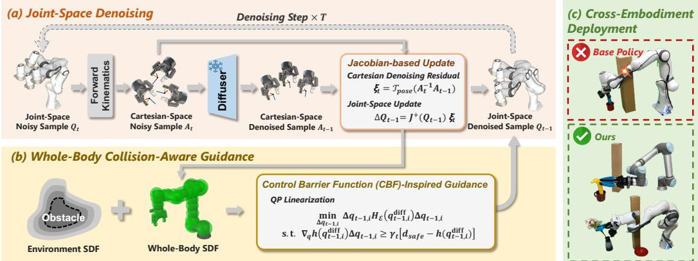  
Figure 2: Overview of EMBODISTEER. (a) A trained Cartesian policy is lifted into the target-robot joint space for inference-time sampling. (b) CBF-inspired guidance steers sampled joint trajectories away from whole-body collisions while preserving end-effector behavior. (c) Visualization of realworld deployment across diverse robot embodiments on constrained manipulation tasks.

## 4 Method

As shown in Fig. 2, the Cartesian end-effector policy is trained on embodiment-agnostic demonstrations and maintained frozen during cross-embodiment inference-time steering. In this section, we first detail our problem formulation of whole-body collision-aware deployment, followed by our proposed joint-space denoising and CBF-inspired whole-body collision-aware guidance mechanism.

## 4.1 Problem Formulation

We consider deploying a frozen embodiment-agnostic Cartesian diffusion policy π on a target robot embodiment E with obstacle information O. The policy generates an end-effector action chunk $A =$ $[ a _ { 1 } , \dotsc , a _ { H } ]$ in Cartesian space, but has no access to the robot’s joint configuration and whole-body collision state during sampling. Therefore, the target-robot joint trajectory $Q = [ q _ { 1 } , \dotsc , q _ { H } ]$ , where $q _ { i } \in \mathbb { R } ^ { D }$ for robot with D controllable arm joints, is required for reasoning about embodimentspecific constraints. The desired whole-body safety condition is

$$
h (q _ {i}) = \mathrm{SDF} (\mathcal {E} (q _ {i}), \mathcal {O}) \geq d _ {\text {safe}}, \quad \forall i = 1, \dots , H,\tag{2}
$$

where positive signed distance indicates clearance, negative values indicate penetration, and $d _ { \mathrm { s a f e } } >$ 0 is the clearance margin.

## 4.2 Joint-Space Denoising with Pretrained Cartesian Diffusion Policy

A straightforward way to lift Cartesian denoising into joint space is to solve inverse kinematics under the target robot E after each denoising step, i.e., $q _ { t , i } = \mathrm { I K } _ { \mathcal { E } } ( a _ { t , i } )$ [36]. However, repeatedly solving IK inside the denoising loop is costly and hinders real-time deployment. Instead, we treat the Cartesian denoising update as a local task-space residual and map it to joint space using the target robot’s Jacobian $J _ { \mathcal { E } } ( \boldsymbol { q } ) \stackrel { - } { \in } \mathbb { R } ^ { 6 \times D }$ . Since adjacent denoising steps typically induce small Cartesian changes, the first-order kinematic relation provides a reliable joint-space update without IK solving at every step. Notably, the damped pseudoinverse Jacobian $J _ { \mathcal { E } } ^ { + } ( \boldsymbol { q } ) = J _ { \mathcal { E } } ( \boldsymbol { q } ) ^ { \top } \big ( J _ { \mathcal { E } } ( \boldsymbol { q } ) J _ { \mathcal { E } } ( \boldsymbol { q } ) ^ { \top } + \lambda _ { \mathrm { p i n v } } I \big ) ^ { - 1 }$ is used here to improve numerical stability and prevent large joint motions near singularities, where $\lambda _ { \mathrm { p i n v } }$ is the damping factor.

Denoising Initialization. We initialize joint-space sampling by drawing Cartesian Gaussian noise $a _ { T , i } \in \mathbb { R } ^ { 9 }$ and locally mapping it around the chunk-start configuration $q ^ { \mathrm { s t a r t } }$

$$
q _ {T, i} = q ^ {\mathrm{start}} + \alpha \cdot \mathrm{clip} \big (J _ {\mathcal {E}} ^ {+} (q ^ {\mathrm{start}}) \xi_ {T, i}, - \Delta q _ {\mathrm{max}}, \Delta q _ {\mathrm{max}} \big), \quad \xi_ {T, i} = \mathcal {T} _ {\mathrm{pose}} (a _ {T, i}).\tag{3}
$$

Algorithm 1: EMBODISTEER: Joint-Space Inference with Whole-Body Collision Guidance
Input: Observation $o$, obstacles $\mathcal{O}$, embodiment $\mathcal{E}$
Output: Joint action chunk $Q_0$
Sample Cartesian noise $a_{T,i}$ and initialize $Q_T = [q_{T,1}, \ldots, q_{T,H}]$ using (3);
for $t = T, \ldots, 1$ do
    // Joint Space Denoising
    Map $Q_t$ to Cartesian action $A_t$ using FK$_{\mathcal{E}}$;          // Kinematic mapping
    $A_{t-1} \leftarrow \text{DDPMStep}(\epsilon_\theta(A_t, t, o), t, A_t)$;        // Frozen Cartesian policy
    $[\xi_{t,i}] \leftarrow \mathcal{T}_{\text{pose}}(A_t^{-1}A_{t-1})$;         // Cartesian denoising residual
    Update joint space sample $Q_{t-1}^{\text{diff}}$ using (4);       // Jacobian residual update
    // Whole-Body Collision-Aware Guidance
    Solve (6) in batch to get solution $\Delta Q_{t-1}^{\text{cbf}}$;                   // Solve QP
    Apply the solution $\Delta Q_{t-1}^{\text{cbf}}$ to $Q_{t-1}^{\text{diff}}$ using (7) to get $Q_{t-1}$;      // Apply the guidance
end
return $Q_0$

Here, $\mathcal { T } _ { \mathrm { p o s e } }$ converts the Cartesian noise into a 6D pose twist relative to the chunk-start end-effector pose, $\Delta q _ { \mathrm { m a x } }$ bounds the per-joint perturbation, and α is a global scaling factor. This local kinematic mapping keeps joint-space samples consistent with the Cartesian diffusion initialization.

Joint-Space Denoising Update. At denoising step $t ,$ EMBODISTEER maintains a noisy joint action chunk $Q _ { t } = [ q _ { t , 1 } , \dots , q _ { t , H } ]$ . We first project $Q _ { t }$ through forward kinematics and convert the resulting end-effector poses into the relative Cartesian action chunk $A _ { t }$ . The frozen Cartesian denoising network is then queried in its original action space as in (1), yielding the Cartesian denoising target A − = DifusionStep $\left( \epsilon _ { \theta } ( A _ { t } , t , o ) , t , A _ { t } \right)$ . Each denoisng update is converted into a local 6D pose twist $\xi _ { t , i } = \mathcal { T } _ { \mathrm { p o s e } } ( a _ { t , i } ^ { - 1 } a _ { t - 1 , i } )$ , and mapped back to the joint space with the damped Jacobian:

$$
q _ {t - 1, i} ^ {\mathrm{diff}} = q _ {t, i} + \mathrm{clip} \big (J _ {\mathcal {E}} ^ {+} (q _ {t, i}) \xi_ {t, i}, - \Delta q _ {\mathrm{max}}, \Delta q _ {\mathrm{max}} \big).\tag{4}
$$

## 4.3 CBF-Inspired Whole-Body Collision-Aware Guidance

Maintaining the denoising state in joint space allows EMBODISTEER to consider whole-body constraints during sampling. A direct approach is energy-based guidance with gradients over the joint trajectory[46, 54], which penalizes unsafe configurations at each denoising step: $q _ { t - 1 , i } \ =$ $\mathsf { \bar { q } } _ { t - 1 , i } ^ { \mathrm { d i f f } } - \mathsf { \bar { \rho } } _ { t } \nabla _ { q } \bar { \mathcal { L } } _ { \mathrm { c o l l } } \left( q _ { t - 1 , i } ^ { \mathrm { d i f f } } \right)$ , where $\mathcal { L } _ { \mathrm { c o l l } } ( q )$ is the cost function punishing whole-body collision, and $\rho _ { t }$ is the guidance strength. However, because whole-body collision gradients often originate from non-end-effector links such as the elbow or forearm, pushing the robot body away from obstacles can also perturb the end-effector trajectory needed for task completion.

CBF-Inspired Guidance Formulation. EMBODISTEER adopts a CBF-inspired collision-aware guidance to encourage whole-body safety while preserving end-effector motion. For clarity, we describe the guidance for a single horizon step $q _ { t - 1 , i } ^ { \mathrm { d i f f } }$ and apply the same update independently to all steps in the horizon. We compute a guided joint configuration $q _ { t - 1 , i }$ by solving

$$
\min _ {q _ {t - 1, i}} \frac {1}{2} \left\| \mathrm{FK} \left(q _ {t - 1, i} ^ {\text {diff}}\right) ^ {- 1} \mathrm{FK} \left(q _ {t - 1, i}\right) \right\| _ {W} ^ {2} + \frac {1}{2} \lambda_ {\mathrm{cbf}} \left\| q _ {t - 1, i} - q _ {t - 1, i} ^ {\text {diff}} \right\| ^ {2}, \quad \text {s.t.} h (q _ {t - 1, i}) \geq d _ {\text {safe}},\tag{5}
$$

where $W$ is a diagonal weight matrix, and $\lambda _ { \mathrm { c b f } }$ balances task-space preservation and joint-space regularization. The objective tracks the diffusion update in both task and joint space, while allowing the safety constraint to move the robot body away from obstacles when necessary.

QP Linearization for Efficient Update. To obtain a lightweight per-step update, we linearize the forward kinematics and safety function at $q _ { t - 1 , i } ^ { \mathrm { d i f f } }$ . Let $\Delta q _ { t - 1 , i } = q _ { t - 1 , i } - q _ { t - 1 , i } ^ { \mathrm { d i f f } }$ . Substituting FK $\left( q _ { t - 1 , i } ^ { \mathrm { d i f f } } \right) ^ { - 1 } \mathrm { F K } \left( q _ { t - 1 , i } \right) \approx J _ { \mathcal { E } } \left( q _ { t - 1 , i } ^ { \mathrm { d i f f } } \right) \Delta q _ { i }$ and $h \left( \boldsymbol { q } _ { t - 1 , i } \right) \approx h \left( \boldsymbol { q } _ { t - 1 , i } ^ { \mathrm { d i f f } } \right) + \nabla _ { \boldsymbol { q } } h \left( \boldsymbol { q } _ { t - 1 , i } ^ { \mathrm { d i f f } } \right) ^ { \top } \Delta \boldsymbol { q } _ { i }$

Whole-Body Safety-Critical Manipulation Tasks  
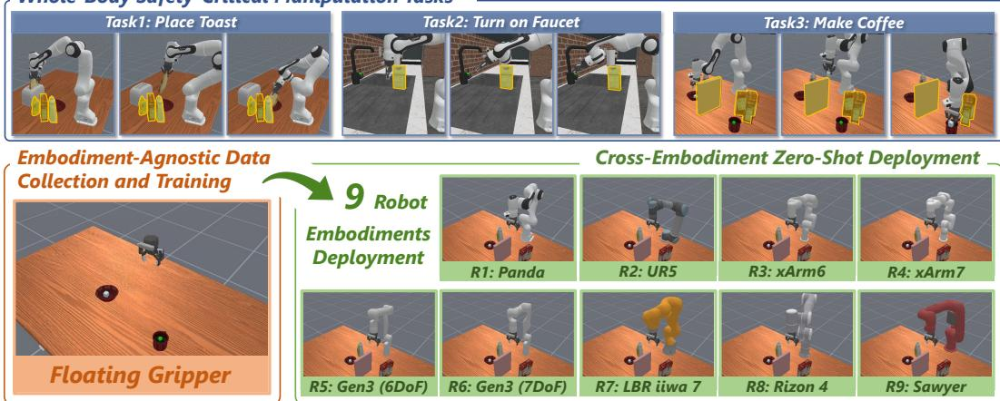  
Figure 3: We evaluate EMBODISTEER on three manipulation tasks requiring both task completion and whole-body obstacle avoidance. Cartesian policies are trained from obstacle-free floatinggripper demonstrations and deployed zero-shot on 9 robot embodiments with test-time obstacles.

into (5) yields the single-constraint QP:

$$
\min _ {\Delta q _ {i}} \frac {1}{2} \Delta q _ {t - 1, i} ^ {\top} H _ {\mathcal {E}} \left(q _ {t - 1, i} ^ {\mathrm{diff}}\right) \Delta q _ {t - 1, i}, \quad \mathrm{s.t.} \nabla_ {q} h \left(q _ {t - 1, i} ^ {\mathrm{diff}}\right) ^ {\top} \Delta q _ {t - 1, i} \geq \gamma_ {t} \left[ d _ {\mathrm{safe}} - h \left(q _ {t - 1, i} ^ {\mathrm{diff}}\right) \right]\tag{6}
$$

where $H _ { \mathcal { E } } \left( q _ { t - 1 , i } ^ { \mathrm { d i f f } } \right) = J _ { \mathcal { E } } \left( q _ { t - 1 , i } ^ { \mathrm { d i f f } } \right) ^ { \top } W J _ { \mathcal { E } } \left( q _ { t - 1 , i } ^ { \mathrm { d i f f } } \right) + \lambda _ { \mathrm { c b f } } I$ , and $\gamma _ { t }$ controls the strength of the constraint. Since the QP has only one linear inequality, it can be solved efficiently in closed form or by a batched small-scale QP solver. Denoting the solution as $\Delta q _ { t - 1 , i } ^ { \mathrm { c b f } }$ , the final guided sample is

$$
q _ {t - 1, i} = q _ {t - 1, i} ^ {\mathrm{diff}} + \mathrm{clip} (\Delta q _ {t - 1, i} ^ {\mathrm{cbf}}, - \Delta q _ {\max} ^ {\mathrm{cbf}}, \Delta q _ {\max} ^ {\mathrm{cbf}}).\tag{7}
$$

## 5 Results

## 5.1 Simulation Results

Experiment Setup. We design three challenging manipulation tasks in ManiSkill [55] to evaluate body-aware cross-embodiment deployment, as shown in Fig. 3. These tasks require both accurate end-effector motion and collision avoidance between surrounding obstacles and the full robot body. For each task, we collect 200 diverse demonstrations with a floating gripper, recording only wrist-view RGB observations, end-effector states, and end-effector actions to keep the policy embodiment-agnostic. The trained Cartesian policy is deployed zero-shot on 9 robot arms with different morphologies, while sharing the same gripper and wrist-camera mounting.

Baselines. We consider four baseline groups: 1) Cartesian denoising without guidance (EE) directly executes the Cartesian end-effector actions predicted by the learned policy; 2) Joint-space denoising without guidance (Joint) lifts Cartesian sampling into the target robot’s joint space without collision guidance, isolating the effect of joint-space denoising alone; 3) Cartesian denoising with post-hoc correction leaves Cartesian sampling unchanged and applies whole-body collision avoidance only after trajectory generation, where EE w/ Sampling samples multiple actions and selects the candidate with the largest realized clearance, and EE w/ CBF solves IK followed by a one-shot CBF-QP correction; 4) Joint-space denoising with guidance adds collision-aware guidance during every joint-space denoising step, where Joint w/ CG uses cost-gradient guidance and EMBODISTEER uses our proposed task-aware CBF-QP guidance.

Results and Analysis. Tab. 1 reports quantitative results averaged over 9 robot embodiments. In obstacle-free settings, the Cartesian policy transfers directly across diverse arms with over 90% average task success. Joint-space denoising preserves task success and even yields a slight improvement, showing that sampling in joint space maintains the learned end-effector behavior. With obstacles, however, Cartesian execution drops to 35.7% success and 0.614 reward, with 57.6% collision rate, revealing the limitation of end-effector-only deployment under whole-arm collision constraints.

Table 1: Quantitative results on manipulation tasks with obstacles, averaged over 9 robot embodiments. TSR is task success rate (%), RWD is reward per episode, and COR is collision occurrence rate (%). Best results among obstacle-present methods are shown in bold.

<table><tr><td rowspan="2">Obstacles</td><td rowspan="2">Method</td><td colspan="3">PlaceToast</td><td colspan="3">TurnOnFaucet</td><td colspan="3">MakeCoffee</td><td colspan="3">Average</td></tr><tr><td>TSR↑</td><td>RWD↑</td><td>COR↓</td><td>TSR↑</td><td>RWD↑</td><td>COR↓</td><td>TSR↑</td><td>RWD↑</td><td>COR↓</td><td>TSR↑</td><td>RWD↑</td><td>COR↓</td></tr><tr><td rowspan="2">w/o Obs.</td><td>EE</td><td>96.8</td><td>.980</td><td>-</td><td>83.6</td><td>.937</td><td>-</td><td>89.7</td><td>.932</td><td>-</td><td>90.0</td><td>.950</td><td>-</td></tr><tr><td>Joint</td><td>94.4</td><td>.965</td><td>-</td><td>87.9</td><td>.957</td><td>-</td><td>89.7</td><td>.929</td><td>-</td><td>90.7</td><td>.950</td><td>-</td></tr><tr><td rowspan="5">w/ Obs.</td><td>EE</td><td>43.4</td><td>.634</td><td>52.6</td><td>41.6</td><td>.752</td><td>61.8</td><td>22.2</td><td>.456</td><td>58.3</td><td>35.7</td><td>.614</td><td>57.6</td></tr><tr><td>EE w/ Sampling</td><td>47.1</td><td>.661</td><td>51.3</td><td>43.9</td><td>.767</td><td>53.2</td><td>24.1</td><td>.478</td><td>60.0</td><td>38.4</td><td>.635</td><td>54.8</td></tr><tr><td>EE w/ CBF</td><td>65.8</td><td>.764</td><td>15.3</td><td>56.3</td><td>.797</td><td>29.9</td><td>48.9</td><td>.606</td><td>8.6</td><td>57.0</td><td>.722</td><td>17.9</td></tr><tr><td>Joint w/ CG</td><td>57.7</td><td>.687</td><td>0.2</td><td>10.3</td><td>.403</td><td>52.0</td><td>22.4</td><td>.424</td><td>40.6</td><td>30.1</td><td>.505</td><td>30.9</td></tr><tr><td>EMBODISTEER</td><td>74.8</td><td>.829</td><td>4.6</td><td>60.6</td><td>.833</td><td>27.1</td><td>57.2</td><td>.670</td><td>2.8</td><td>64.2</td><td>.777</td><td>11.5</td></tr></table>

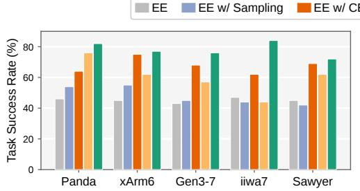

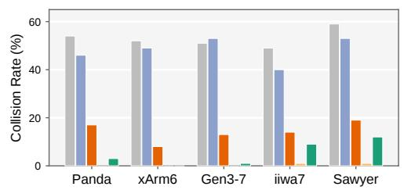  
Figure 4: Per-embodiment comparison on the PLACETOAST task, where the task success rate (left) and collision rate (right) across five representative robot embodiments are reported.

Among obstacle-aware methods, EMBODISTEER achieves the best overall balance between task success and whole-body collision avoidance. Fig. 4 further compares success rate and collision rate across different embodiments, showing consistent gains over baselines. EE w/ Sampling only modestly improves success by 2.7% and reduces collision failures by 2.8%, while incurring much higher cost from repeated sampling and collision checking. EE w/ CBF provides a stronger post-hoc correction, improving success by over 20%, but applies safety only after denoising and cannot shape the generated trajectory. In contrast, EMBODISTEER injects guidance at every joint-space denoising step, producing safer and more feasible trajectories.

Joint w/ CG exhibits large task-dependent variation. It performs competitively on PLACETOAST, where coarse end-effector motion is often sufficient, but struggles on TURNONFAUCET and MAKECOFFEE, which require precise interactions. Although collision-cost gradients can push the arm away from obstacles, they can also significantly distort the end-effector trajectory. This highlights the benefit of EMBODISTEER’s CBF-QP guidance, which moves the robot body while minimizing deviation from the policy-predicted Cartesian motion. Finally, the constraint strength (the scale of $\gamma )$ ablation shows the tradeoff between safety and task preservation. With $\gamma = 0 ;$

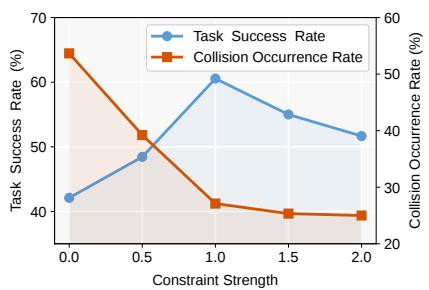  
Figure 5: Ablation for the constraint strength on TURNONFAUCET.

EMBODISTEER reduces to joint-space denoising without collision guidance. Increasing γ initially reduces collisions and improves success, but overly large guidance eventually lowers task success by driving samples away from the learned policy distribution.

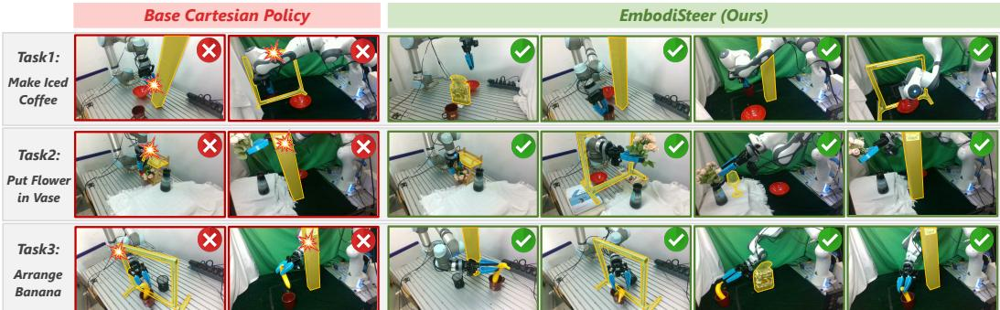  
Figure 6: Real-world deployment of an arm-agnostic Cartesian policy on UR5 and Panda. Without guidance, the base policy often preserves task intent but collides with obstacles (yellow region), whereas EMBODISTEER steers joint trajectories to avoid arm-body collisions and complete tasks.

## 5.2 Real-World Experiments

Experiment Setup. We further evaluate EMBODISTEER on two physical embodiments, UR5 and Franka Panda, across three tabletop manipulation tasks, as shown in Fig. 6. For each task, we collect 200 demonstrations without extra obstacles, with the UMI handheld-gripper [8] and train a Cartesian diffusion policy without robot-specific demonstrations or finetuning. Obstacles are introduced only at deployment time, thus directly evaluating whether EMBODISTEER can introduce embodimentaware collision avoidance to an embodiment-agnostic policy. EMBODISTEER also supports realtime physical deployment, achieving inference rates of 9.61 Hz on an RTX 4070 Ti SUPER.

Results. For each robot and task, we conduct 10 no-obstacle trials to evaluate base task competence and 10 obstacle trials to evaluate whole-body collision avoidance. The no-obstacle setting confirms that trained embodiment-agnostic Cartesian policies transfer to both physical embodiments, achieving 49/60 successes. With obstacles, however, the base policy drops to 25/60 successes and collides in 58/60 trials, showing that end-effector-only policies lack reliable embodiment-aware execution. In contrast, EMBODISTEER recovers performance to 47/60 successes while reducing collisions to 4/60. Qualitative comparisons in Fig. 6 further illustrate how EMBODISTEER improves collisionaware deployment while maintaining practical control rates across robots and tasks.

## 6 Limitations & Conclusion

Limitations. EMBODISTEER has several limitations. First, our guidance linearizes the wholebody constraint into a local QP and applies clipped joint corrections for stable execution; therefore, it provides an efficient feasible direction for collision avoidance but does not guarantee globally collision-free motion. Second, the guidance is activated only when the robot enters the SDF margin, making it a local correction mechanism rather than a global planner that can select the optimal collision-free motion modes far in advance. Finally, strong guidance may steer the robot into states outside the training distribution of the Cartesian policy, where task execution can fail, suggesting that broader and more diverse demonstrations remain important for robust deployment.

Conclusions. We propose EMBODISTEER for zero-shot embodiment-aware deployment of Cartesian diffusion policies by lifting inference-time sampling into the target robot’s joint space and applying task-preserving whole-body collision guidance. By keeping policy learning in an embodiment-agnostic Cartesian action space while enforcing robot-specific constraints only at deployment time, the method preserves the scalability of Cartesian imitation learning and adds the body awareness needed for safe execution. Across simulation and real-world experiments, EM-BODISTEER improves task success and substantially reduces collisions over Cartesian execution and post-hoc guidance baselines, demonstrating a practical path toward reusable manipulation policies across diverse robot embodiments.

## References

[1] C. Chi, Z. Xu, S. Feng, E. Cousineau, Y. Du, B. Burchfiel, R. Tedrake, and S. Song. Diffusion policy: Visuomotor policy learning via action diffusion. The International Journal of Robotics Research, 44(10-11):1684–1704, 2025.

[2] Y. Ze, G. Zhang, K. Zhang, C. Hu, M. Wang, and H. Xu. 3d diffusion policy: Generalizable visuomotor policy learning via simple 3d representations. arXiv preprint arXiv:2403.03954, 2024.

[3] B. Zitkovich, T. Yu, S. Xu, P. Xu, T. Xiao, F. Xia, J. Wu, P. Wohlhart, S. Welker, A. Wahid, et al. Rt-2: Vision-language-action models transfer web knowledge to robotic control. In Conference on Robot Learning, pages 2165–2183. PMLR, 2023.

[4] M. J. Kim, K. Pertsch, S. Karamcheti, T. Xiao, A. Balakrishna, S. Nair, R. Rafailov, E. Foster, G. Lam, P. Sanketi, et al. Openvla: An open-source vision-language-action model. arXiv preprint arXiv:2406.09246, 2024.

[5] J. Zheng, J. Li, Z. Wang, D. Liu, X. Kang, Y. Feng, Y. Zheng, J. Zou, Y. Chen, J. Zeng, et al. Xvla: Soft-prompted transformer as scalable cross-embodiment vision-language-action model. arXiv preprint arXiv:2510.10274, 2025.

[6] S. Liu, L. Wu, B. Li, H. Tan, H. Chen, Z. Wang, K. Xu, H. Su, and J. Zhu. Rdt-1b: a diffusion foundation model for bimanual manipulation. In International Conference on Learning Representations, volume 2025, pages 29982–30009, 2025.

[7] Y. Wang, S. Zheng, H. Luo, W. Zhang, H. Yuan, C. Xu, H. Xu, Y. Feng, M. Yu, Z. Kang, et al. Rethinking visual-language-action model scaling: Alignment, mixture, and regularization. arXiv preprint arXiv:2602.09722, 2026.

[8] C. Chi, Z. Xu, C. Pan, E. Cousineau, B. Burchfiel, S. Feng, R. Tedrake, and S. Song. Universal manipulation interface: In-the-wild robot teaching without in-the-wild robots. arXiv preprint arXiv:2402.10329, 2024.

[9] E. Bauer, E. Nava, and R. K. Katzschmann. Latent action diffusion for cross-embodiment manipulation. arXiv preprint arXiv:2506.14608, 2025.

[10] Q. Bu, Y. Yang, J. Cai, S. Gao, G. Ren, M. Yao, P. Luo, and H. Li. Univla: Learning to act anywhere with task-centric latent actions. arXiv preprint arXiv:2505.06111, 2025.

[11] L. Wang, X. Chen, J. Zhao, and K. He. Scaling proprioceptive-visual learning with heterogeneous pre-trained transformers. Advances in neural information processing systems, 37: 124420–124450, 2024.

[12] M. Xu, Z. Xu, C. Chi, M. Veloso, and S. Song. Xskill: Cross embodiment skill discovery. In Conference on robot learning, pages 3536–3555. PMLR, 2023.

[13] L. Zha, A. J. Hancock, M. Zhang, T. Yin, Y. Huang, D. Shah, A. Z. Ren, and A. Majumdar. Lap: Language-action pre-training enables zero-shot cross-embodiment transfer. arXiv preprint arXiv:2602.10556, 2026.

[14] J. Zheng, J. Li, D. Liu, Y. Zheng, Z. Wang, Z. Ou, Y. Liu, J. Liu, Y.-Q. Zhang, and X. Zhan. Universal actions for enhanced embodied foundation models. In Proceedings of the Computer Vision and Pattern Recognition Conference, pages 22508–22519, 2025.

[15] A. Patel and S. Song. Get-zero: Graph embodiment transformer for zero-shot embodiment generalization. In 2025 IEEE International Conference on Robotics and Automation (ICRA), pages 14262–14269. IEEE, 2025.

[16] A. Gupta, L. Fan, S. Ganguli, and L. Fei-Fei. Metamorph: Learning universal controllers with transformers. arXiv preprint arXiv:2203.11931, 2022.

[17] M. Xu, H. Zhang, Y. Hou, Z. Xu, L. Fan, M. Veloso, and S. Song. Dexumi: Using human hand as the universal manipulation interface for dexterous manipulation. arXiv preprint arXiv:2505.21864, 2025.

[18] H. Ha, Y. Gao, Z. Fu, J. Tan, and S. Song. Umi on legs: Making manipulation policies mobile with manipulation-centric whole-body controllers. arXiv preprint arXiv:2407.10353, 2024.

[19] J. Bjorck, F. Castaneda, N. Cherniadev, X. Da, R. Ding, L. Fan, Y. Fang, D. Fox, F. Hu, ˜ S. Huang, et al. Gr00t n1: An open foundation model for generalist humanoid robots. arXiv preprint arXiv:2503.14734, 2025.

[20] C. Sferrazza, D.-M. Huang, F. Liu, J. Lee, and P. Abbeel. Body transformer: Leveraging robot embodiment for policy learning. arXiv preprint arXiv:2408.06316, 2024.

[21] N. Bohlinger, G. Czechmanowski, M. Krupka, P. Kicki, K. Walas, J. Peters, and D. Tateo. One policy to run them all: an end-to-end learning approach to multi-embodiment locomotion. arXiv preprint arXiv:2409.06366, 2024.

[22] H. Luo, W. Zhang, Y. Feng, S. Zheng, H. Xu, C. Xu, Z. Xi, Y. Fu, and Z. Lu. Being-h0. 7: A latent world-action model from egocentric videos. arXiv preprint arXiv:2605.00078, 2026.

[23] R. Yang, Q. Yu, Y. Wu, R. Yan, B. Li, A.-C. Cheng, X. Zou, Y. Fang, X. Cheng, R.-Z. Qiu, et al. Egovla: Learning vision-language-action models from egocentric human videos. arXiv preprint arXiv:2507.12440, 2025.

[24] R. Zheng, D. Niu, Y. Xie, J. Wang, M. Xu, Y. Jiang, F. Castaneda, F. Hu, Y. L. Tan, L. Fu, et al. ˜ Egoscale: Scaling dexterous manipulation with diverse egocentric human data. arXiv preprint arXiv:2602.16710, 2026.

[25] A. Wagenmaker, M. Nakamoto, Y. Zhang, S. Park, W. Yagoub, A. Nagabandi, A. Gupta, and S. Levine. Steering your diffusion policy with latent space reinforcement learning. arXiv preprint arXiv:2506.15799, 2025.

[26] Y. Liu, J. Hamid, A. Xie, Y. Lee, M. Du, and C. Finn. Bidirectional decoding: Improving action chunking via guided test-time sampling. In International Conference on Learning Representations, volume 2025, pages 4594–4627, 2025.

[27] R. Romer, J. Balletshofer, J. Thumm, M. Pavone, A. P. Schoellig, and M. Althoff. From¨ demonstrations to safe deployment: Path-consistent safety filtering for diffusion policies. arXiv preprint arXiv:2511.06385, 2025.

[28] J. Ho and T. Salimans. Classifier-free diffusion guidance. arXiv preprint arXiv:2207.12598, 2022.

[29] M. Reuss, M. Li, X. Jia, and R. Lioutikov. Goal-conditioned imitation learning using scorebased diffusion policies. arXiv preprint arXiv:2304.02532, 2023.

[30] P. Dhariwal and A. Nichol. Diffusion models beat gans on image synthesis. Advances in neural information processing systems, 34:8780–8794, 2021.

[31] K. M. Lee, S. Ye, Q. Xiao, Z. Wu, Z. Zaidi, D. B. D’Ambrosio, P. R. Sanketi, and M. C. Gombolay. Learning diverse robot striking motions with diffusion models and kinematically constrained gradient guidance. In 2025 IEEE International Conference on Robotics and Automation (ICRA), pages 12017–12024, 2025. doi:10.1109/ICRA55743.2025.11127310.

[32] W. Xiao, T.-H. Wang, C. Gan, R. Hasani, M. Lechner, and D. Rus. Safediffuser: Safe planning with diffusion probabilistic models. In International Conference on Learning Representations, 2025.

[33] J. Zhang, L. Zhao, A. Papachristodoulou, and J. Umenberger. Constrained diffusers for safe planning and control. Advances in Neural Information Processing Systems, 38:34965–34998, 2026.

[34] Y. Zhong, Q. Jiang, J. Yu, and Y. Ma. Dexgrasp anything: Towards universal robotic dexterous grasping with physics awareness. In Proceedings of the Computer Vision and Pattern Recognition Conference, pages 22584–22594, 2025.

[35] Z. Weng, H. Lu, D. Kragic, and J. Lundell. Dexdiffuser: Generating dexterous grasps with diffusion models. IEEE Robotics and Automation Letters, 9(12):11834–11840, 2024.

[36] Y. Jia, Y. Jiang, K. Lv, Y. Ren, and X. Li. Arm-aware guided dexterous grasp generation with arm-agnostic grasp models. IEEE Robotics and Automation Letters, 11(5):5875–5882, 2026. doi:10.1109/LRA.2026.3674025.

[37] M. Du and S. Song. Dynaguide: Steering diffusion policies with active dynamic guidance. In Proceedings of the 39th Conference on Neural Information Processing Systems (NeurIPS), 2025.

[38] Y. Wang, L. Wang, Y. Du, B. Sundaralingam, X. Yang, Y.-W. Chao, C. Perez-D’Arpino,´ D. Fox, and J. Shah. Inference-time policy steering through human interactions. In 2025 IEEE International Conference on Robotics and Automation (ICRA), pages 15626–15633. IEEE, 2025.

[39] H. Gupta, X. Guo, H. Ha, C. Pan, M. Cao, D. Lee, S. Scherer, S. Song, and G. Shi. Umion-air: Embodiment-aware guidance for embodiment-agnostic visuomotor policies. In 2026 IEEE International Conference on Robotics and Automation (ICRA), 2026. URL https: //arxiv.org/abs/2510.02614.

[40] A. D. Ames, S. Coogan, M. Egerstedt, G. Notomista, K. Sreenath, and P. Tabuada. Control barrier functions: Theory and applications. In 2019 18th European control conference (ECC), pages 3420–3431. Ieee, 2019.

[41] S. Hu, Z. Liu, S. Liu, J. Cen, Z. Meng, and X. He. Vlsa: Vision-language-action models with plug-and-play safety constraint layer. arXiv preprint arXiv:2512.11891, 2025.

[42] L. Brunke, Y. Zhang, R. Romer, J. Naimer, N. Staykov, S. Zhou, and A. P. Schoellig. Semanti-¨ cally safe robot manipulation: From semantic scene understanding to motion safeguards. IEEE Robotics and Automation Letters, 2025.

[43] K. P. Wabersich and M. N. Zeilinger. A predictive safety filter for learning-based control of constrained nonlinear dynamical systems. Automatica, 129:109597, 2021.

[44] S. Gros, M. Zanon, and A. Bemporad. Safe reinforcement learning via projection on a safe set: How to achieve optimality? IFAC-PapersOnLine, 53(2):8076–8081, 2020.

[45] X. Zhai, B. Ou, Y. Wang, H. Y. Leong, Q. Yu, C. Hao, and Y. Liu. Cofreevla: Collision-free dual-arm manipulation via vision-language-action model and risk estimation. arXiv preprint arXiv:2601.21712, 2026.

[46] H. Li, Q. Feng, Z. Zheng, J. Feng, Z. Chen, and A. Knoll. Language-guided object-centric diffusion policy for generalizable and collision-aware manipulation. In 2025 IEEE International Conference on Robotics and Automation (ICRA), pages 12834–12841. IEEE, 2025.

[47] H. Deng, W. Guo, Q. Wang, Z. Wu, and Z. Wang. Safebimanual: Diffusion-based trajectory optimization for safe bimanual manipulation. arXiv preprint arXiv:2508.18268, 2025.

[48] A. Dastider, H. Fang, and M. Lin. Apex: Ambidextrous dual-arm robotic manipulation using collision-free generative diffusion models. In 2024 IEEE/RSJ International Conference on Intelligent Robots and Systems (IROS), pages 9526–9533. IEEE, 2024.

[49] K. Lv, M. Yu, Y. Jia, C. Zhang, and X. Li. Kinematics-aware diffusion policy with consistent 3d observation and action space for whole-arm robotic manipulation. IEEE Robotics and Automation Letters, 2026. doi:10.1109/LRA.2026.3685437.

[50] Q. Lv, H. Li, X. Deng, R. Shao, Y. Li, J. Hao, L. Gao, M. Y. Wang, and L. Nie. Spatialtemporal graph diffusion policy with kinematic modeling for bimanual robotic manipulation. In Proceedings of the Computer Vision and Pattern Recognition Conference, pages 17394– 17404, 2025.

[51] K. Chen, Z. Bi, G. Zhao, C. Zheng, Y. Li, H. Zhao, and J. Ma. Samp: Spatial anchor-based motion policy for collision-aware robotic manipulators. arXiv preprint arXiv:2509.11185, 2025.

[52] A. Fishman, A. Walsman, M. Bhardwaj, W. Yuan, B. Sundaralingam, B. Boots, and D. Fox. Avoid everything: Model-free collision avoidance with expert-guided fine-tuning. In CoRL Workshop on Safe and Robust Robot Learning for Operation in the Real World, 2024.

[53] Y. Zhou, C. Barnes, J. Lu, J. Yang, and H. Li. On the continuity of rotation representations in neural networks. In Proceedings of the IEEE/CVF Conference on Computer Vision and Pattern Recognition, pages 5745–5753, 2019.

[54] H. Ma, S. Bodmer, A. Carron, M. Zeilinger, and M. Muehlebach. Constraint-aware diffusion guidance for robotics: Real-time obstacle avoidance for autonomous racing. arXiv preprint arXiv:2505.13131, 2025.

[55] S. Tao, F. Xiang, A. Shukla, Y. Qin, X. Hinrichsen, X. Yuan, C. Bao, X. Lin, Y. Liu, T. kai Chan, Y. Gao, X. Li, T. Mu, N. Xiao, A. Gurha, V. N. Rajesh, Y. W. Choi, Y.-R. Chen, Z. Huang, R. Calandra, R. Chen, S. Luo, and H. Su. Maniskill3: Gpu parallelized robotics simulation and rendering for generalizable embodied ai. Robotics: Science and Systems, 2025.

## A Method Details

## A.1 Cartesian Action Conversion and Pose-Twist Mapping

The main text writes the Cartesian denoising residual compactly as $\mathcal { T } _ { \mathrm { p o s e } } ( a _ { t , i } ^ { - 1 } a _ { t - 1 , i } )$ . Here we make this notation explicit for the 9D pose component of the Cartesian action. Let the chunk-start endeffector pose be $T _ { 0 } = ( p _ { 0 } , R _ { 0 } )$ ) and let $\boldsymbol { a } _ { i } = [ \delta p _ { i } , r _ { i } ]$ , where $r _ { i } \in \mathbb { R } ^ { 6 }$ is the continuous 6D rotation representation. We convert $a _ { i }$ into a world-frame pose through

$$
\Phi (a _ {i}; T _ {0}) = (p _ {i}, R _ {i}), \qquad p _ {i} = p _ {0} + R _ {0} \delta p _ {i}, \qquad R _ {i} = R _ {0} \phi_ {\mathrm{6D}} (r _ {i}),\tag{8}
$$

where $\phi _ { \mathrm { 6 D } } ( \cdot )$ maps the 6D rotation representation to $S O ( 3 )$ [53]. The shorthand $a _ { t , i } ^ { - 1 } a _ { t - 1 , i }$ in the main text therefore denotes the relative transform

$$
\Phi (a _ {t, i}; T _ {0}) ^ {- 1} \Phi (a _ {t - 1, i}; T _ {0}) = (\Delta p _ {t, i}, \Delta R _ {t, i}).\tag{9}
$$

The pose-twist operator then returns

$$
\xi_ {t, i} = \mathcal {T} _ {\mathrm{pose}} \left(\Phi (a _ {t, i}; T _ {0}) ^ {- 1} \Phi (a _ {t - 1, i}; T _ {0})\right) = \left[ \begin{array}{c} \Delta p _ {t, i} \\ \mathrm{Log} (\Delta R _ {t, i}) \end{array} \right],\tag{10}
$$

where Log $: S O ( 3 )  \mathbb { R } ^ { 3 }$ is the rotation-vector map.

The joint-space initialization follows (3). In experiments, $q ^ { \mathrm { s t a r t } }$ is the current robot joint configuration at the beginning of the action chunk. Cartesian Gaussian noise is converted relative to $T _ { 0 }$ represented as a pose twist, and locally mapped to joint perturbations with the damped Jacobian pseudo-inverse. During denoising, the local kinematic approximation $\xi _ { t , i } \approx J _ { \mathcal { E } } ( q _ { t , i } ) \Delta q _ { t , i }$ yields (4). The per-joint clipping in Eqs. (3) and (4) is used to avoid large local linearization errors and unstable motions near singularities.

## A.2 Whole-Body SDF Representation

The whole-body safety function $h ( q )$ is computed through cuRobo’s collision geometry and signeddistance interfaces. The robot body is approximated by a set of collision spheres attached to the robot links, and we query the SDF value and gradient of these spheres with respect to known obstacle geometry. Let $d _ { j } ( q )$ denote the signed distance returned for the $j \cdot$ -th sphere at configuration $q ,$ , where the convention is that positive values indicate penetration and negative values indicate clearance. Under this convention, the exact worst signed distance over all robot collision spheres is

$$
d _ {\max} (q) = \max _ {j} d _ {j} (q).\tag{11}
$$

Equivalently, under the paper’s convention that positive $h ( q )$ indicates clearance and negative values indicate penetration, the exact whole-body clearance is $h _ { \mathrm { e x a c t } } ( q ) = - d _ { \mathrm { m a x } } ( q )$

Using the exact max gives the correct worst-sphere value but can introduce abrupt gradient switches when different collision spheres become the maximum. For smoother guidance gradients, we use a normalized smooth maximum over only the top-k largest cuRobo signed distances. Let $\mathcal { K } ( q )$ be the indices of the k largest values in $\{ d _ { j } ( q ) \} _ { j }$ , and let $m ( q ) = \mathrm { m a x } _ { j \in { \mathcal { K } } ( q ) } d _ { j } ( q )$ . We compute

$$
\widetilde {d} _ {\max} (q) = m (q) + \frac {1}{\tau} \log \left(\frac {1}{k} \sum_ {j \in \mathcal {K} (q)} \exp \left(\tau \left[ d _ {j} (q) - m (q) \right]\right)\right),\tag{12}
$$

where $\tau$ is the smoothmax temperature. The CBF safety value used by the QP is

$$
h (q) = - \widetilde {d} _ {\max} (q).\tag{13}
$$

Because (12) is a smooth approximation to the exact max over spheres, it can introduce a small bias in the estimated worst distance. We use it because the smoother gradient is more stable for local guidance than the discontinuous gradient of the exact max. If the opposite SDF sign convention is used, the same idea becomes a top-k smooth minimum over clearances.

In the experiments, obstacles are modeled as known cuboids in both simulation and real-world evaluation. We therefore assume access to obstacle pose and shape during deployment; perception of unknown obstacles is outside the scope of this work. Fig. 7 illustrates the representation: the physical obstacle layout is converted into known cuboids, while the robot body is approximated by link-attached collision spheres for whole-body SDF queries.

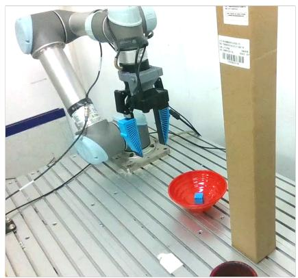

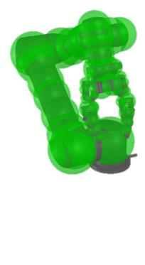  
Figure 7: Whole-body SDF representation. The left image shows the real scene. The right image shows the corresponding cuRobo scene used for SDF queries, where the robot is represented by collision spheres and the obstacle is represented as a cuboid.

## A.3 CBF-Inspired QP Details

The main text derives the CBF-inspired nonlinear guidance objective and its linearized QP form. Here we provide additional details omitted for space. For each horizon step, (6) can be written as

$$
\min _ {\Delta q} \frac {1}{2} \Delta q ^ {\top} H \Delta q, \quad \text {s.t.} \quad a ^ {\top} \Delta q \geq b,\tag{14}
$$

where

$$
a = \nabla_ {q} h (q _ {t - 1, i} ^ {\mathrm{diff}}), \qquad b = \gamma_ {t} \left[ d _ {\mathrm{safe}} - h (q _ {t - 1, i} ^ {\mathrm{diff}}) \right], \qquad H = J _ {\mathcal {E}} ^ {\top} W J _ {\mathcal {E}} + \lambda_ {\mathrm{cbf}} I.\tag{15}
$$

The scalar $\gamma _ { t }$ is the scheduled constraint strength at diffusion timestep t. Consistent with the reverse denoising update in the main text, t decreases from $T - 1$ to 0 during inference. Following [54], we use

$$
\gamma_ {t} = \gamma \cdot \sigma \bigg (\beta \cdot \left(c - \frac {t}{T - 1}\right) \bigg), \qquad \sigma (z) = \frac {1}{1 + \exp (- z)},\tag{16}
$$

where $\gamma$ is the base constraint strength. We set the slope $\beta$ to 50 and the transition point c to 0.7 in all experiments. This schedule gives smaller constraint strength in early denoising steps and approaches $\gamma$ in later steps, when samples are closer to the data manifold and less likely to be washed out by subsequent denoising updates. Fig. 8 visualizes this schedule for the default $T = 1 6$ denoising steps and $\gamma = 1 . 0$ . The $\mathrm { Q P }$ uses the nonnegative right-hand side max(b, 0), so configurations already satisfying the safety margin receive zero correction from the constraint.

The closed-form solution follows from the KKT conditions of the single-constraint QP. With the clipped right-hand side $\bar { b } = \operatorname* { m a x } ( b , 0 )$ , the Lagrangian is

$$
\mathcal {L} (\Delta q, \mu) = \frac {1}{2} \Delta q ^ {\top} H \Delta q + \mu (\bar {b} - a ^ {\top} \Delta q), \quad \mu \geq 0.\tag{17}
$$

Stationarity gives $H \Delta q - \mu a = 0$ , hence $\Delta q = \mu H ^ { - 1 } a . \mathrm { ~ I f ~ } \bar { b } = 0$ , the unconstrained minimizer $\Delta q = 0$ is feasible. Otherwise, complementary slackness makes the constraint active, so $a ^ { \top } \Delta q =$ $\mu a ^ { \top } H ^ { - 1 } a = \bar { b }$ and $\mu = \bar { b } / ( a ^ { \top } H ^ { - 1 } a )$ . The resulting solution is

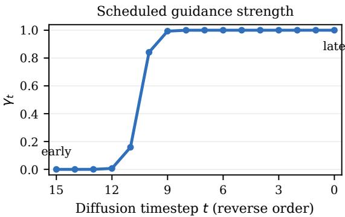  
Figure 8: Scheduled constraint strength $\gamma _ { t }$ over reverse denoising steps. The guidance is weak in early noisy steps and approaches the base scale $\gamma$ in later steps.

$$
\Delta q ^ {\star} = \left\{ \begin{array}{l l} 0, & b \leq 0, \\ \frac {b}{a ^ {\top} H ^ {- 1} a + \varepsilon}   H ^ {- 1} a, & b > 0, \end{array} \right.\tag{18}
$$

where ε is a small numerical stabilizer. The case $b \leq 0$ corresponds to a locally satisfied safety constraint, for which the unconstrained minimizer $\Delta q = 0$ is feasible. The update is then clipped as in (7). The $\mathrm { Q P }$ is solved over the arm joints only; the gripper command is not modified by the collision-avoidance correction. The task-preservation metric uses the end-effector geometric Jacobian with separate position and rotation weights. Because the method uses a local linearization and clipped updates, the guidance should be interpreted as an efficient feasible correction direction rather than a formal global safety certificate.

## B Implementation Details

## B.1 Diffusion Policy Architecture

We use the same Cartesian diffusion-policy architecture across all embodiments. In both simulation and real-world experiments, RGB observations are encoded with the pretrained CLIP ViT-B/16 backbone (vit base patch16 clip 224.openai) loaded through timm and finetuned during policy training. The resulting observation feature is used as a global condition for a conditional 1D U-Net denoiser over the action chunk. The denoiser takes a noisy Cartesian action sequence and a diffusion timestep as input, and predicts the noise $\epsilon _ { \theta }$ used by the DDPM reverse step. The action sequence has horizon H and action dimension 10, consisting of relative end-effector translation, a continuous 6D rotation representation, and one gripper command. During deployment, EMBODIS-TEER keeps this trained denoiser unchanged and only changes the sampling variable from Cartesian actions to target-robot joint trajectories.

## B.2 Hyperparameters

Table 2 lists the hyperparameters used for training and deployment.

## B.3 Runtime Breakdown

Fig. 9 reports the measured runtime breakdown of one guided joint-space inference call on an RTX 4070 Ti SUPER, including all 16 reverse-diffusion steps. The full EMBODISTEER inference time is 103 ms, corresponding to 9.61 Hz deployment. The base Cartesian policy already requires observation encoding and U-Net denoising, which account for 46.8 ms. The remaining measured time is introduced by joint-space lifting, whole-body SDF queries, CBF-QP guidance, and associated runtime overhead.

Table 2: Training and deployment hyperparameters.

<table><tr><td>Quantity</td><td>Value</td><td>Notes</td></tr><tr><td>Observation horizon</td><td>2</td><td>Diffusion policy input setting.</td></tr><tr><td>Action horizon  $H$ </td><td>16</td><td>Predicted action chunk length.</td></tr><tr><td>Execution horizon</td><td>16 in simulation, 6 in real world.</td><td>Number of actions executed before replanning.</td></tr><tr><td>Visual backbone</td><td>CLIP ViT-B/16</td><td>vit_base_patch16_clip_224.openai loaded through timm, pretrained and finetuned.</td></tr><tr><td>U-Net channels</td><td>[256, 512, 1024]</td><td>Conditional 1D U-Net downsampling dimensions.</td></tr><tr><td>Diffusion step embedding</td><td>128</td><td>Timestep embedding dimension.</td></tr><tr><td>Diffusion training timesteps</td><td>50</td><td>DDIM scheduler with squared-cosine beta schedule and epsilon prediction.</td></tr><tr><td>Inference denoising steps</td><td>16</td><td>Reverse diffusion steps at deployment.</td></tr><tr><td>Control frequency</td><td>10</td><td>Simulation and real-world control rate.</td></tr><tr><td>Training epochs</td><td>120</td><td>Used for both simulation and real-world policies.</td></tr><tr><td>Batch size</td><td>128 in simulation, 64 in real world.</td><td>Training batch size for simulation and real-world checkpoints.</td></tr><tr><td>Optimizer</td><td>AdamW</td><td>Learning rate  $3 \times 10^{-4}$ , betas (0.95, 0.999), weight decay  $10^{-6}$ .</td></tr><tr><td>Learning-rate schedule</td><td>Cosine</td><td>2000 warmup steps.</td></tr><tr><td>EMA</td><td>0.9999 max decay</td><td>EMA enabled during training.</td></tr><tr><td>Image augmentation</td><td>Crop + color jitter</td><td>Random crop ratio 0.95; brightness 0.3, contrast 0.4, saturation 0.5, hue 0.08.</td></tr><tr><td>Noise initialization scale  $\alpha$ </td><td>0.1</td><td>Scale for Jacobian-projected noise.</td></tr><tr><td>Jacobian damping  $\lambda_{\text{pinv}}$ </td><td>0.001</td><td>Used in  $J_{\mathcal{E}}^{+}$ .</td></tr><tr><td>Joint update clip  $\Delta q_{\text{max}}$ </td><td>0.5</td><td>Used in joint denoising update.</td></tr><tr><td>Safety margin  $d_{\text{safe}}$ </td><td>0.05~0.10</td><td>Task-dependent; set to 0.05, 0.07, or 0.10 by obstacle layout.</td></tr><tr><td>SDF aggregation top- $k$ </td><td>4</td><td>Number of critical collision spheres.</td></tr><tr><td>Smoothmax temperature  $\tau$ </td><td>20.0</td><td>Temperature in (12).</td></tr><tr><td>Base constraint strength  $\gamma$ </td><td>1.0</td><td>Base multiplier in (16).</td></tr><tr><td>QP regularization  $\lambda_{\text{cbf}}$ </td><td>0.01</td><td>Joint-space regularization.</td></tr><tr><td>Task position weight</td><td>1.0</td><td>Position rows in  $J_{\mathcal{E}}^{\top} W J_{\mathcal{E}}$ .</td></tr><tr><td>Task rotation weight</td><td>0.1</td><td>Rotation rows in  $J_{\mathcal{E}}^{\top} W J_{\mathcal{E}}$ .</td></tr><tr><td>CBF update clip  $\Delta q_{\text{max}}^{\text{cbf}}$ </td><td>0.1</td><td>Clipping applied to the guidance update.</td></tr></table>

## B.4 Baseline Implementation Details

Table 3 summarizes how each baseline is implemented. All baselines use the same trained Cartesian policy checkpoint for a given task.

## C Simulation Results

## C.1 Task Definitions and Evaluation Protocol

The simulation benchmark contains three manipulation tasks: PLACETOAST, TURNONFAUCET, and MAKECOFFEE. Cartesian policies are trained from obstacle-free floating-gripper demonstrations generated by task-specific motion planning, and are evaluated zero-shot on robot embodiments with different kinematics and arm geometries. In obstacle-present settings, obstacles are introduced only at test time. Success rate (TSR), reward per episode (RWD), and collision occurrence rate (COR) are reported as in the main text.

<table><tr><td>Component</td><td>Included operations</td><td>ms</td><td>%</td></tr><tr><td colspan="4">Base Cartesian policy components</td></tr><tr><td>Diffusion U-Net</td><td>U-Net denoising, 16 steps</td><td>41.2</td><td>39.9</td></tr><tr><td>Observation Encoder</td><td>Image/state observation encoding</td><td>5.6</td><td>5.4</td></tr><tr><td>Base policy subtotal</td><td>Measured base-policy components</td><td>46.8</td><td>45.4</td></tr><tr><td colspan="4">Additional EMBODISTEER components</td></tr><tr><td>Kinematic Mapping</td><td>FK, Jacobian, DLS, twist</td><td>13.5</td><td>13.1</td></tr><tr><td>CBF Guidance</td><td>CBF autograd, QP, linearization setup</td><td>11.5</td><td>11.2</td></tr><tr><td>Collision SDF Query</td><td>Sphere FK, SDF query, world setup</td><td>2.8</td><td>2.7</td></tr><tr><td>Pose / Norm. / Scheduler</td><td>Pose conversion, normalizer, scheduler step</td><td>11.1</td><td>10.8</td></tr><tr><td>I/O and Action Formatting</td><td>Obs. preprocessing, joint tensor, action conversion</td><td>1.0</td><td>1.0</td></tr><tr><td>Other Runtime Overhead</td><td>Uninstrumented loop/PyTorch overhead</td><td>16.3</td><td>15.8</td></tr><tr><td>Added subtotal</td><td>Joint-space lifting and guidance overhead</td><td>56.2</td><td>54.6</td></tr><tr><td>Full total</td><td>Guided joint-space inference</td><td>103.0</td><td>100.0</td></tr></table>

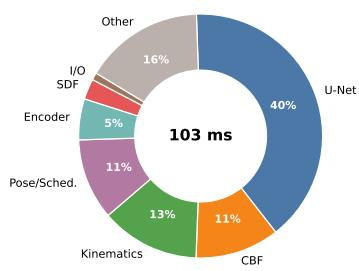

Figure 9: Runtime breakdown for one guided joint-space inference call on an RTX 4070 Ti SUPER.  
Table 3: Baseline implementation details.

<table><tr><td>Method</td><td>Implementation</td></tr><tr><td>EE</td><td>Runs the Cartesian diffusion policy in its original action space and executes the predicted end-effector actions without collision-aware guidance.</td></tr><tr><td>Joint</td><td>Uses the same joint-space denoising procedure as EMBODISTEER, including FK queries to the frozen Cartesian denoiser and damped Jacobian updates, but does not apply collision guidance.</td></tr><tr><td>EE w/ Sampling</td><td>Keeps Cartesian denoising unchanged, samples multiple candidate action chunks, realizes them through the target robot, and selects the candidate with the largest clearance. Number of candidates: 16.</td></tr><tr><td>EE w/ CBF</td><td>Keeps Cartesian denoising unchanged, solves IK for the generated action chunk, and applies a one-shot CBF-QP correction after generation.</td></tr><tr><td>Joint w/ CG</td><td>Adds collision-cost gradient guidance during joint-space denoising. Unlike EMBODISTEER, the update is not explicitly regularized by the task-space QP objective, so whole-body collision gradients can perturb the end-effector trajectory.</td></tr></table>

As illustrated in Fig. 3, the benchmark uses the same three tasks and obstacle layouts across 9 robot embodiments. We therefore avoid duplicating the task and robot lists here; the appendix focuses on the complete per-robot quantitative results and guidance ablations.

## C.2 Full Quantitative Results

Table 4 reports the per-robot simulation results behind Table 1. For EMBODISTEER, the listed guidance strengths match the main-paper setting for each task.

Table 4: Full per-robot simulation results. Obs. indicates whether obstacles are present during evaluation; TSR is success-once rate, RWD is maximum reward per episode, and COR is collision occurrence rate. COR is reported only for obstacle-present settings.

<table><tr><td>Obs.</td><td>Method</td><td>Robot</td><td>TSR↑</td><td>RWD↑</td><td>COR↓</td><td>Robot</td><td>TSR↑</td><td>RWD↑</td><td>COR↓</td><td>Robot</td><td>TSR↑</td><td>RWD↑</td><td>COR↓</td></tr><tr><td colspan="14">PLACETOAST</td></tr><tr><td rowspan="3"></td><td rowspan="3">EE</td><td>UR5</td><td>100.0%</td><td>1.000</td><td>-</td><td>Panda</td><td>100.0%</td><td>1.000</td><td>-</td><td>xArm6</td><td>100.0%</td><td>1.000</td><td>-</td></tr><tr><td>xArm7</td><td>98.0%</td><td>0.989</td><td>-</td><td>iiwa7</td><td>98.0%</td><td>0.989</td><td>-</td><td>Gen3-6D</td><td>81.0%</td><td>0.879</td><td>-</td></tr><tr><td>Gen3-7D</td><td>98.0%</td><td>0.989</td><td>-</td><td>Rizon4</td><td>99.0%</td><td>0.991</td><td>-</td><td>Sawyer</td><td>97.0%</td><td>0.984</td><td>-</td></tr><tr><td>w/o Obs.</td><td></td><td></td><td></td><td></td><td></td><td></td><td></td><td></td><td></td><td>Avg.</td><td>96.8%</td><td>0.980</td><td>-</td></tr></table>

Continued on next page

<table><tr><td>Obs.</td><td>Method</td><td>Robot</td><td>TSR↑</td><td>RWD↑</td><td>COR↓</td><td>Robot</td><td>TSR↑</td><td>RWD↑</td><td>COR↓</td><td>Robot</td><td>TSR↑</td><td>RWD↑</td><td>COR↓</td></tr><tr><td rowspan="4"></td><td rowspan="4">Joint</td><td>UR5</td><td>100.0%</td><td>1.000</td><td>-</td><td>Panda</td><td>100.0%</td><td>1.000</td><td>-</td><td>xArm6</td><td>98.0%</td><td>0.988</td><td>-</td></tr><tr><td>xArm7</td><td>99.0%</td><td>0.995</td><td>-</td><td>iiwa7</td><td>98.0%</td><td>0.989</td><td>-</td><td>Gen3-6D</td><td>73.0%</td><td>0.827</td><td>-</td></tr><tr><td>Gen3-7D</td><td>85.0%</td><td>0.907</td><td>-</td><td>Rizon4</td><td>98.0%</td><td>0.983</td><td>-</td><td>Sawyer</td><td>99.0%</td><td>0.995</td><td>-</td></tr><tr><td></td><td></td><td></td><td></td><td></td><td></td><td></td><td></td><td>Avg.</td><td>94.4%</td><td>0.965</td><td>-</td></tr><tr><td rowspan="20">w/Obs.</td><td rowspan="4">EE</td><td>UR5</td><td>39.0%</td><td>0.560</td><td>50.0%</td><td>Panda</td><td>46.0%</td><td>0.585</td><td>54.0%</td><td>xArm6</td><td>45.0%</td><td>0.676</td><td>52.0%</td></tr><tr><td>xArm7</td><td>48.0%</td><td>0.695</td><td>56.0%</td><td>iiwa7</td><td>47.0%</td><td>0.689</td><td>49.0%</td><td>Gen3-6D</td><td>36.0%</td><td>0.611</td><td>51.0%</td></tr><tr><td>Gen3-7D</td><td>43.0%</td><td>0.665</td><td>51.0%</td><td>Rizon4</td><td>42.0%</td><td>0.552</td><td>51.0%</td><td>Sawyer</td><td>45.0%</td><td>0.676</td><td>59.0%</td></tr><tr><td></td><td></td><td></td><td></td><td></td><td></td><td></td><td></td><td>Avg.</td><td>43.4%</td><td>0.634</td><td>52.6%</td></tr><tr><td rowspan="4">EE w/Samp.</td><td>UR5</td><td>48.0%</td><td>0.626</td><td>62.0%</td><td>Panda</td><td>54.0%</td><td>0.651</td><td>46.0%</td><td>xArm6</td><td>55.0%</td><td>0.736</td><td>49.0%</td></tr><tr><td>xArm7</td><td>52.0%</td><td>0.717</td><td>50.0%</td><td>iiwa7</td><td>44.0%</td><td>0.663</td><td>40.0%</td><td>Gen3-6D</td><td>36.0%</td><td>0.613</td><td>47.0%</td></tr><tr><td>Gen3-7D</td><td>45.0%</td><td>0.677</td><td>53.0%</td><td>Rizon4</td><td>48.0%</td><td>0.601</td><td>62.0%</td><td>Sawyer</td><td>42.0%</td><td>0.661</td><td>53.0%</td></tr><tr><td></td><td></td><td></td><td></td><td></td><td></td><td></td><td></td><td>Avg.</td><td>47.1%</td><td>0.661</td><td>51.3%</td></tr><tr><td rowspan="4">EE w/CBF</td><td>UR5</td><td>76.0%</td><td>0.797</td><td>11.0%</td><td>Panda</td><td>64.0%</td><td>0.692</td><td>17.0%</td><td>xArm6</td><td>75.0%</td><td>0.849</td><td>8.0%</td></tr><tr><td>xArm7</td><td>66.0%</td><td>0.796</td><td>14.0%</td><td>iiwa7</td><td>62.0%</td><td>0.768</td><td>14.0%</td><td>Gen3-6D</td><td>62.0%</td><td>0.766</td><td>5.0%</td></tr><tr><td>Gen3-7D</td><td>68.0%</td><td>0.809</td><td>13.0%</td><td>Rizon4</td><td>50.0%</td><td>0.580</td><td>37.0%</td><td>Sawyer</td><td>69.0%</td><td>0.816</td><td>19.0%</td></tr><tr><td></td><td></td><td></td><td></td><td></td><td></td><td></td><td></td><td>Avg.</td><td>65.8%</td><td>0.764</td><td>15.3%</td></tr><tr><td rowspan="4">Joint w/ CG</td><td>UR5</td><td>35.0%</td><td>0.386</td><td>0.0%</td><td>Panda</td><td>76.0%</td><td>0.789</td><td>0.0%</td><td>xArm6</td><td>62.0%</td><td>0.752</td><td>0.0%</td></tr><tr><td>xArm7</td><td>67.0%</td><td>0.786</td><td>0.0%</td><td>iiwa7</td><td>44.0%</td><td>0.628</td><td>1.0%</td><td>Gen3-6D</td><td>54.0%</td><td>0.699</td><td>0.0%</td></tr><tr><td>Gen3-7D</td><td>57.0%</td><td>0.721</td><td>0.0%</td><td>Rizon4</td><td>62.0%</td><td>0.665</td><td>0.0%</td><td>Sawyer</td><td>62.0%</td><td>0.753</td><td>1.0%</td></tr><tr><td></td><td></td><td></td><td></td><td></td><td></td><td></td><td></td><td>Avg.</td><td>57.7%</td><td>0.687</td><td>0.2%</td></tr><tr><td rowspan="4">Ours</td><td>UR5</td><td>78.0%</td><td>0.807</td><td>0.0%</td><td>Panda</td><td>82.0%</td><td>0.842</td><td>3.0%</td><td>xArm6</td><td>77.0%</td><td>0.859</td><td>0.0%</td></tr><tr><td>xArm7</td><td>68.0%</td><td>0.805</td><td>0.0%</td><td>iiwa7</td><td>84.0%</td><td>0.905</td><td>9.0%</td><td>Gen3-6D</td><td>54.0%</td><td>0.712</td><td>0.0%</td></tr><tr><td>Gen3-7D</td><td>76.0%</td><td>0.853</td><td>1.0%</td><td>Rizon4</td><td>82.0%</td><td>0.849</td><td>16.0%</td><td>Sawyer</td><td>72.0%</td><td>0.831</td><td>12.0%</td></tr><tr><td></td><td></td><td></td><td></td><td></td><td></td><td></td><td></td><td>Avg.</td><td>74.8%</td><td>0.829</td><td>4.6%</td></tr><tr><td colspan="14">TURNONFAUCET</td></tr><tr><td rowspan="8">w/o Obs.</td><td rowspan="4">EE</td><td>Panda</td><td>81.0%</td><td>0.943</td><td>-</td><td>xArm6</td><td>99.0%</td><td>0.998</td><td>-</td><td>xArm7</td><td>78.0%</td><td>0.937</td><td>-</td></tr><tr><td>UR5</td><td>90.0%</td><td>0.918</td><td>-</td><td>iiwa7</td><td>87.0%</td><td>0.964</td><td>-</td><td>Gen3-6D</td><td>96.0%</td><td>0.988</td><td>-</td></tr><tr><td>Gen3-7D</td><td>53.0%</td><td>0.880</td><td>-</td><td>Rizon4</td><td>73.0%</td><td>0.822</td><td>-</td><td>Sawyer</td><td>95.0%</td><td>0.987</td><td>-</td></tr><tr><td></td><td></td><td></td><td></td><td></td><td></td><td></td><td></td><td>Avg.</td><td>83.6%</td><td>0.937</td><td>-</td></tr><tr><td rowspan="4">Joint</td><td>UR5</td><td>88.0%</td><td>0.912</td><td>-</td><td>Panda</td><td>90.0%</td><td>0.974</td><td>-</td><td>xArm6</td><td>100.0%</td><td>1.000</td><td>-</td></tr><tr><td>xArm7</td><td>90.0%</td><td>0.971</td><td>-</td><td>iiwa7</td><td>91.0%</td><td>0.975</td><td>-</td><td>Gen3-6D</td><td>95.0%</td><td>0.988</td><td>-</td></tr><tr><td>Gen3-7D</td><td>63.0%</td><td>0.909</td><td>-</td><td>Rizon4</td><td>87.0%</td><td>0.952</td><td>-</td><td>Sawyer</td><td>87.0%</td><td>0.936</td><td>-</td></tr><tr><td></td><td></td><td></td><td></td><td></td><td></td><td></td><td></td><td>Avg.</td><td>87.9%</td><td>0.957</td><td>-</td></tr><tr><td rowspan="20">w/Obs.</td><td rowspan="4">EE</td><td>UR5</td><td>11.0%</td><td>0.417</td><td>86.0%</td><td>Panda</td><td>23.0%</td><td>0.471</td><td>94.0%</td><td>xArm6</td><td>26.0%</td><td>0.791</td><td>89.0%</td></tr><tr><td>xArm7</td><td>41.0%</td><td>0.823</td><td>61.0%</td><td>iiwa7</td><td>66.0%</td><td>0.915</td><td>28.0%</td><td>Gen3-6D</td><td>73.0%</td><td>0.931</td><td>41.0%</td></tr><tr><td>Gen3-7D</td><td>42.0%</td><td>0.860</td><td>40.0%</td><td>Rizon4</td><td>12.0%</td><td>0.657</td><td>88.0%</td><td>Sawyer</td><td>80.0%</td><td>0.904</td><td>29.0%</td></tr><tr><td></td><td></td><td></td><td></td><td></td><td></td><td></td><td></td><td>Avg.</td><td>41.6%</td><td>0.752</td><td>61.8%</td></tr><tr><td rowspan="4">EE w/Samp.</td><td>UR5</td><td>6.0%</td><td>0.453</td><td>86.0%</td><td>Panda</td><td>35.0%</td><td>0.554</td><td>87.0%</td><td>xArm6</td><td>31.0%</td><td>0.811</td><td>84.0%</td></tr><tr><td>xArm7</td><td>32.0%</td><td>0.789</td><td>47.0%</td><td>iiwa7</td><td>69.0%</td><td>0.911</td><td>18.0%</td><td>Gen3-6D</td><td>74.0%</td><td>0.935</td><td>28.0%</td></tr><tr><td>Gen3-7D</td><td>50.0%</td><td>0.874</td><td>21.0%</td><td>Rizon4</td><td>13.0%</td><td>0.665</td><td>90.0%</td><td>Sawyer</td><td>85.0%</td><td>0.911</td><td>18.0%</td></tr><tr><td></td><td></td><td></td><td></td><td></td><td></td><td></td><td></td><td>Avg.</td><td>43.9%</td><td>0.767</td><td>53.2%</td></tr><tr><td rowspan="4">EE w/CBF</td><td>UR5</td><td>33.0%</td><td>0.506</td><td>29.0%</td><td>Panda</td><td>48.0%</td><td>0.661</td><td>46.0%</td><td>xArm6</td><td>60.0%</td><td>0.857</td><td>36.0%</td></tr><tr><td>xArm7</td><td>55.0%</td><td>0.833</td><td>26.0%</td><td>iiwa7</td><td>78.0%</td><td>0.945</td><td>9.0%</td><td>Gen3-6D</td><td>87.0%</td><td>0.942</td><td>12.0%</td></tr><tr><td>Gen3-7D</td><td>48.0%</td><td>0.851</td><td>1.0%</td><td>Rizon4</td><td>8.0%</td><td>0.632</td><td>97.0%</td><td>Sawyer</td><td>90.0%</td><td>0.949</td><td>13.0%</td></tr><tr><td></td><td></td><td></td><td></td><td></td><td></td><td></td><td></td><td>Avg.</td><td>56.3%</td><td>0.797</td><td>29.9%</td></tr><tr><td rowspan="4">Joint w/ CG</td><td>UR5</td><td>8.0%</td><td>0.448</td><td>88.0%</td><td>Panda</td><td>7.0%</td><td>0.339</td><td>82.0%</td><td>xArm6</td><td>6.0%</td><td>0.432</td><td>75.0%</td></tr><tr><td>xArm7</td><td>0.0%</td><td>0.239</td><td>65.0%</td><td>iiwa7</td><td>12.0%</td><td>0.501</td><td>42.0%</td><td>Gen3-6D</td><td>33.0%</td><td>0.667</td><td>30.0%</td></tr><tr><td>Gen3-7D</td><td>11.0%</td><td>0.481</td><td>23.0%</td><td>Rizon4</td><td>2.0%</td><td>0.173</td><td>70.0%</td><td>Sawyer</td><td>14.0%</td><td>0.350</td><td>61.0%</td></tr><tr><td></td><td></td><td></td><td></td><td></td><td></td><td></td><td></td><td>Avg.</td><td>10.3%</td><td>0.403</td><td>59.6%</td></tr><tr><td rowspan="4">Ours</td><td>UR5</td><td>32.0%</td><td>0.502</td><td>23.0%</td><td>Panda</td><td>57.0%</td><td>0.802</td><td>42.0%</td><td>xArm6</td><td>75.0%</td><td>0.900</td><td>30.0%</td></tr><tr><td>xArm7</td><td>52.0%</td><td>0.842</td><td>28.0%</td><td>iiwa7</td><td>76.0%</td><td>0.926</td><td>17.0%</td><td>Gen3-6D</td><td>90.0%</td><td>0.971</td><td>7.0%</td></tr><tr><td>Gen3-7D</td><td>61.0%</td><td>0.897</td><td>2.0%</td><td>Rizon4</td><td>15.0%</td><td>0.744</td><td>88.0%</td><td>Sawyer</td><td>87.0%</td><td>0.916</td><td>7.0%</td></tr><tr><td></td><td></td><td></td><td></td><td></td><td></td><td></td><td></td><td>Avg.</td><td>60.6%</td><td>0.833</td><td>27.1%</td></tr></table>

Continued on next page

<table><tr><td>Obs.</td><td>Method</td><td>Robot</td><td>TSR↑</td><td>RWD↑</td><td>COR↓</td><td>Robot</td><td>TSR↑</td><td>RWD↑</td><td>COR↓</td><td>Robot</td><td>TSR↑</td><td>RWD↑</td><td>COR↓</td></tr><tr><td rowspan="8">w/o Obs.</td><td rowspan="3">EE</td><td>UR5</td><td>94.0%</td><td>0.952</td><td>-</td><td>Panda</td><td>94.0%</td><td>0.951</td><td>-</td><td>xArm6</td><td>87.0%</td><td>0.917</td><td>-</td></tr><tr><td>xArm7</td><td>90.0%</td><td>0.943</td><td>-</td><td>iiwa7</td><td>85.0%</td><td>0.913</td><td>-</td><td>Gen3-6D</td><td>93.0%</td><td>0.960</td><td>-</td></tr><tr><td>Gen3-7D</td><td>94.0%</td><td>0.965</td><td>-</td><td>Rizon4</td><td>88.0%</td><td>0.904</td><td>-</td><td>Sawyer</td><td>82.0%</td><td>0.881</td><td>-</td></tr><tr><td></td><td></td><td></td><td></td><td></td><td></td><td></td><td></td><td></td><td>Avg.</td><td>89.7%</td><td>0.932</td><td>-</td></tr><tr><td rowspan="3">Joint</td><td>UR5</td><td>94.0%</td><td>0.951</td><td>-</td><td>Panda</td><td>93.0%</td><td>0.943</td><td>-</td><td>xArm6</td><td>91.0%</td><td>0.937</td><td>-</td></tr><tr><td>xArm7</td><td>90.0%</td><td>0.936</td><td>-</td><td>iiwa7</td><td>92.0%</td><td>0.959</td><td>-</td><td>Gen3-6D</td><td>95.0%</td><td>0.975</td><td>-</td></tr><tr><td>Gen3-7D</td><td>88.0%</td><td>0.927</td><td>-</td><td>Rizon4</td><td>80.0%</td><td>0.833</td><td>-</td><td>Sawyer</td><td>84.0%</td><td>0.900</td><td>-</td></tr><tr><td></td><td></td><td></td><td></td><td></td><td></td><td></td><td></td><td></td><td>Avg.</td><td>89.7%</td><td>0.929</td><td>-</td></tr><tr><td rowspan="20">w/ Obs.</td><td rowspan="3">EE</td><td>UR5</td><td>8.0%</td><td>0.277</td><td>85.0%</td><td>Panda</td><td>24.0%</td><td>0.408</td><td>60.0%</td><td>xArm6</td><td>27.0%</td><td>0.536</td><td>70.0%</td></tr><tr><td>xArm7</td><td>28.0%</td><td>0.540</td><td>69.0%</td><td>iiwa7</td><td>26.0%</td><td>0.548</td><td>59.0%</td><td>Gen3-6D</td><td>25.0%</td><td>0.497</td><td>45.0%</td></tr><tr><td>Gen3-7D</td><td>24.0%</td><td>0.513</td><td>47.0%</td><td>Rizon4</td><td>24.0%</td><td>0.385</td><td>44.0%</td><td>Sawyer</td><td>14.0%</td><td>0.401</td><td>46.0%</td></tr><tr><td></td><td></td><td></td><td></td><td></td><td></td><td></td><td></td><td></td><td>Avg.</td><td>22.2%</td><td>0.456</td><td>58.3%</td></tr><tr><td rowspan="3">EE w/ Samp.</td><td>UR5</td><td>8.0%</td><td>0.243</td><td>87.0%</td><td>Panda</td><td>24.0%</td><td>0.393</td><td>63.0%</td><td>xArm6</td><td>24.0%</td><td>0.539</td><td>71.0%</td></tr><tr><td>xArm7</td><td>30.0%</td><td>0.577</td><td>64.0%</td><td>iiwa7</td><td>39.0%</td><td>0.635</td><td>56.0%</td><td>Gen3-6D</td><td>20.0%</td><td>0.490</td><td>56.0%</td></tr><tr><td>Gen3-7D</td><td>24.0%</td><td>0.523</td><td>52.0%</td><td>Rizon4</td><td>23.0%</td><td>0.384</td><td>56.0%</td><td>Sawyer</td><td>25.0%</td><td>0.516</td><td>35.0%</td></tr><tr><td></td><td></td><td></td><td></td><td></td><td></td><td></td><td></td><td></td><td>Avg.</td><td>24.1%</td><td>0.478</td><td>60.0%</td></tr><tr><td rowspan="3">EE w/ CBF</td><td>UR5</td><td>19.0%</td><td>0.314</td><td>8.0%</td><td>Panda</td><td>62.0%</td><td>0.683</td><td>11.0%</td><td>xArm6</td><td>58.0%</td><td>0.699</td><td>14.0%</td></tr><tr><td>xArm7</td><td>48.0%</td><td>0.615</td><td>2.0%</td><td>iiwa7</td><td>66.0%</td><td>0.762</td><td>4.0%</td><td>Gen3-6D</td><td>67.0%</td><td>0.769</td><td>6.0%</td></tr><tr><td>Gen3-7D</td><td>43.0%</td><td>0.574</td><td>4.0%</td><td>Rizon4</td><td>39.0%</td><td>0.494</td><td>21.0%</td><td>Sawyer</td><td>38.0%</td><td>0.543</td><td>7.0%</td></tr><tr><td></td><td></td><td></td><td></td><td></td><td></td><td></td><td></td><td></td><td>Avg.</td><td>48.9%</td><td>0.606</td><td>8.6%</td></tr><tr><td rowspan="3">Joint w/ CG</td><td>UR5</td><td>13.0%</td><td>0.287</td><td>79.0%</td><td>Panda</td><td>18.0%</td><td>0.333</td><td>51.0%</td><td>xArm6</td><td>29.0%</td><td>0.528</td><td>56.0%</td></tr><tr><td>xArm7</td><td>31.0%</td><td>0.519</td><td>36.0%</td><td>iiwa7</td><td>17.0%</td><td>0.385</td><td>28.0%</td><td>Gen3-6D</td><td>31.0%</td><td>0.541</td><td>39.0%</td></tr><tr><td>Gen3-7D</td><td>33.0%</td><td>0.544</td><td>36.0%</td><td>Rizon4</td><td>5.0%</td><td>0.183</td><td>13.0%</td><td>Sawyer</td><td>25.0%</td><td>0.493</td><td>27.0%</td></tr><tr><td></td><td></td><td></td><td></td><td></td><td></td><td></td><td></td><td></td><td>Avg.</td><td>22.4%</td><td>0.424</td><td>40.6%</td></tr><tr><td rowspan="3">Ours</td><td>UR5</td><td>28.0%</td><td>0.387</td><td>3.0%</td><td>Panda</td><td>75.0%</td><td>0.798</td><td>4.0%</td><td>xArm6</td><td>68.0%</td><td>0.757</td><td>3.0%</td></tr><tr><td>xArm7</td><td>64.0%</td><td>0.756</td><td>2.0%</td><td>iiwa7</td><td>73.0%</td><td>0.815</td><td>0.0%</td><td>Gen3-6D</td><td>69.0%</td><td>0.795</td><td>2.0%</td></tr><tr><td>Gen3-7D</td><td>56.0%</td><td>0.662</td><td>1.0%</td><td>Rizon4</td><td>38.0%</td><td>0.481</td><td>9.0%</td><td>Sawyer</td><td>44.0%</td><td>0.574</td><td>1.0%</td></tr><tr><td></td><td></td><td></td><td></td><td></td><td></td><td></td><td></td><td></td><td>Avg.</td><td>57.2%</td><td>0.670</td><td>2.8%</td></tr></table>

## C.3 Additional Ablations and Sensitivity Analyses

We first analyze the main design choices and hyperparameters of EMBODISTEER. The constraint strength γ controls the strength of the CBF-QP constraint relative to the diffusion update: too small a value may leave collisions unresolved, while too large a value can over-steer the sample and hurt task execution. Following the linearized QP derivation, we use $\gamma = 1 . 0$ as the default scale and sweep around this value. Fig. 10 therefore visualizes a guidance-strength sensitivity analysis across tasks.

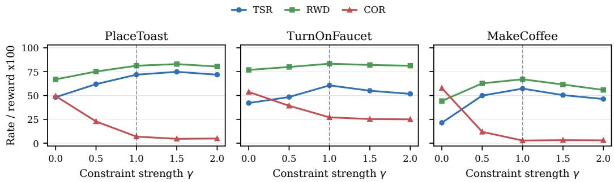  
Figure 10: CBF-QP guidance-strength sensitivity analysis. The default $\gamma = 1 . 0$ follows the linearized QP derivation and provides a robust task–collision tradeoff across the three tasks.

The regularization weight $\lambda _ { \mathrm { c b f } }$ controls how much the QP penalizes joint-space deviation from the denoised sample. This term is included to prevent collision avoidance from being absorbed by unnecessarily large joint motions. Table 5 shows that performance is stable over a broad range, with the default $\lambda _ { \mathrm { c b f } } = 0 . 0 1$ giving a balanced setting.

Table 5: CBF-QP regularization sensitivity analysis averaged over the 9 robot embodiments used in the paper. The $\lambda _ { \mathrm { c b f } } = 0 . 0 1$ row corresponds to the default setting.

<table><tr><td>Task</td><td> $\lambda_{\text{cbf}}$ </td><td>TSR ↑</td><td>RWD ↑</td><td>COR ↓</td></tr><tr><td rowspan="8">PLACETOAST</td><td>0.000</td><td>70.8%</td><td>0.800</td><td>5.9%</td></tr><tr><td>0.001</td><td>70.0%</td><td>0.797</td><td>6.1%</td></tr><tr><td>0.005</td><td>72.4%</td><td>0.809</td><td>5.0%</td></tr><tr><td>0.010</td><td>71.8%</td><td>0.812</td><td>6.9%</td></tr><tr><td>0.050</td><td>70.9%</td><td>0.797</td><td>5.3%</td></tr><tr><td>0.100</td><td>70.1%</td><td>0.797</td><td>5.7%</td></tr><tr><td>0.500</td><td>69.9%</td><td>0.797</td><td>5.9%</td></tr><tr><td>1.000</td><td>70.9%</td><td>0.803</td><td>7.1%</td></tr><tr><td rowspan="8">TURNONFAUCET</td><td>0.000</td><td>57.2%</td><td>0.829</td><td>26.3%</td></tr><tr><td>0.001</td><td>58.9%</td><td>0.842</td><td>25.7%</td></tr><tr><td>0.005</td><td>58.6%</td><td>0.833</td><td>24.9%</td></tr><tr><td>0.010</td><td>60.6%</td><td>0.833</td><td>27.1%</td></tr><tr><td>0.050</td><td>57.0%</td><td>0.817</td><td>26.6%</td></tr><tr><td>0.100</td><td>59.6%</td><td>0.831</td><td>25.9%</td></tr><tr><td>0.500</td><td>59.7%</td><td>0.838</td><td>25.7%</td></tr><tr><td>1.000</td><td>60.2%</td><td>0.835</td><td>24.6%</td></tr><tr><td rowspan="8">MAKECOFFEE</td><td>0.000</td><td>46.3%</td><td>0.603</td><td>3.6%</td></tr><tr><td>0.001</td><td>42.4%</td><td>0.574</td><td>3.2%</td></tr><tr><td>0.005</td><td>45.3%</td><td>0.591</td><td>2.6%</td></tr><tr><td>0.010</td><td>57.2%</td><td>0.670</td><td>2.8%</td></tr><tr><td>0.050</td><td>47.2%</td><td>0.606</td><td>2.0%</td></tr><tr><td>0.100</td><td>42.7%</td><td>0.570</td><td>3.4%</td></tr><tr><td>0.500</td><td>44.7%</td><td>0.590</td><td>3.6%</td></tr><tr><td>1.000</td><td>46.4%</td><td>0.603</td><td>3.6%</td></tr></table>

We also ablate the guidance schedule by comparing the scheduled strength in (16) with a constant scale $\gamma _ { t } = \gamma = 1 . 0$ throughout denoising. The schedule is intended to avoid strong corrections in early noisy denoising steps, where samples are still far from the policy distribution. Table 6 shows that scheduling helps preserve task performance while maintaining similar collision rates.

Table 6: Guidance schedule ablation averaged over the 9 robot embodiments used in the paper. Scheduled guidance uses Eq. (16); constant guidance keeps $\gamma _ { t } = \gamma = 1 . 0$ for all denoising steps.

<table><tr><td>Task</td><td>Guidance scale</td><td>TSR ↑</td><td>RWD ↑</td><td>COR ↓</td></tr><tr><td rowspan="2">PLACETOAST</td><td>Scheduled  $\gamma_t$ </td><td>71.8%</td><td>0.812</td><td>6.9%</td></tr><tr><td>Constant  $\gamma_t$ </td><td>70.2%</td><td>0.796</td><td>5.6%</td></tr><tr><td rowspan="2">TURNONFAUCET</td><td>Scheduled  $\gamma_t$ </td><td>60.6%</td><td>0.833</td><td>27.1%</td></tr><tr><td>Constant  $\gamma_t$ </td><td>57.8%</td><td>0.827</td><td>26.1%</td></tr><tr><td rowspan="2">MAKECOFFEE</td><td>Scheduled  $\gamma_t$ </td><td>57.2%</td><td>0.670</td><td>2.8%</td></tr><tr><td>Constant  $\gamma_t$ </td><td>46.2%</td><td>0.593</td><td>2.8%</td></tr></table>

Finally, we sweep the cost-gradient guidance scale $\rho$ for the gradient-based baseline (Joint w/ CG). This verifies that the baseline is not disadvantaged by a single poorly chosen scale. As shown in Fig. 11, tuning $\rho$ can reduce collisions, but the unconstrained gradient update often degrades task performance, especially in tasks requiring precise end-effector motion.

## C.4 Additional Qualitative Results

Fig. 12 shows representative simulation rollouts across the three benchmark tasks. The base Cartesian policy often produces task-directed end-effector motion but cannot reason about out-ofdistribution obstacles, which leads to end-effector collisions near the task object. It also ignores the target robot’s arm geometry, leading to arm-body obstacle contact. In contrast, EMBODISTEER preserves the same task intent while steering both the end-effector and the full robot body around the obstacle.

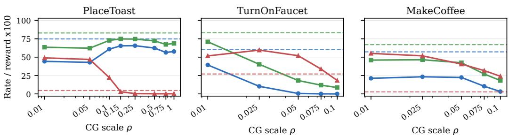  
Figure 11: Cost-gradient guidance-strength sensitivity analysis. Solid curves show the CG baseline under different $\rho ,$ while dashed horizontal lines show EMBODISTEER with its default setting. Tuning $\rho$ can reduce collisions, but CG consistently gives a worse task–collision tradeoff.

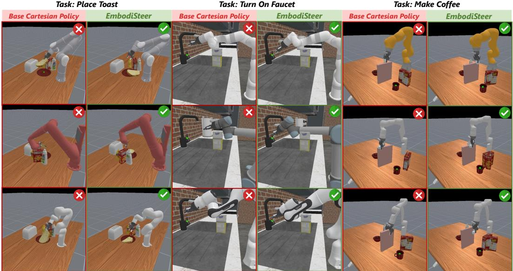  
Figure 12: Additional simulation qualitative results. The base Cartesian policy can collide at the end-effector or along the arm body when obstacles are added at test time, while EMBODISTEER generates collision-aware whole-body motion and completes the task.

## D Real-World Results

## D.1 Setup and Annotation Protocol

Each real-world task uses 200 UMI handheld-gripper demonstrations collected without extra obstacles. Because these demonstrations are collected with a handheld gripper rather than a particular robot arm, the training data are embodiment-agnostic. For each task, a single Cartesian diffusion policy checkpoint is trained and shared by UR5 and Franka Panda without robot-specific finetuning. The three tasks are illustrated in Fig. 13: MAKEICEDCOFFEE requires grasping blocks from a bowl, which represent ice cubes, and placing them into a cup; PUTFLOWERINVASE requires grasping the bouquet and inserting it into the vase; and ARRANGEBANANA requires grasping a banana from a pen holder and placing it into a cup. For each robot-task pair, we evaluate 10 no-obstacle trials and 10 obstacle-present trials distributed across the obstacle types in Fig. 14. A trial is marked successful if the task object reaches the intended final state without timeout, object drop, or human intervention.

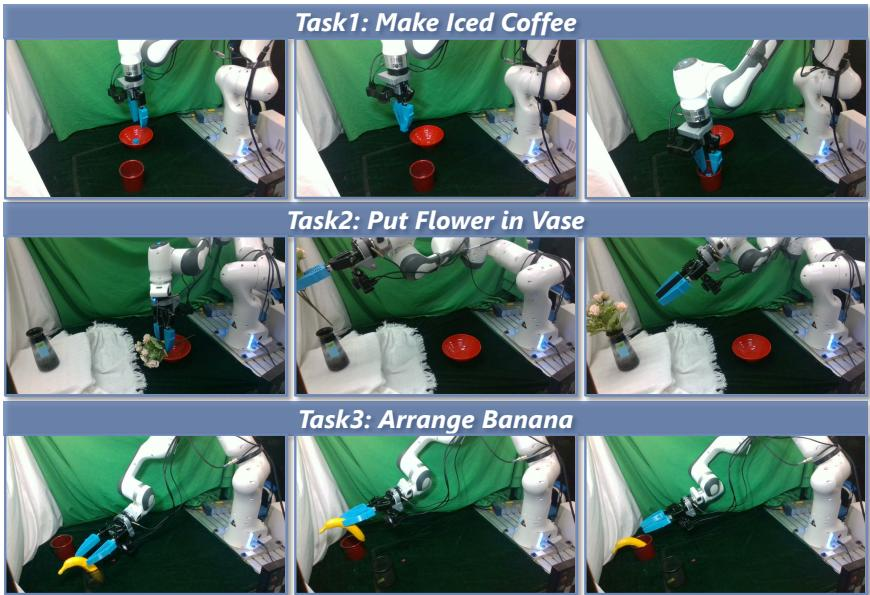  
Figure 13: Real-world task protocols. Each row shows representative stages of one UMI-trained task: MAKEICEDCOFFEE, PUTFLOWERINVASE, and ARRANGEBANANA.

Task success and collision are annotated independently. For safety in the real-world setup, obstacles are movable: after contact, they can be knocked over or pushed aside, unlike the fixed obstacles in simulation that often stop the robot motion. As a result, a rollout can still finish the task after a collision. COR therefore measures whether any end-effector or arm-body obstacle contact occurs during the rollout, separately from task success.

## D.2 Full Real-World Results

Table 7 reports the real-world results by robot and task. Each task checkpoint is shared by both robots.

Table 7: Real-world results by robot and task. TSR and COR are reported as success/collision counts over 10 trials for each robot-task pair; the total row aggregates over 60 trials.

<table><tr><td rowspan="2">Robot</td><td rowspan="2">Task</td><td>No Obstacle</td><td colspan="2">Obstacle, Base Policy</td><td colspan="2">Obstacle, EMBODISTEER</td></tr><tr><td>TSR ↑</td><td>TSR ↑</td><td>COR ↓</td><td>TSR ↑</td><td>COR ↓</td></tr><tr><td rowspan="3">UR5</td><td>MAKEICEDCOFFEE</td><td>9/10</td><td>4/10</td><td>10/10</td><td>8/10</td><td>1/10</td></tr><tr><td>PUTFLOWERINVASE</td><td>7/10</td><td>4/10</td><td>9/10</td><td>6/10</td><td>1/10</td></tr><tr><td>ARRANGEBANANA</td><td>8/10</td><td>4/10</td><td>9/10</td><td>9/10</td><td>0/10</td></tr><tr><td rowspan="3">Panda</td><td>MAKEICEDCOFFEE</td><td>9/10</td><td>6/10</td><td>10/10</td><td>8/10</td><td>1/10</td></tr><tr><td>PUTFLOWERINVASE</td><td>6/10</td><td>1/10</td><td>10/10</td><td>6/10</td><td>0/10</td></tr><tr><td>ARRANGEBANANA</td><td>10/10</td><td>6/10</td><td>10/10</td><td>10/10</td><td>1/10</td></tr><tr><td>Total</td><td>All tasks</td><td>49/60</td><td>25/60</td><td>58/60</td><td>47/60</td><td>4/60</td></tr></table>

## D.3 Obstacle Layouts and Qualitative Results

The real-world obstacle layouts are shown in Fig. 14. The obstacle type and pose are varied across episodes. These layouts require the robot to avoid collisions with both the arm links and the end effector.

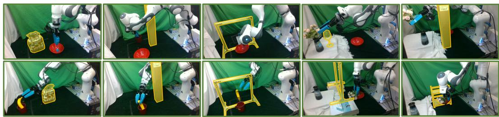  
Figure 14: Real-world obstacle layouts. The obstacles are highlighted with yellow masks. The obstacle type and pose are varied across episodes.

Fig. 16 shows representative real-world rollouts for all three tasks. Each row compares the base Cartesian policy and EMBODISTEER on both UR5 and Franka Panda. The qualitative results mirror the quantitative trend in Table 7: the base policy often reaches toward the task object while contacting the obstacle, whereas EMBODISTEER modifies the whole-body motion to avoid end-effector and arm-body obstacles.

## E Failure Mode Analysis

Fig. 15 summarizes three representative failure modes observed in our experiments. First, although guidance improves collision avoidance on average, a large correction can steer the robot into joint states that are rarely covered by the demonstrations. The frozen Cartesian policy may then receive observations outside its training distribution and fail to recover task progress. Second, the CBF-QP update is based on a local linearization and clipped joint correction, so it provides a practical avoidance direction rather than a formal collision-free certificate; collisions can still occur in highly constrained layouts or when the required correction is too large. Third, some task phases are more sensitive to small end-effector deviations than others. In pick-and-place tasks, for example, guidance applied near grasping or placement can perturb precision-critical motion and cause grasp misses, drops, or misplacement, even when the resulting motion avoids obstacles.

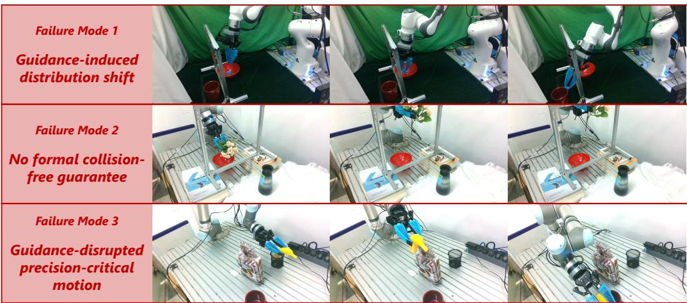  
Figure 15: Representative failure modes. Guidance may move the robot into out-of-distribution states, fail to fully prevent collision under local linearization and clipping, or disrupt precisioncritical pick/place motions.

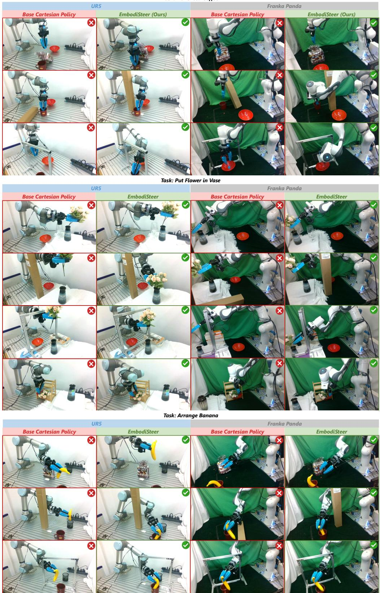  
Figure 16: Real-world qualitative results. From top to bottom: MAKEICEDCOFFEE, PUTFLOWER-INVASE, and ARRANGEBANANA. Each row compares the base Cartesian policy and EMBODIS-TEER on UR5 and Franka Panda under obstacle layouts that test end-effector and arm-body avoidance.