# Feedback World Model Enables Precise Guidance of Diffusion Policy

Tuo An1,∗, Jindou Jia1,∗, Gen Li1, Jingliang Li1, Chuhao Zhou1, Pengfei Liu1, Bofan Lyu1, Jiaqi Bai1, Xinying Guo1, Geng Li1, Jianfei Yang1

1MARS Lab, Nanyang Technological University ∗Equal contribution

World models aim to improve robotic decision making by predicting the consequences of actions. However, in practice, their predictions often become unreliable once the robot encounters states outside the training distribution, limiting their efectiveness at deployment. We observe that execution itself provides a natural but underutilized signal: after each action, the robot directly observes the true next state, revealing the mismatch between predicted and actual outcomes. Building on this insight, we propose feedback world model, a new paradigm that closes the loop between prediction and observation at inference time. Instead of treating the world model as a static open-loop predictor, our method maintains a lightweight feedback state that is updated online to iteratively correct future predictions, compensating for model errors using real-time observations without additional training data or parameter updates. We show that this process can be interpreted as a latent-space observer and admits convergence guarantees under mild conditions. We further introduce action-aware guidance to better translate corrected predictions into control by emphasizing action-controllable components while suppressing irrelevant variations. Experiments on LIBERO-Plus, Robomimic, and real-world manipulation tasks demonstrate that our method substantially improves both prediction accuracy and policy performance under distribution shift. In particular, it reduces world model prediction error by up to 76.4% and improves out-of-distribution (OOD) success rate by 30%. These results show that incorporating real-time feedback at inference time provides a simple yet powerful alternative to static world modeling.

Correspondence: jianfei.yang@ntu.edu.sg, antu0001@e.ntu.edu.sg Project site: https://lorenzo-0-0.github.io/Feedback\_World\_Model/

## 1 Introduction

World models, which predict how environment states evolve under actions, have emerged as a promising tool for improving the robustness and generalization of robotic policies (Sun et al., 2026a; Yuan et al., 2026; Ye et al., 2026; Su et al., 2026; Hou et al., 2026). Existing approaches primarily incorporate world models in two ways. One line integrates predicted dynamics, preferences, or rewards into policy training, using them as auxiliary supervision or optimization signals (Sun et al., 2026a; Yuan et al., 2026; Sun et al., 2026b; Liu et al., 2026). The other leverages world models at inference time to evaluate or plan over candidate actions, directly influencing decision making during execution (Sun and Song, 2025; Yan et al., 2026). Across both paradigms, the key idea is to move beyond pure behavior cloning by grounding policy learning and execution in predicted environment dynamics, encouraging actions that lead to plausible and task-consistent future states (Quevedo et al., 2025; Sun and Song, 2025).

However, these benefits become dificult to realize when policies are deployed beyond the training distribution. In robotic manipulation tasks, even small variations in initial pose, object configuration, or visual observation can shift the system into out-of-distribution (OOD) regimes. Under such shifts, the reliability of the world model becomes critical: inaccurate predictions can directly mislead both policy learning and test-time guidance (Quevedo et al., 2025). A common strategy to improve robustness is to scale up data or model capacity, for example through large pretrained video models (Ye et al., 2026) or additional real-world rollouts for finetuning (Sun and Song, 2025; Liu et al., 2026). While efective, this approach substantially increases training cost and is often impractical in data-limited robotic settings (Ye et al., 2026; Yuan et al., 2026). Notably, deployment itself provides an underexplored signal: after each action, the robot observes the true next state, which directly exposes the mismatch between predicted and actual transitions. This real-time feedback ofers a natural opportunity to improve prediction reliability without additional data collection or model scaling.

Despite this, existing methods largely treat world models as static predictors at inference time. While new observations are incorporated for subsequent predictions, they are rarely used to correct the model’s internal prediction state. As a result, prediction errors can persist and accumulate over time, especially in long-horizon or OOD scenarios. This limitation points to a key missing capability: can a world model actively exploit real-time feedback during inference to maintain reliable prediction under distribution shift, without requiring additional data or larger models?

To this end, we propose a feedback world model that leverages real-time observations during policy inference to correct future predictions online. Instead of operating as a static open-loop predictor, our model maintains a lightweight feedback state that is updated after each environment interaction. The observed mismatch between predicted and observed transitions is used to iteratively correct subsequent predictions, mitigating error accumulation without requiring additional training data or parameter updates. This mechanism can be interpreted as a latent-space observer and, under a linear feedback formulation, admits theoretical convergence guarantees. Furthermore, we introduce action-aware guidance strategy for difusion policy inference. Rather than uniformly comparing predicted observations, we emphasize components that are more directly influenced by the robot’s actions, such as end-efector motion and object pose. This focuses guidance on controllable, task-relevant changes while reducing interference from action-irrelevant variations.

We thoroughly evaluate our method on four tasks from the LIBERO-10 task suite in the LIBERO-Plus benchmark (Fei et al., 2025), three representative Robomimic tasks (Mandlekar et al., 2022), and two real-world manipulation tasks, focusing on data-limited world model and OOD settings induced by robot initial-state perturbations. Notably, the proposed feedback mechanism reduces world model prediction error by up to 76.4% under OOD conditions, without additional training data. Built on these improved predictions, the downstream difusion policy achieves the best overall performance, increasing the average success rate by 30%.

To summarize, our contributions are threefold: (1) We propose a feedback world model that incorporates real-time observations as online corrective signals, enabling reliable prediction under distribution shift with minimal overhead, and providing theoretical convergence guarantees. (2) We introduce an action-aware guidance strategy that emphasizes controllable, action-relevant components to improve policy guidance. (3) We validate the proposed approach on both simulated and real-world robotic tasks, demonstrating consistent improvements in world model prediction accuracy and downstream policy performance.

## 2 Related work

## 2.1 Efficient and accurate world models.

Recent work on robotic world models has improved model quality along three directions: stronger latent representations, more accurate predictive dynamics, and more eficient architectures. One line of work improves representation quality through latent predictive pretraining, learning abstractions that capture action-conditioned dynamics and suppress nuisance visual variation (Sun et al., 2026a; Zhou et al., 2025). Another improves predictive accuracy through iterative or closed-loop refinement, where world models are adapted using rollout data or coupled with downstream learning (Liu et al., 2026; Feng et al., 2023). In parallel, eficiency-oriented designs such as Fast-WAM (Yuan et al., 2026), DreamZero (Ye et al., 2026), and DDP-WM (Yin et al., 2026) reduce the cost of world or world-action modeling through latent-space prediction, architectural simplification, or faster inference.

However, these advances are still largely driven by ofline training, additional data, or improved model design, while the deployed world model typically remains frozen and lacks online adaptivity. This leaves prediction drift under distribution shift relatively underexplored. Our work instead studies how a deployed world model can be corrected online from real observations.

## 2.2 Inference-Time Policy Steering.

Recent eforts study how to steer difusion policies at inference time for improved robustness. Since difusion policies generate actions through iterative denoising (Chi et al., 2025), they naturally allow external objectives to be injected during sampling. Value-guided denoising (Nakamoto et al., 2025) uses value gradients without updating policy parameters, DynaGuide (Du and Song, 2025) injects guidance from an external latent dynamics model, and latent policy barrier (Sun and Song, 2025) uses future latent predictions relative to an expert manifold. More structured guidance signals include contact-guided generation in hierarchical difusion policy (Wang et al., 2025) and task-progress guidance in ProgressVLA (Yan et al., 2026).

In contrast, our method builds guidance from feedback-corrected future prediction and further reweights latent dimensions by action controllability, which measures how strongly each latent component can be influenced by the candidate action, rather than relying on a uniformly constructed guidance signal.

## 3 Preliminaries

## 3.1 Action-conditioned world model for robot learning

In robot learning, world models are commonly used as action-conditioned predictive models that estimate how the robot-environment state evolves under candidate actions. In this work, we consider prediction in a latent state space. Let $O _ { t }$ denote the observation context available at time $t ,$ which may include the current observation as well as a finite history of previous observations. We encode this context into a latent state

$$
z _ {t} = \psi (O _ {t}),\tag{1}
$$

where $\psi$ is the context encoder. For notational brevity, we denote a candidate future action sequence from time t as $A _ { t }$ . The latent world model $f _ { \theta }$ then predicts the next latent state as

$$
\hat {z} _ {t + 1} = f _ {\theta} (z _ {t}, A _ {t}).\tag{2}
$$

This formulation captures action-conditioned latent dynamics and enables rollout-based reasoning about the consequences of candidate robot actions (Hafner et al., 2019b,a, 2021).

## 3.2 Diffusion policy

Difusion-based policies model the conditional distribution over action sequences through a denoising process (Chi et al., 2025; Jia et al., 2026). The policy learns a time-dependent score function that estimates the gradient of the log-probability of actions conditioned on the observation and optional language instruction (Song and Ermon, 2019; Song et al., 2021).

Score Function Learning. A difusion policy $\pi _ { \phi }$ parameterized by $\phi$ learns the score function:

$$
s _ {\phi} (A _ {t} ^ {(\tau)}, O _ {t}, \ell , \tau) \approx \nabla_ {A _ {t} ^ {(\tau)}} \log p _ {\tau} (A _ {t} ^ {(\tau)} \mid O _ {t}, \ell),\tag{3}
$$

where $A _ { t } ^ { ( \tau ) }$ is the noisy action at difusion step $\tau _ { \mathrm { { i } } }$ and ℓ denotes an optional language instruction. In practice, this is implemented via a denoising objective that trains the model to predict the score (or equivalently, the injected noise) at each difusion step.

Guided Denoising. Since the difusion policy explicitly models the score function, additional objectives can be naturally incorporated at inference time via score guidance (Dhariwal and Nichol, 2021). Given a task-oriented guidance term $g ( A _ { t } ^ { ( \tau ) } , O _ { t } )$ , the guided score is:

$$
\tilde {s} (A _ {t} ^ {(\tau)}, O _ {t}, \ell , \tau) = s _ {\phi} (A _ {t} ^ {(\tau)}, O _ {t}, \ell , \tau) + \lambda g (A _ {t} ^ {(\tau)}, O _ {t}),\tag{4}
$$

where $\lambda$ controls the strength of guidance. This formulation enables integrating auxiliary signals, such as those derived from world models, into the action generation process (Janner et al., 2022; Sun and Song, 2025).

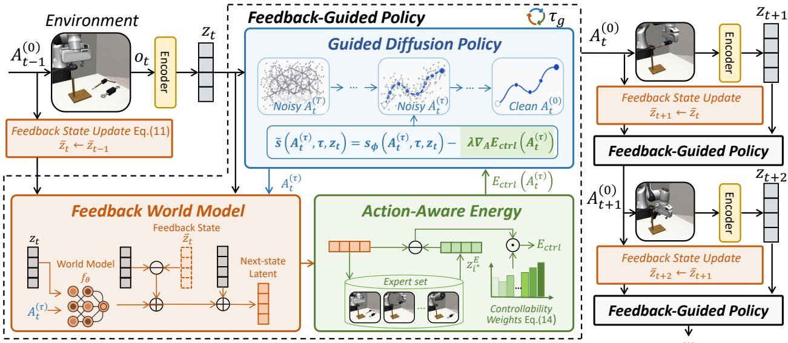  
Figure 1 Overview of the Feedback-Guided Policy. During denoising, the feedback world model predicts the future latent outcome of the current action trajectory, and an action-aware energy guides the policy toward expert-like, action-relevant states. After each execution, the new observation updates the feedback state, which corrects subsequent feedback world model predictions and forms an outer loop for reducing prediction drift during inference.

## 4 Methodology

## 4.1 Framework overview

We first provide an overview of the proposed Feedback-Guided Policy (Fig. 1), an inference framework that uses online observation feedback to construct reliable and action-aware policy guidance. At each denoising step τ , a candidate action sequence $A _ { t } ^ { ( \tau ) }$ is evaluated through a learned world model. Following prior world model guidance methods (Sun and Song, 2025), the predicted next latent state $\hat { z } _ { t + 1 } ( A _ { t } ^ { ( \tau ) } )$ is matched to the nearest expert latent in $\mathcal { Z } ^ { E } = \{ z _ { i } ^ { E } \} _ { i = 1 } ^ { N }$ with N samples:

$$
i ^ {\star} = \arg \min _ {i} \left\| \hat {z} _ {t + 1} (A _ {t} ^ {(\tau)}) - z _ {i} ^ {E} \right\| _ {2} ^ {2}.\tag{5}
$$

The corresponding guidance energy is then defined as the squared latent distance to this nearest expert state:

$$
E (A _ {t} ^ {(\tau)}) = \left\| \hat {z} _ {t + 1} (A _ {t} ^ {(\tau)}) - z _ {i ^ {\star}} ^ {E} \right\| _ {2} ^ {2}.\tag{6}
$$

This energy encourages candidate actions whose predicted outcomes are closer to expert-like latent states. It is used to guide difusion sampling as

$$
\tilde {s} = s _ {\phi} - \lambda \nabla_ {A _ {t} ^ {(\tau)}} E (A _ {t} ^ {(\tau)}),\tag{7}
$$

where λ controls the guidance strength, and $\nabla _ { A _ { t } ^ { ( \tau ) } } E ( A _ { t } ^ { ( \tau ) } )$ denotes the gradient of the guidance energy with respect to the candidate action sequence.

This standard formulation is limited by two factors: the predicted latent state may drift under distribution shift, and uniform latent matching may include action-irrelevant components in the guidance signal. We address these issues with two complementary designs. First, a feedback world model uses online observations to correct latent predictions during inference. Second, an action-aware energy reweights latent dimensions according to their estimated action controllability. Together, they produce guidance based on predictions that are both dynamically reliable and action-relevant. Algorithm 1 in Appendix E summarizes the full inference pipeline. In the following subsections, we detail the feedback world model and action-aware energy, respectively.

## 4.2 Feedback world model

As discussed in Sec. 4.1, world-model-based guidance relies on the predicted latent $\hat { z } _ { t + 1 }$ to construct the energy signal. In standard usage, the pretrained world model $f _ { \theta }$ operates in an open-loop manner (2), causing prediction errors to accumulate under distribution shift or long-horizon rollout, which leads to biased guidance.

To improve prediction reliability, we introduce a feedback world model that uses real observations to correct latent predictions without updating the pretrained world model $f _ { \theta }$ . Following (Jia et al., 2025), we reinterpret the learned transition model in velocity form:

$$
v _ {t} (A _ {t} ^ {(\tau)}) \triangleq \frac {f _ {\theta} (z _ {t} , A _ {t} ^ {(\tau)}) - z _ {t}}{\delta t} = \frac {\hat {z} _ {t + 1} - z _ {t}}{\delta t},\tag{8}
$$

where δt is the environment update interval. In addition to the observed latent state $z _ { t } ,$ , we maintain an auxiliary feedback state $\bar { z } _ { t }$ (initialized as $z _ { \mathrm { 0 } } )$ that tracks the model’s internal belief about where the system should be after past executed actions. The discrepancy

$$
e _ {t} = z _ {t} - \bar {z} _ {t}\tag{9}
$$

therefore measures the accumulated prediction discrepancy up to the current environment step.

During difusion guidance at step t, this discrepancy is held fixed and used to correct the score function for every noisy action $A _ { t } ^ { ( \tau ) }$ :

$$
\left\{ \begin{array}{l} \hat {v} _ {t} (A _ {t} ^ {(\tau)}) = v _ {t} (A _ {t} ^ {(\tau)}) + L e _ {t}, \\ z _ {t + 1} ^ {\mathrm{fb}} (A _ {t} ^ {(\tau)}) = z _ {t} + \delta t \cdot \hat {v} _ {t} (A _ {t} ^ {(\tau)}), \end{array} \right.\tag{10}
$$

where L is the positive-definite feedback gain. The corrected prediction $z _ { t + 1 } ^ { \mathrm { f b } } ( A _ { t } ^ { ( \tau ) } )$ replaces the open-loop prediction $\hat { z } _ { t + 1 } ( A _ { t } ^ { ( \tau ) } )$ in the guidance energy of Eq. (6). After the guided clean action $A _ { t } ^ { ( 0 ) }$ is executed in the environment, the feedback state is propagated using the same action-conditioned corrected velocity:

$$
\bar {z} _ {t + 1} = \bar {z} _ {t} + \delta t \cdot \hat {v} _ {t} (A _ {t} ^ {(0)}).\tag{11}
$$

After the environment returns the next observation $o _ { t + 1 }$ , we obtain the corresponding observed latent state $z _ { t + 1 }$ . This latent state reflects the actual transition reached after executing $A _ { t } ^ { ( 0 ) }$ , and is used to form the next feedback residual:

$$
e _ {t + 1} = z _ {t + 1} - \bar {z} _ {t + 1},\tag{12}
$$

which is carried forward and used to correct predictions at step $t { + } 1$ . Thus, the action $A _ { t } ^ { ( 0 ) }$ and the observation $z _ { t + 1 }$ are aligned across one environment transition: $A _ { t } ^ { ( 0 ) }$ advances the internal belief to $\bar { z } _ { t + 1 }$ , and the subsequently observed $z _ { t + 1 }$ calibrates the residual signal used at the next decision step.

Convergence guarantee. Under a bounded residual assumption on the learned latent dynamics, the feedback update admits a convergence guarantee. Suppose the residual error between the true latent velocity and the learned latent velocity is bounded by γ. Then the auxiliary feedback state satisfies

$$
\lim _ {t \to \infty} \| z _ {t} - \bar {z} _ {t} \| \leq \frac {\gamma}{\lambda_ {\min} (L)}.\tag{13}
$$

For the scalar-gain case $L = l I$ with an identity matrix I, this reduces to $\gamma / l$ . See Appendix A for proof details. This bound formalizes the role of feedback: the learned world model determines the residual disturbance level, while the feedback gain controls how strongly real observations suppress accumulated prediction error. Consequently, the corrected one-step prediction used for guidance also remains bounded during deployment.

## 4.3 Action-aware guidance

World-model-based guidance in Eq. (7) depends not only on prediction accuracy, but also on whether the guidance objective emphasizes action-relevant state changes. Uniform latent matching is suboptimal because latent representations often entangle controllable factors, such as robot-object geometry, with weakly controllable factors, such as background appearance and lighting. We therefore propose an action-aware energy that reweights latent dimensions according to their controllability.

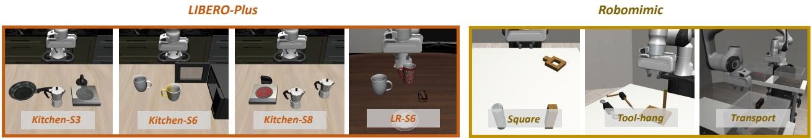  
Figure 2 Simulated tasks. For LIBERO-Plus, we evaluate four representative single-task settings from the Kitchen and Living Room (LR) scenes, with further details provided in Appendix C. For Robomimic tasks, we evaluate three representative tasks including Transport, Square and Tool-Hang.

Specifically, we estimate the controllability of the j-th latent dimension by its counterfactual variance under the learned world model:

$$
w _ {j} = \frac {1}{M} \sum_ {i = 1} ^ {M} \mathrm{Var} _ {a \sim \mathcal {A} _ {\mathrm{demo}}} ([ f _ {\theta} (z _ {i}, a) ] _ {j}), \quad j \in \{1, \dots , D \},\tag{14}
$$

where $\{ z _ { i } \} _ { i = 1 } ^ { M }$ are observations drawn at uniformly spaced indices along the demonstration trajectory, and the variance is taken over actions sampled from the demonstration action pool $A _ { \mathrm { d e m o } } .$ . A larger $w _ { j }$ indicates that the corresponding latent dimension is more responsive to action perturbations and is therefore more relevant for action guidance. In practice we approximate (14) with M=200 states and 32 action samples per state.

We normalize the weights and apply a soft interpolation to preserve the overall scale of the energy:

$$
\bar {w} _ {j} = \frac {w _ {j}}{\frac {1}{D} \sum_ {k = 1} ^ {D} w _ {k} + \epsilon}, \qquad w _ {j} ^ {(\beta)} = 1 + \beta (\bar {w} _ {j} - 1),\tag{15}
$$

where $\epsilon = 1 0 ^ { - 8 }$ is a small constant added for numerical stability that prevents division by zero in the unlikely event that the average counterfactual variance vanishes, and $\beta \in [ 0 , 1 ]$ controls the strength of controllability modulation. The final guidance loss replaces the standard MSE with the controllability-weighted form

$$
E _ {\mathrm{ctrl}} (A _ {t} ^ {(\tau)}) = \sum_ {j = 1} ^ {D} w _ {j} ^ {(\beta)} (z _ {t + 1, j} ^ {\mathrm{fb}} (A _ {t} ^ {(\tau)}) - \hat {z} _ {i ^ {*}, j} ^ {E}) ^ {2}.\tag{16}
$$

The gradient $\nabla _ { A } E _ { \mathrm { c t r l } }$ is then used as the guidance term in Eq. (7), so action-sensitive latent dimensions contribute more strongly to denoising guidance, while action-invariant dimensions are down-weighted.

## 5 Experiments

We conduct experiments mainly to answer two questions. First, can the proposed feedback world model reduce prediction error online in OOD settings? Second, when combined with controllability-aware guidance, can the improved feedback world model further enhance the OOD success rate of difusion policies? To study these questions, we evaluate on both simulation benchmarks and real-world manipulation tasks under OOD settings induced by robot initial-state perturbations.

## 5.1 Experimental setup

Simulation benchmarks. We evaluate our method on seven simulated manipulation tasks spanning Robomimic and LIBERO-Plus, as shown in Fig. 2 (Mandlekar et al., 2022; Fei et al., 2025). For Robomimic, we use three representative tasks, Square, Tool-Hang, and Transport, and train the difusion policy in a low-data regime using 20% of the oficial demonstrations. For LIBERO-Plus, we use four single-task settings from the LIBERO-10 suite, focusing on the oficial robot initial-state perturbation category. In all simulation experiments, the base world model is trained from the corresponding expert demonstrations, and OOD robustness is evaluated under perturbed robot initial states while keeping the task goal and scene semantics unchanged. Further details on task selection and perturbation protocols are provided in Appendix B and Appendix C.

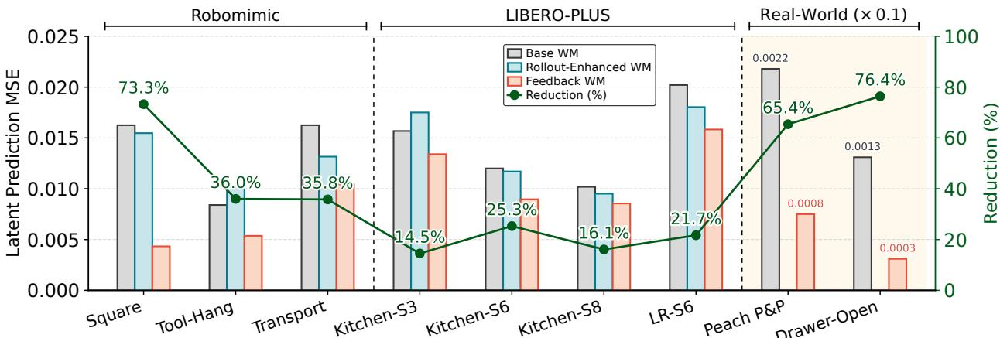

Figure 3 Latent prediction MSE on simulated and real-world OOD tasks. Base WM denotes the action-conditioned world model trained only on expert demonstrations. Rollout-Enhanced WM is trained on both expert demonstrations and policy rollout data. Feedback WM augments the base world model with online feedback correction. Reduction is computed as the relative decrease in prediction error achieved by Feedback WM over Base WM.  
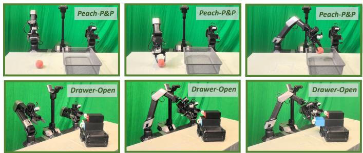

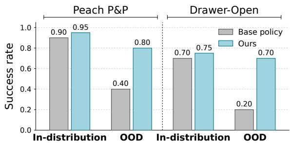  
Figure 4 Real-world tasks and results. We deploy the policy on the Peach-P&P and Drawer-Open tasks under both in-distribution and out-of-distribution initial states. For each setting, we perform 20 rollout episodes and report the corresponding success rate.

Real-world tasks. We further evaluate on two real-world manipulation tasks, Peach-P&P and Drawer-Open, as shown in Fig. 4. Peach-P&P requires picking a peach from the table and placing it into a target box, while Drawer-Open requires handle localization and contact-rich pulling with a deformable rubber handle. We collect 50 and 65 expert trajectories for the two tasks, respectively, and train both the difusion policy and world model from scratch. At test time, we reset the robot arm to abnormal initial poses outside the training distribution, yielding a real-world robot-initial-state OOD setting.

## 5.2 Experimental results

## 5.2.1 Feedback world model improves online prediction.

We first evaluate whether the proposed feedback mechanism improves world model prediction under robot initial-state OOD shifts. Fig. 3 shows latent prediction MSE under simulated and real-world OOD settings. The base world model sufers from large errors under perturbed initial states, while rollout-enhanced training provides limited and inconsistent gains, especially when the test-time OOD states difer from those covered by the collected rollouts. By correcting its internal predictive state with online observations, our feedback world model consistently reduces prediction error without extra training data or parameter updates. The reduction reaches 73.3% on Robomimic Square and 65.4%/76.4% on the real-world Peach-P&P and Drawer-Open tasks, confirming improved prediction reliability under OOD conditions.

Table 1 Success rates on simulated OOD manipulation tasks. Baselines include Base policy, Mixed BC using expert and rollout data, Filtered BC removing failed rollouts, Std. Guid. using the base world model, and Rollout Guid. using a rollout-enhanced world model. Best and second-best results are bolded and underlined. Details about rollout data collection are provided in Appendix D.

<table><tr><td>Benchmark</td><td>Task</td><td>Base</td><td>Mixed BC</td><td>Filtered BC</td><td>Std. Guid.</td><td>Rollout Guid.</td><td>Ours</td></tr><tr><td rowspan="3">Robomimic</td><td>Square</td><td>0.36</td><td>0.08</td><td>0.12</td><td>0.40</td><td>0.44</td><td>0.46</td></tr><tr><td>Tool-Hang</td><td>0.27</td><td>0.22</td><td>0.22</td><td>0.22</td><td>0.31</td><td>0.36</td></tr><tr><td>Transport</td><td>0.34</td><td>0.26</td><td>0.36</td><td>0.46</td><td>0.52</td><td>0.60</td></tr><tr><td rowspan="4">LIBERO-Plus</td><td>Kitchen-S3</td><td>0.55</td><td>0.57</td><td>0.70</td><td>0.61</td><td>0.50</td><td>0.68</td></tr><tr><td>Kitchen-S6</td><td>0.45</td><td>0.48</td><td>0.54</td><td>0.48</td><td>0.50</td><td>0.55</td></tr><tr><td>Kitchen-S8</td><td>0.59</td><td>0.42</td><td>0.35</td><td>0.62</td><td>0.62</td><td>0.65</td></tr><tr><td>LR-S6</td><td>0.26</td><td>0.24</td><td>0.24</td><td>0.21</td><td>0.24</td><td>0.36</td></tr><tr><td>Average</td><td></td><td>0.40</td><td>0.32</td><td>0.36</td><td>0.43</td><td>0.45</td><td>0.52</td></tr></table>

To further analyze the online evolution of the feedback mechanism, we visualize the predicted latent trajectories of the base and feedback world models together with the ground-truth latent trajectory in a shared PCA plane (Fig. 5). The base world model progressively drifts away from the ground truth as the episode unfolds whereas the feedback-corrected trajectory remains closely aligned and quickly recovers after the early-stage transient. This confirms that the feedback mechanism not only reduces the average prediction error in Fig. 3, but also keeps the world model on the correct latent manifold during online execution.

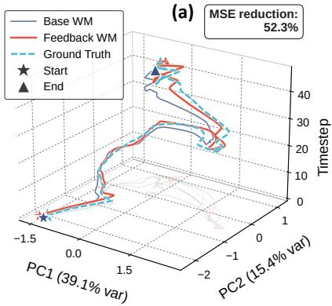

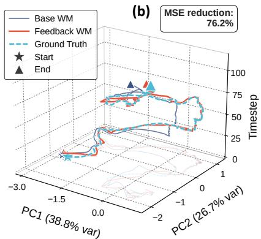

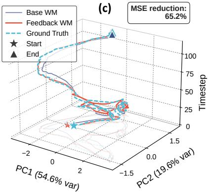  
Figure 5 Latent-space rollout trajectories on three cases. At each step we encode the predicted observations rolled out by the Base WM and the Feedback WM together with the ground-truth observation from the environment, and project them onto a 3-D view (PC1, PC2, timestep). The Feedback WM’s predicted-observation trajectory stays close to the ground-truth manifold throughout, while the Base WM drifts away.

## 5.2.2 Action-aware guidance improves controllable policy guidance.

While the feedback world model improves prediction reliability, efective policy guidance also requires focusing the guidance objective on action-controllable state components. To examine this, we visualize the distribution of action controllability in the world model latent space (Fig. 6). Across three Robomimic tasks, the sorted weights show a clear long-tailed pattern: the top 5% of dimensions contribute about 20–25% of the total controllability weight, while many dimensions have much smaller weights. The per-latent-observation variance map further shows that high-weight dimensions remain consistently action-responsive across observations. These results reveal strong action anisotropy in the latent representation, supporting our design choice to emphasize action-controllable dimensions during guidance.

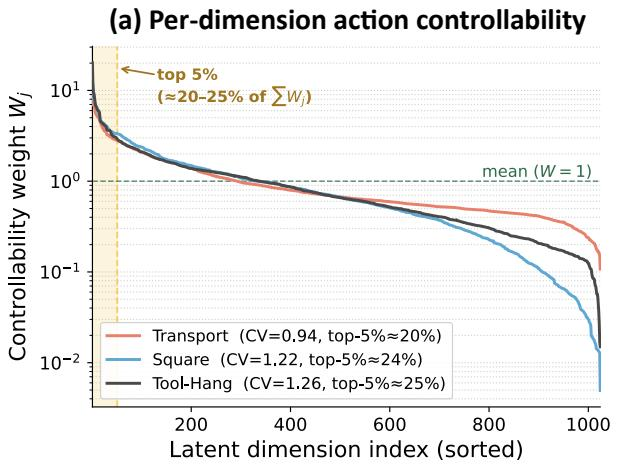

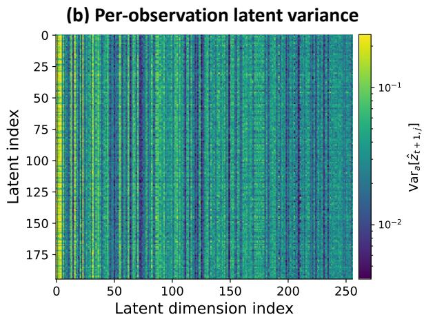  
Figure 6 Action controllability of the world model latent. (a) Sorted controllability weights $w _ { j }$ on three Robomimic tasks, shown in log scale. (b) Counterfactual action variance $\mathrm { V a r } _ { a } \big [ \hat { z } _ { t + 1 , j } \big ]$ on Transport, computed over sampled observations and 256 selected latent dimensions. Persistent vertical bands indicate dimensions that remain action-responsive across observations, supporting the use of an ofline-frozen W at inference time.

We further ablate action-aware guidance on Robomimic tasks, as shown in Table 2. Compared with guidance using only the feedback world model, adding action-aware weighting further improves policy success rates. This indicates that accurate prediction alone is not suficient for efective guidance: predicted state components should also be weighted by their action controllability. By downweighting action-irrelevant visual components, action-aware guidance focuses action optimization on task-relevant state changes and improves downstream policy success.

## 5.2.3 Combined guidance improves OOD performance across benchmarks.

Having verified the efectiveness of feedback correction and action-aware weighting separately, we next evaluate their combined efect on policy performance across broader simulated and real-world OOD settings. Table 1 and Fig. 4 report policy success rates in simulated and real-world OOD settings. Across simulated tasks, our method achieves the highest average success rate of 52%, outperforming the base policy (40%), standard guidance (43%), and rollout-enhanced guidance (45%). This corresponds to a 30% relative improvement over the base policy. Although Filtered BC slightly outperforms ours on Kitchen-S3, rollout-based augmentation is less stable overall: Mixed BC often degrades performance, and rollout-enhanced guidance improves the average success rate only moderately compared with standard guidance. This suggests that simply adding rollout data does not necessarily resolve OOD generalization, since rollout trajectories may contain failure cases, biased state distributions, or insuficient coverage of the final test-time perturbations.

Real-world results further confirm the benefit under robot initial-state shifts. Under in-distribution states, our method slightly improves the already strong base policy, from 90% to 95% on Peach-P&P and from 70% to 75% on Drawer-Open. Under OOD states, the gains become much larger, improving success from 40% to 80% and from 20% to 70%, respectively. Overall, the results suggest that reliable next-state prediction from the feedback world model, together with fine-grained action-aware guidance, leads to more robust policy performance under distribution shift.

## 6 Conclusion

In this work, we introduce a feedback world model for robust test-time guidance of difusion policies. Instead of using a pretrained world model as a static open-loop predictor, our method exploits real observations collected during policy execution to correct the model’s latent predictive state online, improving prediction reliability without additional training data or parameter updates. We further propose action-aware guidance, which weights latent prediction errors by ofline-estimated controllability to focus guidance on action-sensitive state components. Extensive simulated and real-world experiments show that combining feedback correction with action-aware guidance leads to more robust policy execution in OOD manipulation settings.

Table 2 Ablation study. + Feedback WM uses the feedback world model for guidance without per-dimension weighting; + Action-aware additionally weights the latent reconstruction loss by the ofline counterfactual-variance controllability score W .

<table><tr><td>Method</td><td>Square</td><td>Transport</td><td>Tool-Hang</td></tr><tr><td>Base</td><td>0.36</td><td>0.34</td><td>0.27</td></tr><tr><td>+ Feedback WM</td><td>0.40</td><td>0.54</td><td>0.32</td></tr><tr><td>+ Action-aware</td><td>0.46</td><td>0.60</td><td>0.36</td></tr></table>

Limitations and future work. Similar to prior inference-time guidance methods for difusion policies (Sun and Song, 2025; Yan et al., 2026), our approach has higher inference latency than an unguided base difusion policy because guidance is applied during denoising. Since the feedback update is analytic and the controllability weights are computed ofline, most overhead comes from the guided-difusion paradigm rather than from our proposed components. Future work can apply these ideas to more eficient guidance frameworks and latency-sensitive robotic tasks.

## A Proof of the convergence guarantee

We provide the convergence analysis of the proposed feedback world model. Let $z _ { t } = \psi ( O _ { t } )$ denote the observed latent state and let $\bar { z } _ { t }$ denote the auxiliary feedback state. For the executed action $A _ { t } ^ { ( 0 ) }$ , we write the true latent transition in velocity form as

$$
z _ {t + 1} = z _ {t} + \delta t v _ {t} ^ {\star} (A _ {t} ^ {(0)}),\tag{17}
$$

where $v _ { t } ^ { \star } ( A _ { t } ^ { ( 0 ) } )$ is the true latent velocity induced by the environment. The learned world model gives

$$
v _ {t} (A _ {t} ^ {(0)}) = \frac {f _ {\theta} (z _ {t} , A _ {t} ^ {(0)}) - z _ {t}}{\delta t}.\tag{18}
$$

We assume that the learned latent velocity has a bounded and asymptotically convergent residual error:

$$
v _ {t} ^ {\star} (A _ {t} ^ {(0)}) = v _ {t} (A _ {t} ^ {(0)}) + \Delta_ {t}, \qquad \| \Delta_ {t} \| \leq \gamma , \qquad \Delta_ {t} \to \Delta_ {\infty},\tag{19}
$$

where $\gamma > 0$ is an unknown constant and $\| \Delta _ { \infty } \| \le \gamma$ . This assumption states that the learned latent dynamics may have a nonzero residual error, but the residual remains bounded and approaches a steady limiting disturbance along the deployment trajectory.

The feedback world model corrects the learned velocity by

$$
\hat {v} _ {t} (A _ {t} ^ {(0)}) = v _ {t} (A _ {t} ^ {(0)}) + L (z _ {t} - \bar {z} _ {t}),\tag{20}
$$

where $L \succ 0$ is the feedback gain. The auxiliary feedback state is updated as

$$
\bar {z} _ {t + 1} = \bar {z} _ {t} + \delta t \hat {v} _ {t} (A _ {t} ^ {(0)}).\tag{21}
$$

Define the feedback estimation error as

$$
e _ {t} = z _ {t} - \bar {z} _ {t}.\tag{22}
$$

Combining Eq. (17), Eq. (19), Eq. (20), and Eq. (21), we obtain

$$
\begin{array}{r l} & e _ {t + 1} = z _ {t + 1} - \bar {z} _ {t + 1} \\ & \qquad = z _ {t} + \delta t \big (v _ {t} (A _ {t} ^ {(0)}) + \Delta_ {t} \big) - \Big [ \bar {z} _ {t} + \delta t \big (v _ {t} (A _ {t} ^ {(0)}) + L (z _ {t} - \bar {z} _ {t}) \big) \Big ] \\ & \qquad = (I - \delta t L) e _ {t} + \delta t   \Delta_ {t}. \end{array}\tag{23}
$$

Thus, the feedback residual follows a stable linear system driven by the latent dynamics residual.

We first analyze the continuous-time counterpart of Eq. (23), which is

$$
\dot {e} (t) = - L e (t) + \Delta (t), \qquad \| \Delta (t) \| \leq \gamma , \qquad \Delta (t) \to \Delta_ {\infty}.\tag{24}
$$

Since $L \succ 0$ , the homogeneous system $\dot { e } ( t ) = - L e ( t )$ is exponentially stable. The solution of Eq. (24) is

$$
e (t) = e ^ {- L t} e (0) + \int_ {0} ^ {t} e ^ {- L (t - s)} \Delta (s) d s.\tag{25}
$$

The first term converges to zero because all eigenvalues of $L$ are positive:

$$
\lim _ {t \to \infty} e ^ {- L t} e (0) = 0.\tag{26}
$$

For the second term, since $\Delta ( t )  \Delta _ { \infty } ,$ the forced response of the stable linear system converges to the equilibrium induced by the limiting residual:

$$
\lim _ {t \to \infty} e (t) = L ^ {- 1} \Delta_ {\infty}.\tag{27}
$$

Therefore,

$$
\lim _ {t \to \infty} \| e (t) \| = \| L ^ {- 1} \Delta_ {\infty} \| \leq \| L ^ {- 1} \| _ {2} \| \Delta_ {\infty} \| \leq \frac {\gamma}{\lambda_ {\min} (L)}.\tag{28}
$$

Since $e ( t ) = z ( t ) - \bar { z } ( t )$ , we obtain

$$
\lim _ {t \to \infty} \| z (t) - \bar {z} (t) \| \leq \frac {\gamma}{\lambda_ {\min} (L)}.\tag{29}
$$

For the scalar-gain case $L = l I$ with $l > 0$ , this reduces to

$$
\lim _ {t \to \infty} \| z (t) - \bar {z} (t) \| \leq \frac {\gamma}{l}.\tag{30}
$$

For the discrete-time update used in our implementation, Eq. (23) can be written as

$$
e _ {t + 1} = A e _ {t} + \delta t \Delta_ {t}, \qquad A = I - \delta t L.\tag{31}
$$

If the feedback gain satisfies

$$
\rho (A) = \rho (I - \delta t L) <   1,\tag{32}
$$

where $\rho ( \cdot )$ denotes the spectral radius, then the discrete error system is exponentially stable in the absence of residual input. Unrolling Eq. (31) gives

$$
e _ {t} = A ^ {t} e _ {0} + \delta t \sum_ {k = 0} ^ {t - 1} A ^ {t - 1 - k} \Delta_ {k}.\tag{33}
$$

Because $\rho ( A ) < 1$ , we have $A ^ { t } e _ { 0 }  0$ . Moreover, since $\Delta _ { t }  \Delta _ { \infty }$ , the input response converges to the steady-state response of the stable linear system:

$$
\lim _ {t \to \infty} e _ {t} = \delta t \sum_ {j = 0} ^ {\infty} A ^ {j} \Delta_ {\infty} = \delta t (I - A) ^ {- 1} \Delta_ {\infty}.\tag{34}
$$

Since $I - A = \delta t L$ , this becomes

$$
\lim _ {t \to \infty} e _ {t} = L ^ {- 1} \Delta_ {\infty}.\tag{35}
$$

Therefore,

$$
\lim _ {t \to \infty} \| e _ {t} \| = \| L ^ {- 1} \Delta_ {\infty} \| \leq \frac {\gamma}{\lambda_ {\min} (L)}.\tag{36}
$$

Equivalently,

$$
\lim _ {t \to \infty} \| z _ {t} - \bar {z} _ {t} \| \leq \frac {\gamma}{\lambda_ {\min} (L)}.\tag{37}
$$

In particular, when $L = l I$ and $0 < \delta t l < 2$ , the stability condition $\rho ( I - \delta t L ) < 1$ holds. If additionally $0 < \delta t l \le 1$ , then

$$
\| e _ {t + 1} \| \leq (1 - \delta t   l) \| e _ {t} \| + \delta t   \| \Delta_ {t} \|.\tag{38}
$$

Since $\Delta _ { t }  \Delta _ { \infty }$ , the exact scalar-gain error dynamics converges to

$$
\lim _ {t \to \infty} e _ {t} = \frac {1}{l} \Delta_ {\infty},\tag{39}
$$

and hence

$$
\lim _ {t \to \infty} \| z _ {t} - \bar {z} _ {t} \| = \frac {1}{l} \| \Delta_ {\infty} \| \leq \frac {\gamma}{l}.\tag{40}
$$

Finally, we relate this observer convergence result to the corrected one-step prediction used for policy guidance. For the executed action $A _ { t } ^ { ( 0 ) }$ , the corrected prediction is

$$
z _ {t + 1} ^ {\mathrm{fb}} (A _ {t} ^ {(0)}) = z _ {t} + \delta t \big (v _ {t} (A _ {t} ^ {(0)}) + L e _ {t} \big).\tag{41}
$$

Using Eq. (17) and Eq. (19), its prediction error satisfies

$$
\begin{array}{c} z _ {t + 1} ^ {\mathrm{fb}} (A _ {t} ^ {(0)}) - z _ {t + 1} = z _ {t} + \delta t \big (v _ {t} (A _ {t} ^ {(0)}) + L e _ {t} \big) - z _ {t} - \delta t \big (v _ {t} (A _ {t} ^ {(0)}) + \Delta_ {t} \big) \\ = \delta t \big (L e _ {t} - \Delta_ {t} \big). \end{array}\tag{42}
$$

Since $e _ { t } \to L ^ { - 1 } \Delta _ { \infty }$ and $\Delta _ { t }  \Delta _ { \infty }$ , we have

$$
\lim _ {t \to \infty} \left(L e _ {t} - \Delta_ {t}\right) = L L ^ {- 1} \Delta_ {\infty} - \Delta_ {\infty} = 0.\tag{43}
$$

Therefore,

$$
\lim _ {t \to \infty} \left\| z _ {t + 1} ^ {\mathrm{fb}} (A _ {t} ^ {(0)}) - z _ {t + 1} \right\| = 0.\tag{44}
$$

This result shows that, under a bounded and asymptotically convergent latent dynamics residual, the auxiliary feedback state converges to a bounded neighborhood of the observed latent state, with radius controlled by the residual level and the feedback gain. Moreover, the corrected one-step prediction used for guidance becomes asymptotically unbiased for the executed action. Hence, the feedback world model prevents deployment-time prediction bias from growing unboundedly, and the remaining observer bias is controlled by the learned latent dynamics residual and the feedback gain.

## B Robomimic OOD perturbation settings

Standard Robomimic evaluation initializes test episodes from the same distribution as the training demonstrations. As a result, both the policy and the world model are usually evaluated on familiar robot configurations. To test robustness under a realistic deployment shift, we construct an OOD protocol that perturbs the robot’s initial joint configuration.

For each test episode, we start from the initial simulator state of Robomimic demonstrations and perturb seven arm joint angles:

$$
\tilde {\mathbf {q}} ^ {(i)} = \mathrm{clip} \left(\mathbf {q} ^ {(i)} + \boldsymbol {\epsilon} ^ {(i)}, \mathbf {q} _ {\min}, \mathbf {q} _ {\max}\right), \quad \boldsymbol {\epsilon} ^ {(i)} \sim \mathcal {N} (\mathbf {0}, \sigma^ {2} I _ {7}),\tag{45}
$$

where $\mathbf { q } ^ { ( i ) }$ is the demonstration initial joint configuration and $[ \mathbf { q } _ { \mathrm { m i n } } , \mathbf { q } _ { \mathrm { m a x } } ]$ are the Panda joint limits. For the dual-arm Transport task, the same perturbation procedure is applied independently to each arm. All other simulator state variables are left unchanged.

We use $\sigma = 0 .$ 1 rad in the main experiments. This perturbation is large enough to move the robot away from the demonstration manifold, while remaining physically feasible for task execution. The same perturbed initial states are used for all baselines and our method to ensure a fair comparison. Figs. 7, 8, and 9 visualize the resulting OOD initial states for Square, Transport, and ToolHang. In each figure, the leftmost column shows the in-distribution demonstration start, while the remaining columns show independently sampled OOD starts.

## C LIBERO-Plus single-task settings

We evaluate on four single-task settings from the LIBERO-Plus benchmark, covering representative manipulation tasks from the Kitchen and Living Room scenes of LIBERO-10. For each task, the task instruction, scene layout, camera configuration, lighting, and object categories are kept the same as in the corresponding LIBERO-10 task. The distribution shift is introduced through perturbed initial robot configurations following the oficial LIBERO-Plus Robot Initial States protocol. This setting allows us to evaluate whether the policy and world model remain robust when the robot starts from configurations outside the demonstration distribution, while the task semantics remain unchanged.

Tasks. The four tasks used in our experiments are summarized in Table 3. They include sequential stove manipulation, microwave-door interaction, long-horizon dual-object placement, and relational tabletop placement. These tasks cover both single- and multi-stage manipulation, as well as rigid-object and articulated-object

Square: In-Distribution vs OOD Robot Poses

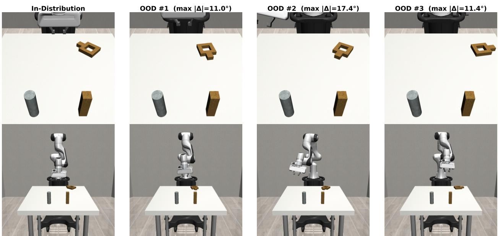  
Figure 7 Square OOD initial states. The leftmost column shows the in-distribution demonstration start. The remaining columns show OOD starts generated by perturbing only the robot arm joints. Top row: agentview camera; bottom row: front-view camera.

interactions. We select these tasks because they cover diverse manipulation challenges while keeping the distribution-shift factor controlled: Kitchen-S3 and Kitchen-S6 involve articulated-object interaction and sequential execution, Kitchen-S8 requires long-horizon placement of multiple objects, and LR-S6 tests relational object placement in a diferent scene layout. Since the task instruction and scene semantics remain unchanged, these settings isolate robustness to robot initial-state shifts from changes in task specification or visual domain.

Demonstrations and evaluation protocol. For each task, we use the 50 expert demonstrations from the corresponding LIBERO-10 task as the only supervision. No LIBERO-Plus demonstrations are used during training. At evaluation time, we use the perturbed initial states released by LIBERO-Plus under the libero\_10 suite and the Robot Initial States category. We evaluate 44 variants for Kitchen-S3, 42 for Kitchen-S6, 34 for Kitchen-S8, and 42 for LR-S6, following the oficial protocol from LIBERO-Plus benchmark. We report the average success rate over all evaluated initial-state variants.

Table 3 LIBERO-Plus single-task settings used in our experiments. All tasks follow the oficial Robot Initial States protocol.

<table><tr><td>Alias</td><td>Scene</td><td>Language instruction</td><td># variants</td></tr><tr><td>Kitchen-S3</td><td>KITCHEN_SCENE3</td><td>turn on the stove and put the moka pot on it</td><td>44</td></tr><tr><td>Kitchen-S6</td><td>KITCHEN_SCENE6</td><td>put the yellow and white mug in the microwave and close it</td><td>42</td></tr><tr><td>Kitchen-S8</td><td>KITCHEN_SCENE8</td><td>put both moka pots on the stove</td><td>34</td></tr><tr><td>LR-S6</td><td>LIVING_ROOM_SCENE6</td><td>put the white mug on the plate and put the chocolate pudding to the right of the plate</td><td>42</td></tr></table>

## D Rollout data collection

We include rollout-data baselines to test whether the gains of feedback world model can be matched by simply collecting additional policy executions and retraining. To avoid information leakage, all rollout trajectories are collected in the original in-distribution Robomimic or LIBERO environments. None of the rollout datasets

Transport: In-Distribution vs OOD Robot Poses

In-Distribution  
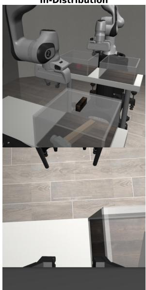

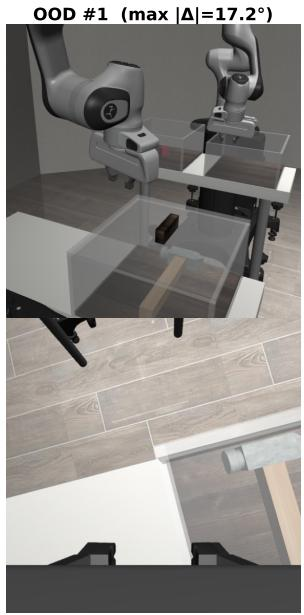

OOD #2 (max | |=17.4°)  
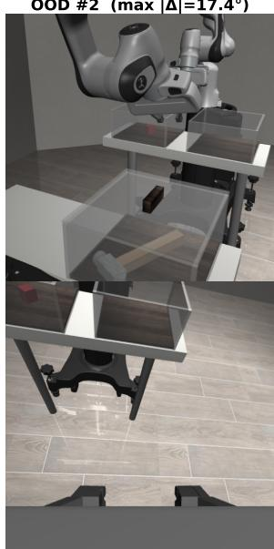

OOD #3 (max | |=17.9°)  
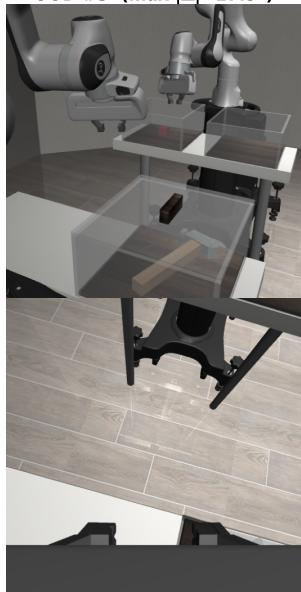  
Figure 8 Transport OOD initial states. The layout follows Fig. 7. For this dual-arm task, joint perturbations are applied independently to the two arms. Top row: shouldercamera0; bottom row: robot-0 wrist camera.

contains trajectories from the final robot-initial-state OOD evaluation setting.

Robomimic. For each Robomimic task, we first train the base difusion policy using the same low-data setting as in the main experiments, i.e., 20% of the oficial expert demonstrations. We then deploy intermediate policy checkpoints in the original Robomimic environment and record closed-loop trajectories. We collect 270 rollout episodes for Square and 150 rollout episodes for Transport and Tool-Hang. The rollout checkpoints are sampled across training to include both partially trained and stronger policies, producing a mixture of successful and failed behaviors.

For data-augmentation baselines, we construct two behavior-cloning datasets: Mixed BC, which combines the 20% expert subset with all collected rollout trajectories, and Filtered BC, which combines the same expert subset with only successful rollout trajectories. For the rollout-enhanced world model baseline, we train the world model on all oficial expert demonstrations plus all collected rollout trajectories, matching the setting used to evaluate whether additional ofline data can improve prediction quality.

LIBERO-Plus single-task setting. For LIBERO-Plus, rollout data are collected from the four selected LIBERO-10 single tasks: Kitchen-S3, Kitchen-S6, Kitchen-S8, and LR-S6. For each task, rollout trajectories are generated by the corresponding single-task policy using the original LIBERO-10 task specification and language instruction. Episodes are initialized from the training demonstration initial states in a round-robin manner to keep the rollout distribution aligned with the expert-data distribution. We collect rollouts from multiple policy checkpoints with a maximum horizon of 500 environment steps. The resulting rollout sets contain 150 episodes for Kitchen-S3 and Kitchen-S6 respectively, 100 episodes for Kitchen-S8 and LR-S6 respectively.

As in Robomimic, we build two rollout-augmented policy-training datasets. Mixed BC uses the original expert demonstrations together with all collected rollout episodes, regardless of success. Filtered BC uses the same expert demonstrations but retains only rollout episodes that achieve task success. The rollout-enhanced world model is trained on the corresponding mixed rollout-augmented dataset. These baselines therefore represent a direct ofline-data-augmentation alternative to our method, whereas the feedback world model uses no additional rollout data and instead corrects the world model state online from observations produced during the current inference episode.

ToolHang: In-Distribution vs OOD Robot Poses

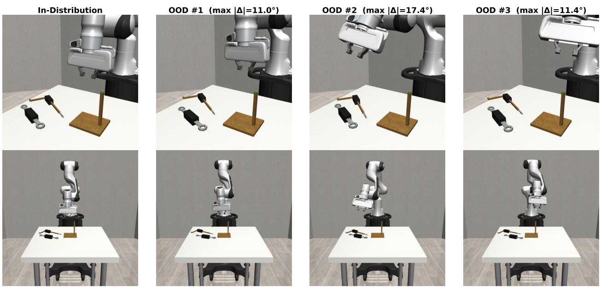  
Figure 9 ToolHang OOD initial states. The layout follows Fig. 7. Top row: side view; bottom row: front view.

## E Complete inference pipeline

Algorithm 1 summarizes the complete inference pipeline of our method. The procedure consists of an ofline preprocessing stage and an online deployment stage. The ofline stage constructs the expert latent memory and estimates the action-aware controllability weights, while the online stage performs feedback world model guidance during difusion-policy sampling.

Offline preprocessing. Given the expert demonstration set $\mathcal { D } _ { \mathrm { e x p e r t } }$ , we first encode all expert observations into the latent space of the observation encoder ψ, yielding an expert latent memory ${ \mathcal { Z } } ^ { E } = \{ \psi ( O ) \vert O \in { \mathcal { D } } _ { \mathrm { e x p e r t } } \}$ This memory is later used as a task-progress prior during guidance: predicted future latents are encouraged to approach nearby expert latents. In addition, we compute the action-aware weights $\{ w _ { j } ^ { ( \beta ) } \} _ { j = 1 } ^ { D }$ from the demonstrations via Eqs. (14)–(15). These weights estimate the degree to which each latent dimension is controllable by the robot action, and are fixed throughout deployment. As a result, the guidance objective focuses more on action-relevant latent changes and suppresses the influence of latent components that are visually salient but weakly controllable.

Online deployment. At the beginning of an episode, the robot observes $o _ { 0 }$ and obtains its latent state $z _ { 0 } = \psi ( o _ { 0 } )$ We initialise the internal feedback state as $\bar { z } _ { 0 } = z _ { 0 }$ . At each environment timestep $t ,$ the difusion policy samples an initial noisy action sequence $A _ { t } ^ { ( T ) }$ and iteratively denoises it from $\tau = T$ to τ = 1. During high-noise denoising steps, we use the original policy score $s _ { \phi } ( A _ { t } ^ { ( \tau ) } , O _ { t } , \ell , \tau )$ without additional guidance. Guidance is only applied in the final $\tau _ { g }$ low-noise denoising steps, where the action sequence already contains meaningful task structure and the world model prediction is more informative.

For each guided denoising step, the feedback world model predicts the next latent state under the current candidate action sequence. Unlike an open-loop world model that predicts only from the current observation, our feedback world model uses the internal feedback state $\bar { z } _ { t }$ as the corrected belief of the current latent state. This allows the predicted future latent $\hat { z } _ { t + 1 } ^ { \mathrm { f b } } ( A _ { t } ^ { ( \tau ) } )$ to incorporate accumulated online observation feedback from previous environment interactions. The predicted latent is then matched to its nearest expert latent $z _ { i ^ { \star } } ^ { E }$ in $\mathcal { Z } ^ { E }$ , and the action-aware guidance energy $E _ { \mathrm { c t r l } } ( A _ { t } ^ { ( \tau ) } )$ is computed using the controllability-weighted latent distance via Eq. (16). The resulting gradient is added to the difusion-policy score, producing the guided score s˜ used for the next denoising update. This forms the inner guidance loop of our method.

After denoising, the clean action sequence $A _ { t } = A _ { t } ^ { ( 0 ) }$ is obtained and the first $T _ { a }$ actions are executed in the environment. The feedback state is then propagated using the corrected latent dynamics induced by the executed action:

$$
\bar {z} _ {t + 1} = \bar {z} _ {t} + \delta t \cdot \hat {v} _ {t} (A _ {t} ^ {(0)}).
$$

The next observation $o _ { t + 1 }$ is encoded as $\boldsymbol { z } _ { t + 1 } = \boldsymbol { \psi } ( o _ { t + 1 } )$ , and the residual

$$
e _ {t + 1} = z _ {t + 1} - \bar {z} _ {t + 1}
$$

is formed for next-step guidance. This residual measures the mismatch between the feedback world model’s internal belief after executing $A _ { t } ^ { ( 0 ) }$ and the actual latent state reached by the environment. It is then held fixed during the next denoising process and used to correct all candidate world model predictions at timestep $t + 1$

Role of the two key components. The feedback world model and action-aware guidance address two complementary limitations of standard world model guided difusion policies. The feedback world model reduces prediction drift during inference by closing the loop between predicted latent dynamics and actual observed transitions. This is particularly important under robot initial-state-induced distribution shifts, where open-loop predictions can quickly deviate from the true trajectory. In contrast, the action-aware guidance improves how the corrected predictions are used for policy guidance. Rather than treating every latent dimension equally, it emphasizes dimensions that are more sensitive to robot actions and therefore more useful for controlling task progress. Together, these two components yield a closed-loop inference procedure in which the world model provides more accurate future-state estimates, and the difusion policy receives guidance concentrated on action-controllable task-relevant changes.

Algorithm 1 Inference Pipeline
Require: Diffusion policy score $s_{\phi}$, encoder $\psi$, world model $f_{\theta}$, expert demos $\mathcal{D}_{\text{expert}}$, feedback gain $L$, controllability strength $\beta$, guidance window $\tau_{g} \leq T$.
Offline preprocessing:
$Z^{E} \leftarrow \{\psi(O) \mid O \in \mathcal{D}_{\text{expert}}\}$; compute action-aware weights $\{w_{j}^{(\beta)}\}_{j=1}^{D}$ via Eqs. (14)-(15).
Online deployment:
Observe $o_0$, encode $z_0 = \psi(o_0)$, initialise feedback state $\bar{z}_0 \leftarrow z_0$.
for each timestep t do
    Sample $A_t^{(T)} \sim \mathcal{N}(0, \mathbf{I})$.
    for denoising step $\tau = T, \ldots, 1$ do
        if $\tau \leq \tau_g$ then $\triangleright$ guidance applied only at the last $\tau_g$ low-noise steps
            Predict next latent with feedback-corrected dynamics: $z_{t+1}^{\text{fb}}(A_t^{(\tau)})$ via Eq. (10).
            Retrieve nearest expert latent $z_{i^*}^{E}$ (Eq. (5)) and form $E_{\text{ctrl}}(A_t^{(\tau)})$ (Eq. (16)).
            $\tilde{s} \leftarrow s_{\phi}(A_t^{(\tau)}, O_t, \ell, \tau) - \lambda \nabla_{A_t^{(\tau)}} E_{\text{ctrl}}(A_t^{(\tau)})$. $\triangleright$ Eq. (7)
        else
            $\tilde{s} \leftarrow s_{\phi}(A_t^{(\tau)}, O_t, \ell, \tau)$.
        end if
        Denoise the action sequence from $A_t^{(\tau)}$ to $A_t^{(\tau-1)}$ using $\tilde{s}$.
    end for
    Execute first $T_a$ actions of $A_t = A_t^{(0)}$ in $\mathcal{E}$.
    Advance feedback state $\bar{z}_{t+1} \leftarrow \bar{z}_t + \delta t \cdot \hat{v}(z_t, A_t^{(0)})$ via Eq. (11).
    Receive $o_{t+1}$, encode $z_{t+1} = \psi(o_{t+1})$. $\triangleright$ form $e_{t+1} = z_{t+1} - \bar{z}_{t+1}$ via Eq. (12) for next-step guidance
end for

## F Implementation details.

Lightweight latent world model architecture. Our world model is intentionally lightweight and task-specific. It is not a large pretrained video prediction model or a VLA-scale world model. Instead, we use a compact latent dynamics model trained from the same task demonstrations as the policy. The model predicts the next latent state from the current observation latent, proprioceptive state, and the executed action chunk. Each RGB view is encoded by the visual encoder associated with the deployed difusion policy, and the resulting visual features are fused with a small proprioception encoder and an action encoder. A Transformer predictor then maps this fused representation to the next-step latent state. The model is trained with a one-step latent prediction objective and does not reconstruct pixels or generate future videos.

This design keeps the world model small and data-eficient: it is trained per task from the available demonstrations only, without large-scale pretraining or additional real-world rollout data. During deployment, the world model is frozen. Our feedback mechanism only maintains and corrects an online latent state estimate using the latest real observation; it does not update the world model parameters at test time.

## F.1 Implementation details of simulated tasks.

Robomimic tasks. We evaluate three Robomimic tasks: Square, Transport, and Tool-Hang. For each task, we train an image-conditioned difusion policy under a low-data setting using 20% of the oficial proficient-human demonstrations. The policy uses RGB observations and proprioception as input. Square and Tool-Hang are single-arm tasks, while Transport is a dual-arm task. The visual observations follow the standard task camera setup, using dual-view inputs such as the agent/shoulder view and wrist-mounted camera view. The policies are trained with a UNet-based difusion policy, AdamW optimization, a cosine learning-rate schedule, EMA, and DDPM denoising. Square uses a shorter action horizon, while Transport and Tool-Hang use a longer action horizon to match their longer execution sequences.

For each Robomimic task, we train a separate lightweight latent world model using the same task demonstrations. The world model uses the same observation modalities as the deployed policy. It predicts the next latent state after the executed action chunk and is queried during difusion-policy inference to provide world model guidance. In the OOD evaluation, we perturb only the robot initial joint configuration while keeping the task goal, object arrangement, camera placement, and environment semantics unchanged. This produces a robot-initial-state OOD setting without introducing visual domain randomization.

LIBERO-Plus single-task tasks. We evaluate four LIBERO-10 single tasks under the Robot Initial States category of LIBERO-Plus: KITCHEN\_SCENE3, KITCHEN\_SCENE6, KITCHEN\_SCENE8, and LIV-ING\_ROOM\_SCENE6. For each task, the policy and world model are trained on demonstrations from the corresponding original LIBERO-10 task and evaluated directly on the LIBERO-Plus robot-initial-state perturbation variants.

The LIBERO policies use dual-view RGB observations from the agent-view camera and the eye-in-hand camera, together with proprioceptive state and the task language embedding. We train a dedicated difusion policy for each single task. The corresponding lightweight world model is trained on the same task demonstrations and uses the same visual, proprioceptive, action, and language inputs as the policy. During evaluation, the world model predicts future latent states under candidate action chunks, and the feedback mechanism corrects its latent state estimate after each real environment observation.

Baselines and method configuration. We compare against the base difusion policy, vanilla world model guidance, and rollout-augmentation baselines when available. The base policy is executed without world model guidance. Vanilla world model guidance uses the frozen latent world model during difusion denoising but does not use feedback correction. Rollout-augmentation baselines retrain the difusion policy with additional policy rollouts: Mixed BC uses all collected rollouts, while Filtered BC uses only successful rollouts. These rollouts are collected from the original validation environments rather than from the final OOD evaluation setting.

For our method, we use the same trained policy and the same trained base world model as the vanilla guidance baseline. The only change is at inference time: after each executed action chunk, the new observation is encoded and used to correct the world model latent state before the next guidance step. When action-aware weighting is enabled, we compute per-dimension controllability weights from demonstration observations by measuring counterfactual action variance in latent space ofline.

## F.2 Implementation details of real-world tasks.

Robot platform. We conduct all real-world experiments on an R1 Lite robot. Although the platform has two arms, all real-world experiments in this paper use only the right arm and the right gripper; the left arm is kept idle throughout data collection and evaluation. The policy outputs a right-arm control command and a right-gripper command. The proprioceptive input contains the right-arm joint state and the right-gripper state. To construct a real-world robot-initial-state OOD setting, we reset the right arm to abnormal initial poses outside the training distribution before evaluation, while keeping the task goal and workspace layout unchanged.

Peach P&P. Peach P&P is a pick-and-place task in which the robot must grasp a peach from the table and place it into a target container. We collect 50 expert demonstrations on the R1 Lite platform using the right arm only. The final deployed policy and world model use two camera views: an agent-view RGB camera and the right-wrist RGB camera. The agent view provides global context of the tabletop scene and the target container, while the right-wrist camera provides close-range visual feedback during grasping and placement.

We train a task-specific image-conditioned difusion policy from scratch on the 50 demonstrations. The policy uses two observation frames and predicts an action chunk for right-arm execution. RGB observations are resized and cropped before being passed to the visual encoder. The lightweight world model is trained from the same 50 demonstrations and uses the same two visual views, right-arm proprioception, right-gripper state, and right-arm action input as the policy. Thus, both the policy and world model are trained only from the expert demonstration set, without additional real-world rollout data.

Drawer-Open. Drawer-Open is a more contact-rich manipulation task. The robot must locate the drawer handle, align the gripper, establish contact, and pull the drawer open with a suitable direction and force. The handle is made of deformable rubber, so the task is sensitive to wrist pose, contact timing, and local visual feedback near the handle. We collect 65 expert demonstrations using the right arm of R1 Lite.

For Drawer-Open, the final deployed policy and world model use only the right-wrist RGB camera view, together with right-arm and right-gripper proprioception. We use this wrist-only observation setting because the task depends primarily on local handle geometry, gripper-handle alignment, and contact evolution after the wrist approaches the drawer. We train a task-specific difusion policy from scratch on the 65 demonstrations. The corresponding lightweight world model is trained from the same demonstrations and uses the same right-wrist visual observation and proprioceptive/action inputs as the policy.

Real-world deployment protocol. At deployment time, the base difusion policy generates action chunks from the current observation history. For world-model-guided methods, the frozen task-specific world mode evaluates candidate denoising trajectories in latent space. After each executed action chunk, the latest real observation from the robot is encoded and used as feedback to correct the world model latent state before the next guidance step. This online correction is applied only at inference time and does not update the policy or world model parameters. All real-world methods are evaluated under the same reset protocol and task success criteria. Peach P&P is counted as successful when the peach is grasped and placed into the target container. Drawer-Open is counted as successful when the drawer is pulled open to the required extent.

## References

Cheng Chi, Zhenjia Xu, Siyuan Feng, Eric Cousineau, Yilun Du, Benjamin Burchfiel, Russ Tedrake, and Shuran Song. Difusion policy: Visuomotor policy learning via action difusion. The International Journal of Robotics Research, 44(10-11):1684–1704, 2025.

Prafulla Dhariwal and Alexander Nichol. Difusion models beat gans on image synthesis. In Proceedings of Advances in Neural Information Processing Systems, pages 8780–8794, 2021.

Maximilian Du and Shuran Song. Dynaguide: Steering difusion polices with active dynamic guidance. arXiv preprint arXiv:2506.13922, 2025.

Senyu Fei, Siyin Wang, Junhao Shi, Zihao Dai, Jikun Cai, Pengfang Qian, Li Ji, Xinzhe He, Shiduo Zhang, Zhaoye Fei, et al. Libero-plus: In-depth robustness analysis of vision-language-action models. arXiv preprint arXiv:2510.13626, 2025.

Yunhai Feng, Nicklas Hansen, Ziyan Xiong, Chandramouli Rajagopalan, and Xiaolong Wang. Finetuning ofline world models in the real world. In Proceedings of Conference on Robot Learning, pages 425–445. PMLR, 2023.

Danijar Hafner, Timothy Lillicrap, Jimmy Ba, and Mohammad Norouzi. Dream to control: Learning behaviors by latent imagination. arXiv preprint arXiv:1912.01603, 2019a.

Danijar Hafner, Timothy Lillicrap, Ian Fischer, Ruben Villegas, David Ha, Honglak Lee, and James Davidson. Learning latent dynamics for planning from pixels. In Proceedings of International Conference on Machine Learning, pages 2555–2565. PMLR, 2019b.

Danijar Hafner, Timothy P Lillicrap, Mohammad Norouzi, and Jimmy Ba. Mastering atari with discrete world models. In Proceedings of International Conference on Learning Representations, 2021.

Bohan Hou, Gen Li, Jindou Jia, Tuo An, Xinying Guo, Sicong Leng, Haoran Geng, Yanjie Ze, Tatsuya Harada, Philip Torr, Oier Mees, Marc Pollefeys, Zhuang Liu, Jiajun Wu, Pieter Abbeel, Jitendra Malik, Yilun Du, and Jianfe Yang. World model for robot learning: A comprehensive survey. arXiv preprint arXiv:2605.00080, 2026.

Michael Janner, Yilun Du, Joshua Tenenbaum, and Sergey Levine. Planning with difusion for flexible behavior synthesis. In Proceedings of International Conference on Machine Learning, pages 9902–9915. PMLR, 2022.

Jindou Jia, Zihan Yang, Meng Wang, Kexin Guo, Jianfei Yang, Xiang Yu, and Lei Guo. Feedback favors the generalization of neural ODEs. In Proceedings of International Conference on Learning Representations, 2025.

Jindou Jia, Gen Li, Xiangyu Chen, Tuo An, Yuxuan Hu, Jingliang Li, Xinying Guo, and Jianfei Yang. Action-to-action flow matching. arXiv preprint arXiv:2602.07322, 2026.

Xiaokang Liu, Zechen Bai, Hai Ci, Kevin Yuchen Ma, and Mike Zheng Shou. World-vla-loop: Closed-loop learning of video world model and vla policy. arXiv preprint arXiv:2602.06508, 2026.

Ajay Mandlekar, Danfei Xu, Josiah Wong, Soroush Nasiriany, Chen Wang, Rohun Kulkarni, Li Fei-Fei, Silvio Savarese, Yuke Zhu, and Roberto Martín-Martín. What matters in learning from ofline human demonstrations for robot manipulation. In Proceedings of Conference on Robot Learning, pages 1678–1690. PMLR, 2022.

Mitsuhiko Nakamoto, Oier Mees, Aviral Kumar, and Sergey Levine. Steering your generalists: Improving robotic foundation models via value guidance. In Proceedings of Conference on Robot Learning, pages 4996–5013. PMLR, 2025.

Julian Quevedo, Percy Liang, and Sherry Yang. Evaluating robot policies in a world model. arXiv e-prints, pages arXiv–2506, 2025.

Yang Song and Stefano Ermon. Generative modeling by estimating gradients of the data distribution. In Proceedings of Advances in Neural Information Processing Systems, 2019.

Yang Song, Jascha Sohl-Dickstein, Diederik P Kingma, Abhishek Kumar, Stefano Ermon, and Ben Poole. Score-based generative modeling through stochastic diferential equations. In Proceedings of International Conference on Learning Representations, 2021.

Yue Su, Sijin Chen, Haixin Shi, Mingyu Liu, Zhengshen Zhang, Ningyuan Huang, Weiheng Zhong, Zhengbang Zhu, Yuxiao Liu, and Xihui Liu. World guidance: World modeling in condition space for action generation. arXiv preprint arXiv:2602.22010, 2026.

Jingwen Sun, Wenyao Zhang, Zekun Qi, Shaojie Ren, Zezhi Liu, Hanxin Zhu, Guangzhong Sun, Xin Jin, and Zhibo Chen. Vla-jepa: Enhancing vision-language-action model with latent world model. arXiv preprint arXiv:2602.10098, 2026a.

Xiaoquan Sun, Zetian Xu, Chen Cao, Zonghe Liu, Yihan Sun, Jingrui Pang, Ruijian Zhang, Zhen Yang, Kang Pang, Dingxin He, et al. Atomvla: Scalable post-training for robotic manipulation via predictive latent world models. arXiv preprint arXiv:2603.08519, 2026b.

Zhanyi Sun and Shuran Song. Latent policy barrier: Learning robust visuomotor policies by staying in-distribution. In Proceedings of Advances in Neural Information Processing Systems, 2025.

Dexin Wang, Chunsheng Liu, Faliang Chang, and Yichen Xu. Hierarchical difusion policy: Manipulation trajectory generation via contact guidance. IEEE Transactions on Robotics, 41:2086–2104, 2025.

Hongyu Yan, Qiwei Li, Jiaolong Yang, and Yadong Mu. Progressvla: Progress-guided difusion policy for vision-language robotic manipulation. arXiv preprint arXiv:2603.27670, 2026.

Seonghyeon Ye, Yunhao Ge, Kaiyuan Zheng, Shenyuan Gao, Sihyun Yu, George Kurian, Suneel Indupuru, You Liang Tan, Chuning Zhu, Jiannan Xiang, et al. World action models are zero-shot policies. arXiv preprint arXiv:2602.15922, 2026.

Shicheng Yin, Kaixuan Yin, Weixing Chen, Yang Liu, Guanbin Li, and Liang Lin. Ddp-wm: Disentangled dynamics prediction for eficient world models. arXiv preprint arXiv:2602.01780, 2026.

Tianyuan Yuan, Zibin Dong, Yicheng Liu, and Hang Zhao. Fast-wam: Do world action models need test-time future imagination? arXiv preprint arXiv:2603.16666, 2026.

Gaoyue Zhou, Hengkai Pan, Yann Lecun, and Lerrel Pinto. Dino-wm: World models on pre-trained visual features enable zero-shot planning. In Proceedings of International Conference on Machine Learning, pages 79115–79135. PMLR, 2025.